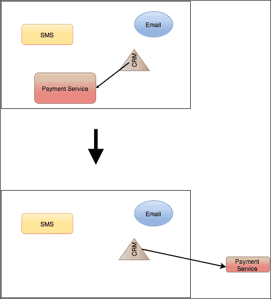
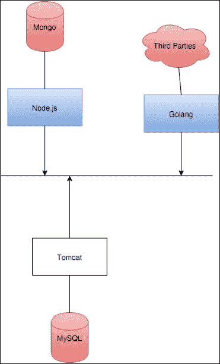

# 第一章 微服务架构

微服务变得越来越受欢迎。如今，几乎每个在绿地项目上工作的工程师都应该考虑使用微服务来提高他们构建的系统的质量。他们应该了解涉及这种系统的架构原则。我们将介绍微服务和**面向服务的架构**（**SOA**）之间的区别。我们还将介绍一个很棒的平台来编写微服务，**Node.js**，它将允许我们轻松创建高性能的微服务。

在本章中，您将从架构的角度了解微服务：

+   什么是微服务？

+   面向微服务的架构

+   主要好处

+   SOA 与微服务

+   为什么选择 Node.js？

# 微服务的需求

软件开发领域在过去 40 年里发展迅速。这种发展的关键点之一是这些系统的规模。从 MS-DOS 时代开始，我们已经跨越了百倍的飞跃进入了我们现在的系统。规模的增长需要更好的组织代码和软件组件的方式。通常，当一家公司因业务需求而增长时，被称为**有机增长**，软件会以单片架构的方式组织，因为这是构建软件的最简单、最快速的方式。几年后（甚至几个月后），由于所创建软件的耦合性，添加新功能变得更加困难。

## 单片软件

像亚马逊或 Netflix 这样的新高科技公司的自然趋势是使用微服务构建他们的新软件，这是理想的情况：他们通过微服务导向的软件获得了巨大的优势（在本书中，您将学习如何），以便在不费吹灰之力的情况下扩展他们的新产品。问题在于，并非所有公司都能提前规划他们的软件。这些公司不是根据规划，而是根据经验的有机增长来构建软件：少数软件组件通过亲和力组合业务流程。看到只有两个大型软件组件的公司并不罕见：用户界面网站和内部管理工具。这通常被称为**单片软件架构**。

一些公司在尝试扩展工程团队时面临着很大的问题。协调构建、部署和维护单个软件组件的团队是很困难的。发布冲突和错误的重新引入是一个常见问题，会耗费团队大量的精力。解决这个问题的一个方法（它带来了好处）是将单片软件拆分为微服务，这样团队就能专注于一些较小的模块和自主的、独立的软件组件，这些组件可以进行版本控制、更新和部署，而不会干扰公司其他系统的运行。

将单体架构拆分为微服务使工程团队能够创建独立和自主的工作单元，这些单元在特定任务上高度专业化，比如发送电子邮件、处理信用卡支付等等。

## 现实世界中的微服务

微服务是专门从事一项任务并共同完成更高级任务的小型软件组件。暂时不要考虑软件，想想一家公司是如何运作的。当有人在公司申请工作时，他申请一个特定的职位：软件工程师、系统管理员、办公室经理。这一点的原因可以用一个词来概括：专业化。如果你习惯于担任软件工程师，你会随着经验的增加而变得更加优秀，并为公司增加更多的价值。你不知道如何与客户打交道并不会影响你的表现，因为那不是你的专业领域，也不会对你的日常工作增加任何价值。

### 提示

专业化通常是提高效率的关键。专注于一件事并做到完美是软件开发的口头禅之一。

微服务是一个可以执行一个任务而不干扰系统其他部分的自主工作单元，类似于公司的一个职位。这有一些好处，可以用来帮助公司的工程团队扩展系统规模。

如今，数百个系统都是使用微服务导向架构构建的，如下所示：

+   **Netflix**：这是最受欢迎的流媒体服务之一，它构建了一个整个应用生态系统，以便提供一个可靠和可扩展的流媒体系统，被全球范围内使用。

+   **Spotify**：这是世界上领先的音乐流媒体服务之一，它使用微服务构建了这个应用。应用程序的每个小部件（这是一个使用 Chromium 嵌入式框架作为桌面应用程序公开的网站）都是一个可以单独更新的不同微服务。

## 微服务导向架构

微服务导向架构具有一些特点，使得它们对任何希望保持其 IT 系统具有弹性并处于可扩展状态的中大型公司都是可取的。

## 它为什么更好？

它们并不是软件工程的圣杯，但是，当小心处理时，它们成为解决大多数技术依赖型公司面临的重大问题的完美方法。

重要的是要牢记微服务导向架构设计的关键原则，比如弹性、可组合性、弹性等；否则，你可能会得到一个跨不同机器拆分的单片应用，而不是一个优雅的解决方案。

## 缺点

微服务导向架构也存在一些批评，因为它们引入了一些需要处理的问题，比如延迟、可追溯性和配置管理，这些问题在基于单片软件的系统中是不存在的。一些问题描述如下：

+   **网络延迟**：微服务具有分布式特性，因此需要考虑网络延迟

+   **运维开销**：更多的服务器意味着更多的维护

+   **最终一致性**：在高交易系统中，我们需要考虑到数据在一段时间内可能不一致（我们将在本章后面讨论这个问题）

总的来说，工程师们应该尝试评估这种方法的利弊，并决定是否使用微服务以适应业务需求。

微服务导向架构有一些需要考虑的特殊之处。当软件工程师编写单片软件时，由于正在构建的软件的性质，有些问题是完全被忽视的。

例如，想象一下我们的软件需要发送电子邮件。在单片软件中，我们只需将功能添加到应用程序的核心中。我们甚至可以选择创建一个专门的模块来处理电子邮件（这似乎是一个好主意）。现在，想象我们正在创建一个微服务，而不是将功能添加到一个大型软件构件中，我们创建了一个可以独立部署和版本化的专用服务。在这种情况下，我们将有一个额外的步骤，我们不得不考虑到**网络延迟**，以达到新的微服务。

在前面的例子中，无论采用何种方法（单片或微服务）构建软件，都不是什么大问题；例如，如果一封电子邮件丢失，也不是世界末日。根据定义，电子邮件的传递并不是有保障的，所以我们的应用程序仍然可以工作，尽管我们可能会收到一些来自客户的投诉。

# 关键设计原则

在构建微服务时，有一些关键的设计原则需要考虑。并没有一条金科玉律，由于微服务是一个较新的概念，有时甚至在应该遵循哪些实践方面缺乏共识。总的来说，我们可以假设以下设计原则：

+   微服务是模拟公司流程的业务单元。

+   它们是包含业务逻辑并使用简单通道和协议进行通信的智能端点。

+   面向微服务的架构从本质上是分散的。这有助于构建健壮和有弹性的软件。

## 业务单元，无组件

软件工程最令人愉快的一面之一就是创建一个新项目。这是你可以应用所有创造力，尝试新的架构概念、框架或方法论的地方。不幸的是，在成熟的公司中，这并不是一种常见情况。通常，我们所做的是在现有软件内部创建新组件。在创建新组件时，你可以遵循的最佳设计原则之一就是尽可能地降低与其他软件的耦合，使其作为一个独立的单元运行。

### 提示

保持低耦合度可以使软件组件很容易转换为微服务。

考虑一个现实世界的例子：你公司的应用现在需要能够处理支付。

在这里逻辑上的决定是创建一个新模块，它知道如何处理所选择的支付提供商（信用卡、PayPal 等），并允许我们将所有与支付相关的业务逻辑放在其中。让我们在以下代码中定义接口：

```js
public interface PaymentService {
  PaymentResponse processPayment(PaymentRequest request) throws MyBusinessException;
}
```

这个简单的接口可以被所有人理解，但在向微服务迈进时它是关键的。我们已经将所有业务知识封装在接口后面，因此理论上我们可以切换支付提供商而不影响应用程序的其他部分——实现细节对外界是隐藏的。

到目前为止，我们知道以下内容：

+   我们知道方法名称，因此知道如何调用服务。

+   该方法可能会抛出`MyBusinessException`类型的异常，迫使调用代码处理它。

+   我们知道输入参数是一个`PaymentRequest`实例。

+   响应是一个已知对象

我们已经创建了一个高内聚和松耦合的业务单元。让我们在接下来的内容中证明这一点：

+   高内聚：支付模块内的所有代码只会做一件事，即处理支付和调用第三方服务的所有方面（连接处理、响应代码等），比如借记卡处理器。

+   松耦合：如果出于某种原因，我们需要切换到新的支付处理器会发生什么？接口中是否有任何信息泄漏？由于合同的变化，我们是否需要更改调用代码？答案是否定的。支付服务接口的实现将始终是一个模块化的工作单元。

以下图表显示了一个由许多组件组成的系统中的一个组件（支付服务）被剥离成一个微服务的过程。



一旦这个模块实现了，我们就能够处理支付，我们的单片应用程序将具有另一个功能，这可能是一个很好的候选项，可以提取为微服务。

现在，只要接口没有改变，与世界其他部分（我们的系统或第三方）的合同没有改变，我们就可以推出支付服务的新版本。这就是为什么保持实现与接口独立是如此重要的原因，即使语言不提供接口支持。

我们还可以扩展并部署尽可能多的支付服务，以满足业务需求，而不必扩展可能没有压力的应用程序的其他部分。

### 提示

**下载示例代码**

您可以从[`www.packtpub.com`](http://www.packtpub.com)的帐户中下载本书的示例代码文件。如果您在其他地方购买了本书，可以访问[`www.packtpub.com/support`](http://www.packtpub.com/support)并注册，以便将文件直接发送到您的电子邮件。

您可以按照以下步骤下载代码文件：

+   使用您的电子邮件地址和密码登录或注册到我们的网站。

+   将鼠标指针悬停在顶部的**SUPPORT**标签上。

+   单击**代码下载和勘误**。

+   在**搜索**框中输入书名。

+   选择要下载代码文件的书籍。

+   从下拉菜单中选择您购买本书的地方。

+   单击**代码下载**。

您还可以通过单击 Packt Publishing 网站上书籍页面上的**代码文件**按钮来下载代码文件。可以通过在**搜索**框中输入书名来访问此页面。请注意，您需要登录到您的 Packt 帐户。

下载文件后，请确保使用以下最新版本的软件解压或提取文件夹：

+   WinRAR / 7-Zip for Windows

+   Zipeg / iZip / UnRarX for Mac

+   7-Zip / PeaZip for Linux

## 智能服务，愚蠢的通信管道

**超文本传输协议**（**HTTP**）是互联网上发生的最好的事情之一。想象一种设计为无状态的协议，但通过使用 Cookie 进行黑客攻击以保持客户端状态。这是在 Web 1.0 时代，当时没有人谈论 REST API 或移动应用程序。让我们看一个 HTTP 请求的示例：

智能服务，愚蠢的通信管道

如您所见，这是一种*人类可读*的协议，不需要解释就能理解。

如今，人们广泛认识到 HTTP 并不局限于在 Web 中使用，并且正如它被设计的那样，它现在被用作从一个端点向另一个端点传输数据的通用协议。HTTP 是微服务之间通信所需的一切：一种传输数据和从传输错误中恢复的协议（在可能的情况下）。

在过去的几年中，特别是在企业界，已经努力创建智能通信机制，如**BPEL**。 BPEL 代表**业务流程执行语言**，它不是专注于通信动作，而是专注于围绕业务步骤的动作。

这引入了一定程度的通信协议复杂性，并使应用程序的业务逻辑从端点渗入其中，导致端点之间存在一定程度的耦合。

业务逻辑应该保留在端点内，而不应渗入通信通道，以便系统可以轻松测试和扩展。多年来学到的教训是，通信层必须是一种简单明了的协议，以确保数据和端点（微服务）的传输。这些端点应该在其实现中嵌入一个事实，即服务可能会在一段时间内停机（这称为弹性，在本章后面我们将讨论这一点），或者网络可能会导致通信问题。

在构建面向微服务的软件时，通常使用 HTTP 协议，但另一个有趣的选择是使用队列，如 Rabbit MQ 和 Kafka，以促进端点之间的通信。

排队技术以一种缓冲方式提供了一种清晰的方法来管理通信，封装了高度事务性系统上确认消息的复杂性。

## 去中心化

单体应用的一个主要缺点是将一切集中在单个（或少数）软件组件和数据库上。这往往导致需要复制和根据公司需求和流程的集中治理而扩展的庞大数据存储。

微服务旨在分散化。与其拥有一个庞大的数据库，为什么不根据之前解释的业务单元来分割数据呢？

一些读者可能会将事务性作为不这样做的主要原因之一。考虑以下情景：

1.  顾客在我们面向微服务的在线商店购买商品。

1.  在支付商品时，系统发出以下调用：

1.  调用公司财务系统创建付款交易。

1.  调用仓库系统发货图书。

1.  调用邮件系统订阅客户的通讯。

在单体软件中，所有调用都将包装在一个事务中，因此，如果由于某种原因，任何调用失败，其他调用中的数据将不会持久保存在数据库中。

当学习设计数据库时，其中一个最重要的原则是由**ACID**首字母缩写总结的。

+   **原子性**：每个事务要么全部成功，要么全部失败。如果某一部分失败，数据库中就不会有任何更改。

+   **一致性**：通过事务对数据的更改需要保证其一致性。

+   **隔离性**：并发执行事务的结果会导致系统状态，这个状态可以通过串行执行事务来获得。

+   **持久性**：一旦事务提交，数据就会持久保存。

在面向微服务的软件中，ACID 原则在全局上并不保证。微服务将在本地提交事务，但没有机制可以保证全局事务的 100%完整性。可以在没有处理付款的情况下发货，除非我们考虑特定规则来防止这种情况。

在面向微服务的架构中，数据的事务性并不受到保证，因此我们需要将失败因素考虑到实现中。解决这个问题的一种方法（尽管，变通更合适）是分散治理和数据存储。

在构建微服务时，我们需要在设计中嵌入这样一个事实，即一个或多个组件可能会失败，并根据软件的可用性降低功能。

让我们看一下下面的图表：


这张图表代表了单体软件的执行顺序。一系列调用的顺序，无论如何，都将遵循 ACID 原则进行执行：要么所有调用（事务）成功，要么都不成功。

这只有可能是因为框架和数据库引擎设计者已经开发了事务的概念，以保证数据的事务性。

在使用微服务时，我们需要考虑工程师所说的最终一致性。在事务部分失败后，每个微服务实例都应该存储恢复事务所需的信息，以便最终使信息一致。根据前面的例子，如果我们在没有处理付款的情况下发送图书，付款网关将有一个失败的事务，稍后会有人处理，使数据再次一致。

解决这个问题的最佳方法是分散治理。每个端点都应该能够做出影响事务全局范围的本地决策。我们将在第三章中更多地讨论这个主题，*从单体到微服务*。

## 技术对齐

在构建新软件时，有一个概念是每个开发人员都应该牢记的：**标准**。

标准保证您的服务将是技术独立的，因此使用不同的编程语言或技术构建集成将变得容易。

使用微服务对系统进行建模的一个优势是，我们可以选择适合特定工作的正确技术，这样在解决问题时可以非常高效。在构建单片软件时，很难像微服务那样结合技术。通常，在单片软件中，我们被绑定到最初选择的技术上。

Java 远程方法调用（RMI）是一个非标准协议的例子，如果您希望系统对新技术开放，应该避免使用它。这是连接使用 Java 编写的软件组件的绝佳方式，但开发人员将很难（甚至无法）使用 Node.js 调用 RMI 方法。这将使我们的架构与特定语言绑定，从微服务的角度来看，这将破坏最有趣的优势之一：技术异构性。

## 太小了有多小？

一旦我们决定将系统建模为一组微服务，就会有一个需要回答的问题：太小了有多小？

答案总是棘手的，可能令人失望：“这取决于”。

在给定系统中微服务的正确大小取决于公司的结构，以及创建易于小型开发团队管理的软件组件的能力。它还取决于技术需求。

想象一个接收和处理银行文件的系统；您可能知道，银行之间的所有支付都以特定已知格式的文件发送（例如欧洲单一支付区域（SEPA）用于欧元支付）。这种系统的一个特点是系统需要知道如何处理大量不同类型的文件。

解决这个问题的第一种方法是从微服务的角度来解决，将其与任何其他服务分离，创建一个工作单元，并为每种类型的文件创建一个微服务。这将使我们能够在不干扰系统其他部分的情况下推出现有文件处理器的修改。这也将使我们能够在一个服务出现问题时继续处理文件。

微服务应该足够小，但要记住，每个微服务都会给运维团队增加负担，他们需要管理一个新的服务。试着从可管理性、可扩展性和专业化的角度回答“太小了有多小？”这个问题。微服务应该足够小，可以由一个人快速管理和扩展（或缩小），而不影响系统的其他部分；它应该只做一件事。

### 提示

作为一个一般规则，一个微服务应该足够小，可以在一个迭代中完全重写。

# 关键好处

在前面的话题中，我们谈到了什么是面向微服务的架构。我还介绍了我从经验中学到的设计原则，以及这种架构的一些好处。

现在，是时候概述这些关键好处，并展示它们将如何帮助我们提高软件质量，以及能够快速适应新的业务需求。

## 弹性

维基百科中将弹性定义为“系统应对变化的能力”。我喜欢将弹性看作是“系统从异常中优雅恢复的能力”（瞬时硬件故障，意外高网络延迟等），或者在压力期间不影响系统性能的能力，一旦情况得到解决。

尽管听起来很简单，但在构建面向微服务的软件时，由于系统的分布性质，问题的来源变得更加广泛，有时很难（甚至不可能）防止所有异常情况。

弹性是从错误中优雅地恢复的能力。它还增加了另一层复杂性：如果一个微服务遇到问题，我们能否防止一般性的失败？理想情况下，我们应该以一种方式构建我们的系统，使服务响应降级而不是导致一般性的失败，尽管这并不总是容易的。

## 可伸缩性

如今，公司中常见的问题之一是系统的可伸缩性。如果您以前曾在单片软件上工作过，我相信您在公司增长的同时曾经遇到过容量问题。

通常，这些问题并不跨越应用程序的所有层或子系统。总会有一个子系统或服务的性能明显比其他部分慢，导致整个应用程序无法满足需求而失败。

以下图表描述了如何扩展微服务（两个邮件服务），而不会干扰系统的其他部分：


### 提示

在汽车保险领域中，一个弱点的例子是计算给定风险因素列表的报价的服务。为了满足这一特定部分的需求，扩展整个应用程序是否有意义？如果你心中的答案是*不*，那么你离微服务更近了一步。微服务使您能够在特定区域的需求增加时扩展系统的部分。

如果我们的保险系统是面向微服务的软件，解决报价计算的高需求所需的唯一事情就是生成更多负责计算的微服务实例（或微服务）。请记住，扩展服务可能会增加操作的开销。

## 技术异构

软件世界每隔几个月都在变化。新的语言正在成为某种类型系统的事实标准。几年前，Ruby on Rails 出现在舞台上，并成为 2013 年新项目中最常用的 Web 框架之一。Golang（由谷歌创建的语言）如今正在成为一种趋势，因为它将巨大的性能与优雅简单的语法结合在一起，可以在几天内被任何有其他编程语言经验的人学会。

过去，我曾使用 Python 和 Java 作为编写微服务的成功替代方案。

特别是自从 Spring Boot 发布以来，Java 是一个吸引人的技术栈，用于编写敏捷（编写和操作）微服务。

Django，也是一个强大的 Python 框架，用于编写微服务。它与 Ruby on Rails 非常相似，自动化数据库迁移，并使创建**CRUD**（创建读取更新删除）服务变得非常容易。

Node.js 利用了一种众所周知的语言 JavaScript，创建了一个改变工程师创建新软件方式的新的服务器端堆栈。

那么，将它们结合起来有什么问题吗？公平地说，这是一个优势：*我们可以选择合适的工具来做合适的工作*。

只要集成技术是标准的，微服务导向的架构使您能够这样做。正如您之前学到的，微服务是*一个可以独立运行的小型软件*。

以下图表显示了微服务如何隐藏数据存储/收集，只有通信点是共同的——这使它们成为低耦合的一个很好的例子（一个服务实现的更改不会干扰任何其他服务）：



我们之前已经谈到了性能。我们的系统中总会有一些部分承受的压力比其他部分大。使用现代多核 CPU，并行（并发）编程可以解决一些性能问题，然而，Node.js 不是一个很好的并行化任务的语言。我们可以选择使用更合适的语言，比如 Erlang，来重写承受压力的微服务，以更优雅的方式管理并发。这应该不会超过两周的时间。

在同一系统上使用多种技术也有不利之处：开发人员和系统管理员需要了解所有（或部分）技术。采用微服务的公司通常会尝试坚持一种核心技术（在本书中，我们将使用 Node.js）和一些辅助技术（尽管我们将使用 Docker 来管理部署，我们也可以使用 Capistrano 或 Fabricator 来管理发布）。

## 可替换性

可替换性是指在不干扰系统行为的情况下更改系统组件的能力。

谈到软件时，可替换性伴随着低耦合。我们应该以一种方式编写我们的微服务，使得内部逻辑不会暴露给调用服务，这样给定服务的客户端不需要知道它是如何实现的，只需要知道接口。让我们看下面的例子。它是用 Java 编写的，因为我们只需要看到接口就能识别出问题：

```js
public interface GeoIpService {
  /**
   * Checks if an IP is in the country given by an ISO code.
   **/
  boolean isIn(String ip, String isoCode) throws SOAPFaultException;
}
```

这个接口，乍一看，就很清楚。它检查给定 IP 是否在给定国家，并抛出一个`SOAPFaultException`，这是一个大问题。

如果我们构建了消费此服务的客户端，将`SoapFaultException`的捕获和处理纳入其逻辑，我们就向外界暴露了内部实现细节，并且使得替换`GeoIpService`接口变得困难。此外，我们创建与应用程序逻辑部分相关的服务的事实表明我们正在创建一个**有界上下文**：一个高度内聚的服务或一组服务，它们共同工作以实现一个目的。

## 独立性

无论我们如何努力，人脑并不是设计来解决复杂问题的。人脑最有效的运作模式是一次只处理一件事，这样我们就可以*将复杂问题分解为更小的问题*。面向微服务的架构应该遵循这种方法：所有服务应该是独立的，并通过接口进行交互，直到可以由不同的工程师组开发而无需任何交互，除了达成接口协议。这将使得采用微服务的公司能够根据业务需求扩大或缩小工程团队，使得业务能够灵活地应对需求高峰或低谷期。

### 为什么可替换性很重要？

在前面的部分，我们谈到了微服务的合适规模。作为一个经验法则，一个团队应该能够在一个迭代中重写并部署一个微服务。其背后的原因是**技术债务**。

我将技术债务定义为从原始技术设计偏离以在计划的截止日期内交付预期功能。这些牺牲或错误的假设通常导致需要完全重构或重写的糟糕软件。

在上面的例子中，接口向外界暴露了我们使用**SOAP**调用 Web 服务的事实，但我们需要在客户端代码中进行更改，因为 REST 客户端肯定与 SOAP 异常无关。

### 易于部署

微服务应该易于部署。

作为软件开发人员，我们深知很多事情可能会出错，阻止软件部署。

如前所述，微服务应该易于部署，出于多种原因，如下列表所述：

+   少量业务逻辑（记住*从零开始重写两周*的经验法则）导致更简单的部署。

+   微服务是自主的工作单元，因此升级服务是复杂系统中的一个封闭问题。无需重新部署整个系统。

+   微服务架构中的基础设施和配置应尽可能自动化。在本书的后面，我们将学习如何使用 Docker 部署微服务以及传统部署技术的好处。

# SOA 与微服务

**面向服务的架构**（**SOA**）已经存在了很多年。SOA 是设计软件的一个很好的原则。它们是为其他组件提供服务的自包含组件。正如我们之前所同意的，这一切都是关于在系统的不同模块之间保持低耦合，就像拼图一样，这样我们就可以替换部件而不会对整个系统造成重大影响。

原则上，SOA 看起来与微服务架构非常相似。那么区别在哪里呢？

微服务是细粒度的 SOA 组件。换句话说，单个 SOA 组件可以分解为多个微服务，这些微服务可以共同工作以提供相同级别的功能：


### 提示

微服务是细粒度的 SOA 组件。它们是专注于狭窄领域的轻量级服务。

微服务和 SOA 之间的另一个区别是用于互连和编写服务的技术。

J2EE 是一个旨在编写 SOA 架构的技术栈，因为它强制执行企业标准。Java 命名和目录接口，企业 JavaBean 和**企业服务总线**（**ESB**）是构建和维护 SOA 应用程序的生态系统。尽管 ESB 是一个标准，但在 2005 年后毕业的工程师中很少有人听说过 ESB，甚至更少的人使用过它，而如今的现代框架如 Ruby on Rails 甚至不考虑这样复杂的软件。

另一方面，微服务强制使用广泛知名和广泛可互操作的标准（如 HTTP）。我们可以选择正确的语言或工具来构建一个组件（微服务），遵循本章前面解释的关键优势之一，在*技术异构性*部分。

除了技术栈和服务的规模之外，SOA 和微服务之间还有一个更大的区别：领域模型。在本章的前面，我们已经谈到了分权化。治理的分权化，更重要的是数据的分权化。在基于微服务的软件中，每个微服务都应该在本地存储自己的数据，将领域模型隔离到单个服务中；而在面向 SOA 的软件中，数据通常存储在几个大型数据库中，服务共享领域模型。

# 为什么选择 Node.js？

几年前，我不相信 Node.js。对我来说，它更像是一种解决问题的真正工具而不是趋势……在服务器上使用 JavaScript？那看起来不对劲。公平地说，我甚至不喜欢 JavaScript。然后，现代框架如 jQuery 或 Angular.js 出现了。它们解决了一个问题，即跨浏览器兼容性。在使用 jQuery 之前，我们需要考虑至少三种不同的浏览器，但使用 jQuery 后，所有这些逻辑都被很好地封装在一个库中，只要我们遵循 jQuery 的文档，就不需要担心兼容性。

然后，JavaScript 变得更受欢迎。突然之间，所有内部工具都是用**单页应用**（**SPA**）框架编写的，大量使用 JavaScript，因此，如今大多数开发人员或多或少都精通 JavaScript。

然后，有人决定将 JavaScript 从浏览器中移出，这是一个很好的主意。Rhino、Node.js 和 Nashorn 是可以执行独立 JavaScript 的运行时的例子。它们中的一些甚至可以与 Java 代码交互，使开发人员能够将 Java 类导入 JavaScript 程序，从而获得对已经用 Java 编写的无数框架的访问。

让我们专注于**Node.js**。Node.js 是面向微服务架构的完美候选者，原因如下列表所述：

+   易于学习（尽管可能很难掌握）

+   易于扩展

+   高度可测试

+   易于部署

+   通过**npm**进行依赖管理

+   有数百个库可以与大多数标准协议集成

这些原因，以及我们将在接下来的章节中开发的其他原因，使 Node.js 成为构建可靠微服务的完美候选者。

## API 聚合

**Seneca**是我在接下来的章节中选择的框架。Seneca 最吸引人的特点之一是 API 聚合。

API 聚合是一种高级技术，通过聚合不同的功能（插件、方法等）来组成一个接口。

让我们看下面的例子：

```js
var express = require('express');
var app = express();

app.get('/sayhello', function (req, res) {
  res.send('Hello World!');
});
app.get('/saygoodbye', function(req, res) {
  res.send('Bye bye!');
});

var server = app.listen(3000, function () {
  var host = server.address().address;
  var port = server.address().port;
  console.log('App listening at http://%s:%s', host, port);
});
```

上面的例子使用了 Express，这是一个非常流行的 Node.js Web 框架。这个框架也是围绕 API 聚合技术构建的。让我们看一下第四行和第七行。在这些行中，开发人员注册了两种方法，当有人用 GET 请求命中 URL `/sayhello` 和 `/saygoodbye` 时，这些方法将被执行。换句话说，该应用程序由不同的较小和独立的实现组成，这些实现在单个接口上向外部世界公开，即在`3000`端口上监听的应用程序。

在接下来的章节中，我将解释为什么这个属性很重要，以及在构建（和扩展）微服务时如何利用它。

## Node.js 的未来

JavaScript 最初是设计为在 Web 浏览器中执行的语言。对于那些工作或学习过的人来说，使用 C/C++非常熟悉，这是它作为 Web 2.0 动态文档操作标准的关键。**异步 JavaScript 和 XML**（**AJAX**）是 JavaScript 增长的催化剂。不同的浏览器对请求对象有不同的实现，因此开发人员很难编写跨浏览器代码。

标准的缺乏导致了许多框架的创建，这些框架封装了 AJAX 背后的逻辑，使得跨浏览器脚本编写变得容易。

JavaScript 是一种脚本语言。它并不是为了面向对象而设计的，也不是为了成为大型应用程序的首选语言，因为代码往往会变得混乱，很难在不同公司之间强制执行代码的布局标准。我工作过的每家公司都有不同的*最佳实践*，有些甚至是相互矛盾的。

**欧洲计算机制造商协会**（**ECMA**）挺身而出。**ECMAScript 6**，ECMA 语言（JavaScript、ActionScript、Rhino 等）的下一个标准引入了类、继承、集合等概念，以及一些有趣的功能，这将使 JavaScript 软件的开发比实际的 V8 规范更容易和更标准。

我认为最有趣的一个特性之一是引入了**class**关键字，它允许我们用对象来建模我们的 JavaScript 软件。

目前，大多数浏览器支持大量这些功能，但是当涉及到 Node.js 时，默认情况下只有少数功能被实现，一些功能需要通过向解释器传递特殊标志（harmony 标志）来实现。

在本书中，我将尽量避免使用 ECMAScript 6 的特性，而是坚持使用 V8 规范，因为它被大多数开发人员所熟知，一旦有人了解了 JavaScript V8，就很容易上手 ECMAScript 6。

# 总结

在本章中，我们学习了围绕微服务的关键概念，以及在设计高质量软件组件时应遵循的最佳实践，以构建健壮和有弹性的软件架构，使我们能够快速响应业务需求。

你还学到了一些关键的好处，比如在面向微服务的架构中使用合适的语言来提供合适的服务（技术异构性），以及一些可能让我们的生活变得更加困难的陷阱，比如由于微服务导致的操作负担。

最后，我们讨论了为什么 Node.js 是构建微服务的好工具，以及我们如何能够通过 JavaScript 从 API 聚合等技术来构建高质量的软件组件。

在接下来的章节中，我们将开发本章讨论的概念，提供代码示例，并进一步解释我多年来学到的主题。

正如之前所解释的，我们将专注于 JavaScript 的 V8 版本，但我将提供一些提示，介绍如何轻松编写可升级的组件以适应 ECMAScript 6。
