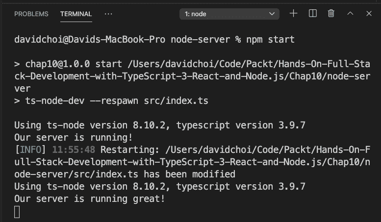

# 第十章：*第十章*：使用 TypeScript 和 GraphQL 依赖项设置 Express 项目

学习现代 JavaScript 编程的最大障碍之一是庞大的包和依赖项数量。尝试为项目选择正确的一组包可能会让人不知所措。在本章中，我们将学习如何设置一个配置良好的 TypeScript、Express 和 GraphQL 项目。我们将看到哪些依赖项受欢迎，以及我们如何通过使用它们来使我们的项目受益。

在本章中，我们将涵盖以下主要主题：

+   创建一个基于 TypeScript 的 Express 项目

+   向项目添加 GraphQL 和依赖项

+   审查辅助包

# 技术要求

你应该对使用 Node、Express 和 GraphQL 进行 Web 开发有基本的了解。我们将再次使用 Node 和 Visual Studio Code。

GitHub 存储库可在[`github.com/PacktPublishing/Full-Stack-React-TypeScript-and-Node`](https://github.com/PacktPublishing/Full-Stack-React-TypeScript-and-Node)找到。使用`Chap10`文件夹中的代码。

要设置`Chap10`代码文件夹，进入你的`HandsOnTypescript`文件夹并创建一个名为`Chap10`的新文件夹。

# 创建一个基于 TypeScript 的 Express 项目

在本节中，我们将构建一个起始项目，我们将以此为基础构建我们的服务器。我们将手动审查和选择每个依赖项，并了解每个依赖项在我们的应用中扮演的角色。完成后，我们将拥有一个构建服务器应用的坚实基础。

有许多预制的项目模板可用于构建 Node 项目。对于 TypeScript 用户来说，一个常见的模板是微软的 TypeScript-Node-Starter 项目。它具有各种有用的依赖项。不幸的是，它面向的是 MongoDB 用户，但我们的应用将使用 Postgres。

另一个项目模板，来自制作 Express 的团队，是`express-generator`。这是一个接受参数并设置基本项目的 CLI。然而，这个模板生成器是面向使用模板引擎如`pug`和`ejs`进行服务器端 HTML 的服务器，对我们来说是不必要的，因为我们正在为 SPA 应用创建 API。此外，它没有 GraphQL 包来帮助我们创建我们的 API。

因此，为了消除多余的包并作为一个学习练习，让我们手动构建我们的项目。这将使我们能够看到构建我们的应用所需的每个部分，并了解每个部分的作用。按照这里给出的步骤：

1.  在`Chap10`文件夹中创建一个新文件夹，并将其命名为`node-server`。

1.  在你的终端中，运行以下命令：

```ts
npm init 
```

1.  接下来，我们安装 TypeScript 并初始化它：

```ts
npm i typescript
tsc -init
```

1.  像这样更新`tsconfig.json`文件：

```ts
{
  "compilerOptions": {
    "target": "es6",
    "module": "commonjs",
    "lib": ["ES6", "ES2017", "ES2018", "ES2019",       "ES2020"],
    "sourceMap": true,
    "outDir": "./dist",
    "rootDir": "src",
    "moduleResolution": "node",
    "removeComments": true,
    "noImplicitAny": true,
    "strictNullChecks": true,
    "strictFunctionTypes": true,
    "noImplicitThis": true,
    "noUnusedLocals": true,
    "noUnusedParameters": false,
    "noImplicitReturns": true,
    "noFallthroughCasesInSwitch": true,
    "allowSyntheticDefaultImports": true,
    "esModuleInterop": true,
    "emitDecoratorMetadata": true,
    "experimentalDecorators": true    
  },
  "exclude": ["node_modules"],
  "include": ["./src/**/*.tsx", "./src/**/*.ts"]
}
```

我们已经在*第二章**，探索 TypeScript*中学习了`tsconfig.json`文件，但让我们再次审查一下这里看到的内容：

+   我们可以以 ES6 为目标，因为我们在自己的服务器上运行，并且可以通过使用适当的 Node 版本来控制 V8 版本。

+   我们使用`commonjs`作为`module`系统，以避免在模块中混合使用`require`和`import`时出现问题。

+   我们希望使用最新的 JavaScript 版本，所以`lib`被设置为允许它们。

+   `outDir`字段表示编译后的`js`文件将保存在其中的文件夹。

+   `rootDir`代表代码源目录。

+   我们允许`emitDecoratorMetadata`和`experimentalDecorator`作为`TypeORM`；访问我们的数据库的存储库层的依赖项将需要使用它们。

+   `exclude`和`include`文件夹，如其含义，表示我们想要隐藏或向 TypeScript 编译器公开的文件夹。

1.  现在让我们添加一些基本依赖项：

```ts
Express and its TypeScript types. 
```

1.  我们安装了`jest`及其类型进行测试。

1.  `ts-jest`包允许我们用 TypeScript 编写测试。

1.  我展示了`nodemon`是为了完整性起见，但我们将运行全局安装的版本，这是我们在*第八章**中安装的，学习使用 Node 和 Express 进行服务器端开发*。

1.  `faker`是用于测试和模拟的虚假数据生成器。

1.  `ts-node-dev`将帮助我们的 Node 服务器在任何 TypeScript 代码更改时重新启动。

现在我们已经安装了基本的依赖项，让我们启动我们的普通 Express 服务器，以确保一切正常运行：

1.  我们需要创建一个服务器设置脚本来初始化我们的服务器，就像我们在*第八章**中做过的那样，学习使用 Node 和 Express 进行服务器端开发*。创建一个名为`src`的文件夹，然后在其中创建另一个名为`index.ts`的文件。然后，添加这段代码：

```ts
import express from "express";
import { createServer } from "http";
const app = express();
const server = createServer(app);
server.listen({ port: 8000 }, () => {
  console.log("Our server is running!");
});
```

基本上，这就是我们以前做的事情：创建一个`express`实例，然后使用它来创建我们的服务器。

1.  现在，我们需要在`package.json`文件中创建一个`"start"`脚本。打开该文件，找到`"scripts"`部分。然后，在现有的`"test"`条目下，添加以下代码：

```ts
"scripts": {
    "test": "echo \"Error: no test specified\" &&        exit 1",
    "start": "ts-node-dev --respawn src/index.ts"
  },
```

该命令使用`ts-node-dev`来监视 TypeScript 更改的发生，然后`"respawn"`。这意味着它将根据需要自动重新启动 Node。

1.  现在，如果你输入这个命令，你的服务器应该运行：

```ts
npm start
```

一旦它运行起来，你应该看到类似这样的东西：


图 10.1 – 第一次运行服务器

正如你所看到的，我们的服务器使用我们的命令启动，并发出控制台日志消息。

1.  如果你通过更改日志消息更新了`index.ts`文件，你会看到服务器自动重新启动，就像这个截图显示的那样：



图 10.2 – 服务器重新启动

服务器重新启动，然后显示我们的新消息，`我们的服务器运行得很好！`。

在这一部分，我们开始学习服务器的重要依赖项。我们将使用所有这些软件包以及其他软件包来构建我们的 GraphQL API。在下一节中，我们将添加我们的 GraphQL 依赖项。

# 向项目添加 GraphQL 和依赖项

我们已经在*第九章**中看过了 GraphQL。在本章中，让我们回顾这些软件包，并介绍一些我们将使用的新相关软件包。

让我们列出一些我们将在应用程序中使用的与 GraphQL 相关的软件包：

+   `graphql`

这个软件包是 GraphQL 的 JavaScript 参考实现。它是由 GraphQL 基金会创建的，我们将使用它来进行一些 GraphQL 查询测试。

+   `graphql-middleware`

这是一个允许我们在解析器运行之前或之后注入我们的代码的软件包。一些可能的操作包括但不限于身份验证检查和日志记录。

+   `graphql-tools`

这个软件包在需要时为我们的 GraphQL 查询提供一些测试和模拟的帮助。

+   `apollo-server-express`

这是我们将用来创建 Express GraphQL 服务器的主要库，我们已经在*第九章**中使用过了，什么是 GraphQL?*。

这些是我们将用于 GraphQL 实现的主要软件包。接下来，我们将创建一个 GraphQL 服务器，并为其构建一些测试。在后面的章节中，我们将把我们在这里使用的各种软件包合并到一个项目中。让我们看看步骤：

1.  在我们的`Chap10`文件夹内创建一个名为`gql-server`的新文件夹。然后，从终端进入其中并运行这些命令：

```ts
npm init
```

1.  接受所有默认值，然后运行此命令：

```ts
npm i express graphql graphql-tools graphql-middleware apollo-server-express uuid -S
```

1.  完成后，运行这个命令：

```ts
npm i @types/express typescript @types/faker @types/jest faker jest nodemon ts-jest ts-node-dev @types/uuid -D
```

1.  现在用这个命令初始化 TypeScript：

```ts
tsc -init
```

1.  完成后，将`node-server`项目中的`tsconfig.json`文件的内容复制到这个新的`gql-server`项目文件夹中的`tsconfig.json`文件中。

1.  现在，在我们的`package.json`文件中，像这样在`scripts`部分中添加一个`start`条目：

图 10.3 - 启动脚本

1.  现在让我们在`gql-server`文件夹的根目录中创建一个新的`src`文件夹。然后将这些文件从`Chap9/graphql-schema`项目复制并粘贴到`src`文件夹中：`db.ts`，`GqlContext.ts`，`resolvers.ts`，`server.ts`和`typeDefs.ts`。

1.  通过使用以下命令启动应用程序，测试我们的应用程序是否能够运行：

```ts
npm start
```

现在让我们添加一些中间件并看看它是如何运行的：

1.  在`src`文件夹中创建一个名为`Logger.ts`的新文件，并将以下代码添加到其中：

```ts
export const log = async (
  resolver: any,
  parent: any,
  args: any,
  context: any,
  info: any
) => {
  If(!parent) {
      console.log("Start logging");
  }
  const result = await resolver(parent, args, context,   info);
  console.log("Finished call to resolver");
  return result;
};
```

在这段代码中，我们拦截任何解析器调用并在`resolver`函数运行之前记录它们。请注意，我们检查`parent`对象是否为`null`，这表示`resolver`调用尚未运行。让我们还将日志记录添加到我们的`getTodos`解析器中。打开`resolvers.ts`并在`getTodos`函数体的开头添加这行代码，就在`return`语句之前：

```ts
console.log("running getTodos");
```

1.  现在我们需要更新我们的`server.ts`文件，以便它使用这个记录器。像这样更新`server.ts`：

```ts
import express from "express";
import { createServer } from "http";
import {
  ApolloServer,
  makeExecutableSchema,
  PubSub,
} from "apollo-server-express";
import typeDefs from "./typeDefs";
import resolvers from "./resolvers";
import { applyMiddleware } from "graphql-middleware";
import { log } from "./Logger";
```

在这里，我们导入了`applyMiddleware`函数和我们之前创建的`log`中间件。请注意，这个`applyMiddleware`函数来自`graphql-middleware`包，与 Apollo 的`applyMiddleware`函数不同，后者仅将 Express 实例与我们的 Apollo 服务器关联：

```ts
const app = express();
const pubsub = new PubSub();
const schema = makeExecutableSchema({ typeDefs, resolvers });
const schemaWithMiddleware = applyMiddleware(schema, log);
const apolloServer = new ApolloServer({
  schema: schemaWithMiddleware,
  context: ({ req, res }: any) => ({ req, res, pubsub }),
});
```

在这里，我们取得了由`makeExecutableSchema`创建的模式，并使用`applyMiddleware`函数创建了一个具有中间件关联的模式。然后，我们将这个模式`schemaWithMiddleware`应用到我们的 Apollo 服务器上。其余的代码没有改变，所以我不会在这里包含它。

1.  如果您尚未启动服务器，请启动服务器并打开浏览器到 GraphQL 服务器 URL。如果您运行调用`getTodos`，您将看到`todos`数据如下返回：


图 10.4 - 调用 getTodos

此外，您应该在 Visual Studio Code 终端中看到我们之前设置的`console.log`消息：


图 10.5 - getTodos 结果

我们的中间件运行并记录。然后，实际的解析器运行并返回数据。

所以，我们现在已经看到了允许我们拦截调用并将自己的代码注入 GraphQL 过程的 GraphQL 中间件。现在让我们尝试使用 GraphQL 创建一些测试：

1.  我们需要为测试目的创建一个 GraphQL 查询运行器。创建一个名为`testGraphQLQuery.ts`的新文件，并将以下代码添加到其中：

```ts
import { graphql, GraphQLSchema } from "graphql";
```

我们导入`graphql`和`GraphQLSchema`，以便我们可以进行手动查询和类型模式文件。

1.  导入`Maybe`，因为它是一个指示参数是否可能被使用的 GraphQL 类型：

```ts
import { Maybe } from "graphql/jsutils/Maybe";
```

1.  创建我们的`Options`接口，它将作为`testGraphQLQuery`函数的参数类型来运行我们的查询：

```ts
interface Options {
  schema: GraphQLSchema;
  source: string;
  variableValues?: Maybe<{ [key: string]: any }>;
}
```

代码`[key: string]`表示对象属性名称 - 例如，`myObj["some name"]`。`testGraphQLQuery`函数使用所需的参数调用，并返回相关数据：

```ts
export const testGraphQLQuery = async ({
  schema,
  source,
  variableValues
}: Options) => {
  return graphql({
    schema,
    source,
    variableValues,
  });
};
```

1.  现在让我们编写我们的测试。创建一个`getUser.test.ts`文件，并将以下代码添加到其中：

```ts
import typeDefs from "./typeDefs";
import resolvers from "./resolvers";
import { makeExecutableSchema } from "graphql-tools";
import faker from "faker";
import { testGraphQLQuery } from "./testGraphQLQuery";
import { addMockFunctionsToSchema } from "apollo-server-express";
```

这些导入都相当不言自明，但`faker`导入用于帮助我们为测试对象的字段值创建虚假条目。

1.  我们使用`describe`设置我们的测试，然后我们为`getUser`创建我们的查询，使用我们想要的字段：

```ts
describe("Testing getting a user", () => {
  const GetUser = `
        query GetUser($id: ID!) {
            getUser(id: $id) {
                id
                username
                email
            }
        }
    `;
```

1.  现在在我们的测试中，我们首先从`typeDefs`和`resolvers`的合并中创建我们的`schema`，然后为我们模拟的`User`对象设置我们的假数据字段：

```ts
  it("gets the desired user", async () => {
    const schema = makeExecutableSchema({ typeDefs,     resolvers });
    const userId = faker.random.alphaNumeric(20);
    const username = faker.internet.userName();
    const email = faker.internet.email();
    const mocks = {
      User: () => ({
        id: userId,
        username,
        email,
      }),
    };
```

正如*第六章**所示，使用 create-react-app 设置我们的项目并使用 Jest 进行测试*，模拟允许我们专注于我们想要测试的代码单元，而不必担心其他项目。

1.  使用`addMockFunctionsToSchema`，我们将我们模拟的`User`对象添加到模式中，以便在进行相关查询时返回它：

```ts
    console.log("id", userId);
    console.log("username", username);
    console.log("email", email);
    addMockFunctionsToSchema({ schema, mocks });
```

1.  最后，我们运行`testGraphQLQuery`函数来获取我们的模拟数据：

```ts
    const queryResponse = await testGraphQLQuery({
      schema,
      source: GetUser,
      variableValues: { id: faker.random.alphaNumeric(20)       },
    });
    const result = queryResponse.data ? queryResponse.     data.getUser : null;
    console.log("result", result);
    expect(result).toEqual({
      id: userId,
      username,
      email,
    });
  });
});
```

如果返回的对象具有相同的字段，那么它表明查询`getUser`查询的逻辑是有效的，因为调用已经通过整个代码路径获取了我们的`User`对象。

1.  在运行测试之前，我们需要为`jest`在`package.json`文件中添加一个配置。将这个配置添加到配置的末尾：

```ts
"jest": {
    "transform": {
      ".(ts|tsx)": "<rootDir>/node_modules/ts-
        jest/preprocessor.js"
    },
    "testRegex": "(/__tests__/.*|\\.(test|spec))       \\.(ts|tsx|js)$",
    "moduleFileExtensions": [
      "ts",
      "tsx",
      "js"
    ]
  }
```

这个配置确保所有带有`spec`或`test`名称的文件都经过测试（这是`testRegex`部分），并且在运行之前将任何 TypeScript 文件转换为 JavaScript（这是`transform`部分）。

1.  如果您在终端上运行`jest`命令，您应该会看到这个结果；确保您在`gql-server`路径上：


图 10.6 – GraphQL 查询测试结果

如您所见，测试通过了。我添加了几个`log`语句，以显示模拟的`User`字段是相同的。您应该避免在测试中这样做，因为这样很难阅读。

注意

在您的`package.json`文件的脚本部分，您可以用"test" : "jest"替换"test"条目。这样，它将更符合其他 NPM 脚本。与任何 NPM 脚本一样，您可以使用`npm run test`命令来运行它。

在本节中，我们了解了一些可用于 GraphQL 的 NPM 包。这些包可以帮助我们构建和测试我们的服务器，使它们更加可靠。在下一节中，我们将看一些其他可以帮助我们构建服务器的包。

# 审查辅助包

在本节中，我们将审查项目的一些辅助依赖项。我们的服务器，本质上是 Node、Express 和 GraphQL。但是，我们的服务器还需要执行许多其他活动，才能完整和完全功能。

让我们列出一些我们将在整个应用程序中使用的包，这些包应该可以让我们编写更少的代码，更多地专注于我们的核心业务逻辑：

+   `bcryptjs`

每个服务器都需要加密数据以确保安全。一个明显的例子是我们用户的密码。Bcrypt 是一种行业标准的加密算法，存在于许多平台上，包括 C++和 Java。`bcryptjs`是该算法的 JavaScript 实现，将帮助我们保护我们的应用程序。

+   `cors`

网络充满了安全隐患和黑客试图破坏服务器。因此，任何 Web 服务器的标准行为都是只允许来自与服务器相同域的客户端请求。对于复杂的服务器设置，如微服务和代理，这是不可行的。因此，`cors`包提供了在我们的服务器上执行 CORS 的工具。

+   `date-fns`

JavaScript Date 对象处理起来非常麻烦，`date-fns`提供了许多有用的方法来解析、格式化和显示日期和时间。

+   `dotenv`

每个大型应用程序都需要将配置信息存储在一个中心位置，以管理和保护敏感数据和设置。使用`dotenv`将允许我们维护我们的敏感信息设置，而不会向最终用户透露它。

+   `nodemailer`

`nodemailer`允许我们从 Node 服务器内部发送电子邮件。例如，我们可以发送电子邮件，允许用户重置密码或通知他们网站上的活动。

+   `request`

这个包将允许我们从 Node 服务器内部发出 HTTP 请求。例如，当我们需要从另一个 API 获取数据时，无论是第三方还是内部，这都可能很有用。

+   `querystring`

`querystring`将允许我们轻松地从对象创建 URL 查询字符串参数，并将 POST 请求的主体解析为字段。这个包可以与`request`包一起使用。

+   `randomstring`

`randomstring`可用于生成随机临时密码。

在构建我们的应用程序时，我们将使用更多的软件包 - 例如，允许我们连接到我们的 Postgres 数据库和 Redis 存储的软件包。然而，我将在相关部分介绍这些软件包，因为那时会更清楚这些软件包的作用。

在本节中，我们了解了一些我们项目中将要使用的杂项软件包。尽管这些工具不是我们应用程序的主要焦点，但它们仍然非常有价值。如果我们要自己编写这些依赖关系，我们将不得不成为各种领域的专家，比如加密和日期时间管理，这对我们来说将是一个巨大的时间浪费，因为这不是我们目标的核心。

# 摘要

在本章中，我们了解了我们将用来构建应用程序的其他 NPM 软件包依赖关系。这些工具在社区中被广泛使用，因此经过了充分的测试和可靠。使用 Node 生态系统中的软件包是 Node 最有价值的好处之一。它使我们不必自己编写、测试和维护这些额外的代码。

在下一章中，我们将详细审查我们将要构建的内容。我们将看到我们应用程序的各个组件是什么，然后我们将开始编写我们应用程序的 React 部分。
