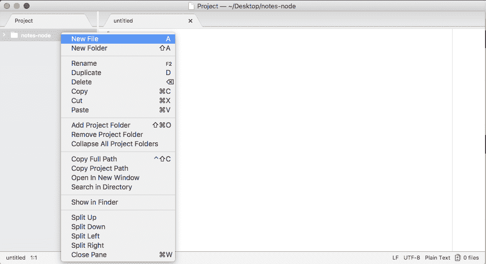
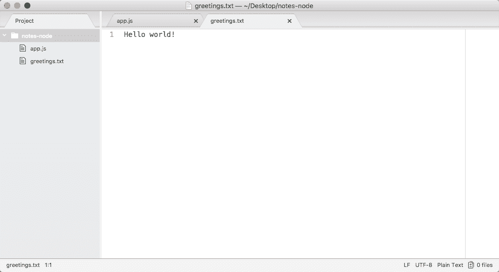
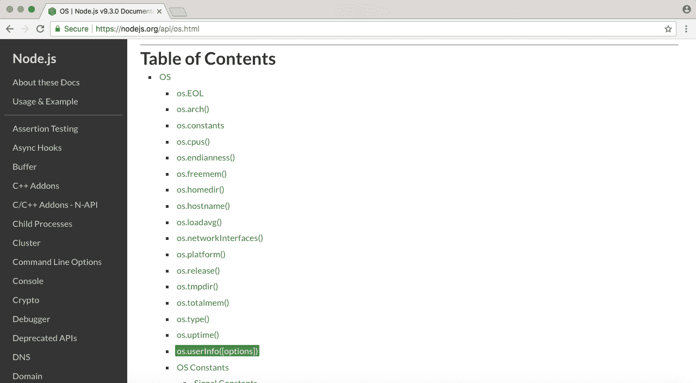
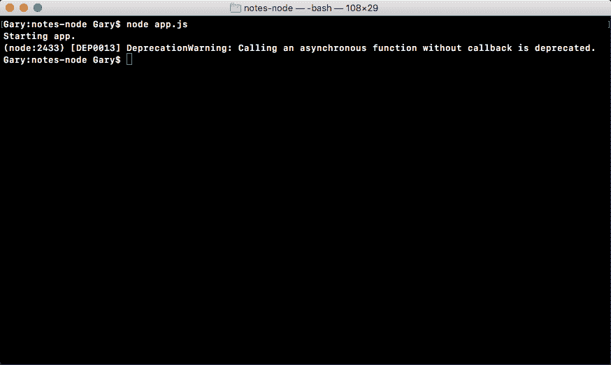
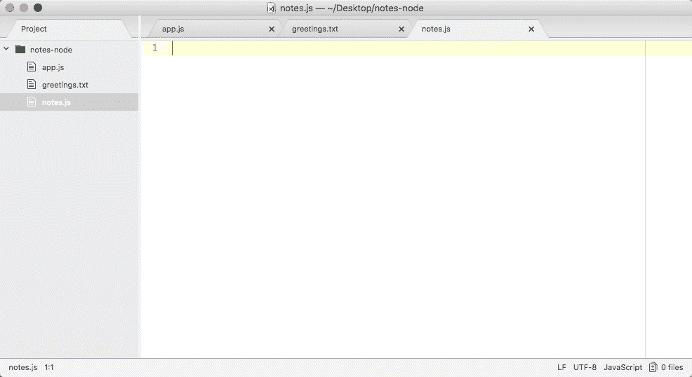
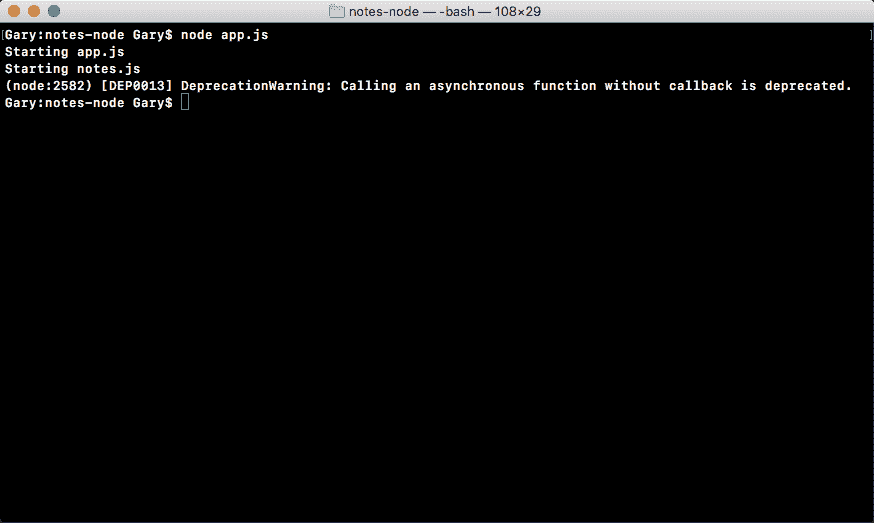
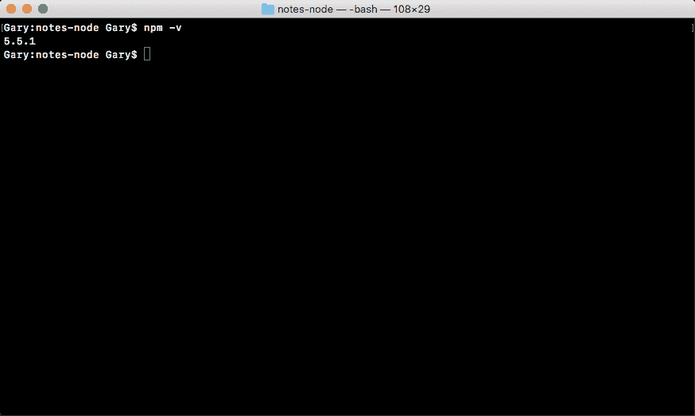
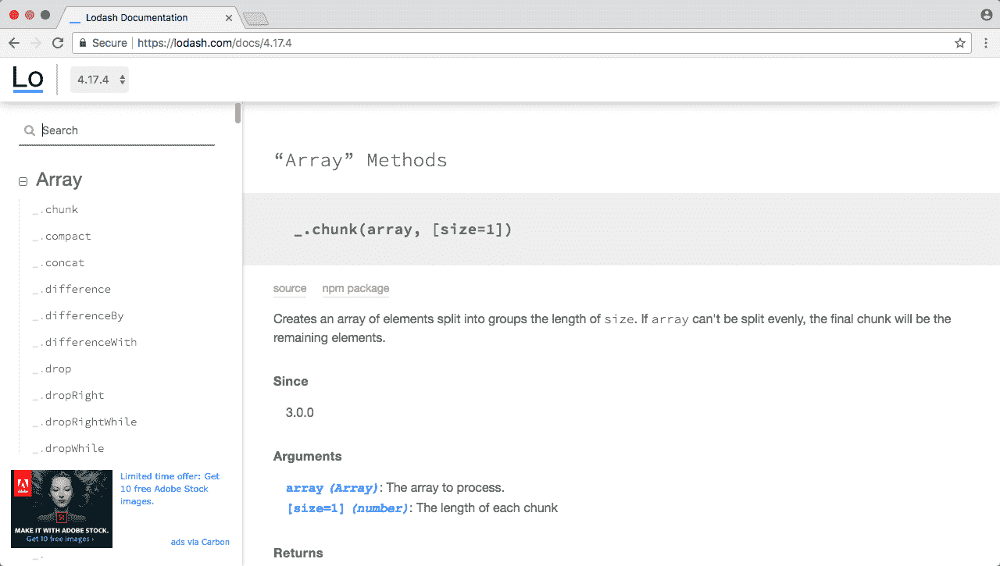
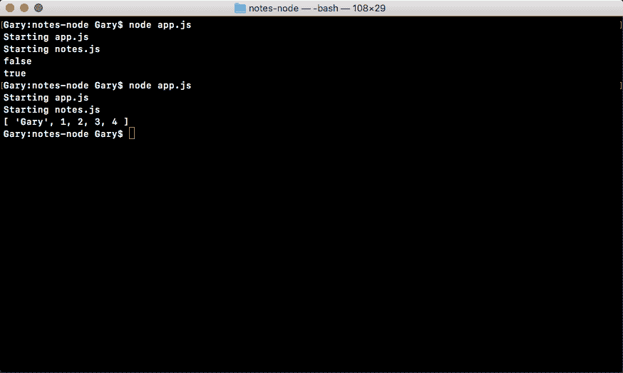
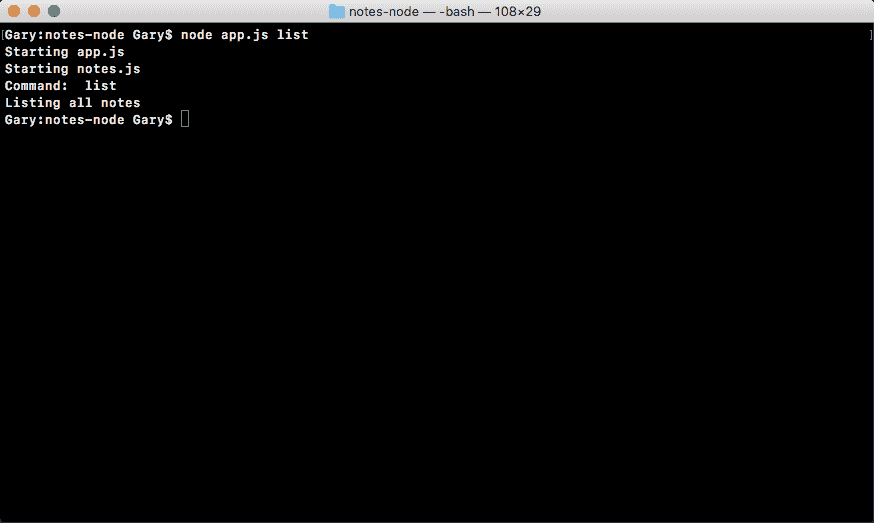

# 第二章：Node 基础-第一部分

在本章中，你将学到很多关于构建 Node 应用的知识，你将实际上构建你的第一个 Node 应用程序。这将是真正有趣的开始。

我们将开始学习所有内置到 Node 中的模块。这些是让你能够以前从未能够做到的 JavaScript 的对象和函数。我们将学习如何做一些事情，比如读写文件系统，这将在 Node 应用程序中用来持久化我们的数据。

我们还将研究第三方 npm 模块；这是 Node 变得如此受欢迎的一个重要原因。npm 模块为你提供了一个很好的第三方库集合，你可以使用它们，它们也有非常常见的问题。因此，你不必一遍又一遍地重写那些样板代码。在本章中，我们将使用第三方模块来帮助获取用户输入。

本章将专门涵盖以下主题：

+   模块基础

+   引入自己的文件

+   第三方模块

+   全局模块

+   获取输入

# 模块基础

在本节中，你将最终学习一些 Node.js 代码，我们将以讨论 Node 中的模块开始。模块是功能单元，所以想象一下，我创建了一些做类似事情的函数，比如一些帮助解决数学问题的函数，例如加法、减法和除法。我可以将它们捆绑成一个模块，称之为 Andrew-math，其他人可以利用它。

现在，我们不会讨论如何制作我们自己的模块；事实上，我们将讨论如何使用模块，这将使用 Node 中的一个函数`require()`来实现。`require()`函数将让我们做三件事：

+   首先，它让我们加载 Node.js 捆绑的模块。这些包括 HTTP 模块，它让我们创建一个 Web 服务器，以及`fs`模块，它让我们访问机器的文件系统。

我们还将在后面的部分中使用`require()`来加载第三方库，比如 Express 和 Sequelize，这将让我们编写更少的代码。

+   我们将能够使用预先编写的库来处理复杂的问题，我们所需要做的就是通过调用一些方法来实现`require()`。

+   我们将使用`require()`来引入我们自己的文件。它将让我们将应用程序分解为多个较小的文件，这对于构建真实世界的应用程序至关重要。

如果你的所有代码都在一个文件中，测试、维护和更新将会非常困难。现在，`require()`并不那么糟糕。在本节中，我们将探讨`require()`的第一个用例。

# 使用`require()`的情况

我们将看一下两个内置模块；我们将弄清楚如何引入它们和如何使用它们，然后我们将继续开始构建那个 Node 应用程序的过程。

# 应用程序的初始化

我们在终端中的第一步是创建一个目录来存储所有这些文件。我们将使用`cd Desktop`命令从我们的主目录导航到桌面：

```js
cd Desktop
```

然后，我们将创建一个文件夹来存储这个项目的所有课程文件。

现在，这些课程文件将在每个部分的资源部分中提供，因此如果你遇到困难，或者你的代码出了问题，你可以下载课程文件，比较你的文件，找出问题所在。

现在，我们将使用`mkdir`命令来创建那个文件夹，这是**make directory**的缩写。让我们将文件夹命名为`notes-node`，如下所示：

```js
mkdir notes-node
```

我们将在 Node 中制作一个笔记应用，所以`notes-node`似乎很合适。然后我们将`cd`进入`notes-node`，然后我们可以开始玩一些内置模块：

```js
cd notes-node
```

这些模块是内置的，所以不需要在终端中安装任何东西。我们可以直接在我们的 Node 文件中引入它们。

在这个过程中的下一步是打开 Atom 文本编辑器中的那个目录。所以打开我们刚刚在桌面上创建的目录，你会在那里找到它，如下面的截图所示：


现在，我们需要创建一个文件，并将该文件放在项目的根目录中：



我们将把这个文件命名为`app.js`，这是我们应用程序的起点：


我们将编写其他在整个应用程序中使用的文件，但这是我们唯一会从终端运行的文件。这是我们应用程序的初始化文件。

# 使用 require()的内置模块

现在，为了开始，我将首先使用`console.log`打印`Starting app`，如下面的代码所示：

```js
console.log('Starting app');
```

我们这样做的唯一原因是为了跟踪我们的文件如何执行，我们只会在第一个项目中这样做。在以后，一旦你熟悉了文件的加载和运行方式，我们就可以删除这些`console.log`语句，因为它们将不再必要。

在调用`console.log`开始应用程序之后，我们将使用`require()`加载一个内置模块。

我们可以在 Node.js API 文档中获得所有内置模块的完整列表。

要查看 Node.js API 文档，请转到[nodejs.org/api](http://nodejs.org/api)。当你访问这个 URL 时，你会看到一个很长的内置模块列表。使用**文件系统**模块，我们将创建一个新文件和**OS**模块。OS 模块将让我们获取当前登录用户的用户名等信息。 

# 在文件系统模块中创建和追加文件

不过，首先我们将从文件系统模块开始。我们将逐步介绍如何创建文件并追加内容：


当你查看内置模块的文档页面时，无论是文件系统还是其他模块，你都会看到一个很长的列表，列出了你可以使用的所有不同函数和属性。在本节中，我们将使用的是`fs.appendFile`。

如果你点击它，它会带你到具体的文档页面，这是我们可以找出如何使用`appendFile`的地方，如下面的截图所示：


现在，`appendFile`非常简单。我们将向它传递两个字符串参数（如前面的截图所示）：

+   一个是文件名

+   另一个是我们想要追加到文件中的数据

这是我们调用`fs.appendFile`所需要提供的全部内容。在我们调用`fs.appendFile`之前，我们需要先引入它。引入的整个目的是让我们加载其他模块。在这种情况下，我们将从`app.js`中加载`fs`模块。

让我们创建一个变量，使用`const`来定义它。

由于我们不会操纵模块返回的代码，所以不需要使用`var`关键字；我们将使用`const`关键字。

然后我们会给它一个名字，`fs`，并将其设置为`require()`，如下面的代码所示：

```js
const fs = require()
```

在这里，`require()`是一个可以在任何 Node.js 文件中使用的函数。你不需要做任何特殊的事情来调用它，只需要像前面的代码中所示的那样调用它。在参数列表中，我们只需要传入一个字符串。

现在，每次调用`require()`时，无论是加载内置模块、第三方模块还是你自己的文件，你只需要传入一个字符串。

在我们的例子中，我们将传入模块名`fs`，并在末尾加上一个分号，如下面的代码所示：

```js
const fs = require('fs');
```

这将告诉 Node，你想要获取`fs`模块的所有内容，并将它们存储在`fs`变量中。此时，我们可以访问`fs`模块上的所有可用函数，包括`fs.appendFile`，我们在文档中探索过。

回到 Atom，我们可以通过调用 `fs.appendFile` 来调用 `appendFile`，传入我们将使用的两个参数；第一个将是文件名，所以我们添加 `greetings.txt`，第二个将是你想要追加到文件中的文本。在我们的例子中，我们将追加 `Hello world!`，如下面的代码所示：

```js
fs.appendFile('greetings.txt', 'Hello world!');
```

让我们保存文件，如上面的命令所示，并从终端运行它，看看会发生什么。

**在 Node v7 上运行程序时的警告** 如果你在 Node v7 或更高版本上运行，当你在终端内运行程序时会收到一个小警告。现在，在 v7 上，它仍然可以工作，只是一个警告，但你可以使用以下代码来摆脱它：

```js
// Orignal line 
fs.appendFile('greetings.txt', 'Hello world!');

// Option one
fs.appendFile('greetings.txt', 'Hello world!', function (err){
  if (err) { 
    console.log('Unable to write to file');
  }
});

// Option two
fs.appendFileSync('greetings.txt', 'Hello world!');
```

在上面的代码中，我们有我们程序中的原始行。

在这里的 `Option one` 是将回调添加为追加文件的第三个参数。当发生错误或文件成功写入时，此回调将被执行。在选项一中，我们有一个 `if` 语句；如果有错误，我们只是在屏幕上打印一条消息 `Unable to write to file`。

现在，在上面的代码中，我们的第二个选项 `Option two` 是调用 `appendFileSync`，这是一个同步方法（我们稍后会详细讨论）；这个函数不需要第三个参数。你可以像上面的代码中所示那样输入它，你就不会收到警告。

因此，如果你看到警告，选择其中一种选项，两者都可以工作得差不多。

如果你使用的是 v6，你可以坚持使用上面代码中的原始行，尽管你可能会使用下面这两个选项之一来使你的代码更具未来性。

不要担心，我们将在整本书中广泛讨论异步和同步函数，以及回调函数。我在代码中给你的只是一个模板，你可以在你的文件中写下来以消除错误。在几章中，你将准确理解这两种方法是什么，以及它们是如何工作的。

如果我们在终端中进行追加，`node app.js`，我们会看到一些很酷的东西：


如前面的代码所示，我们得到了我们的一个 `console.log` 语句，`Starting app.`。所以我们知道应用程序已经正确启动了。此外，如果我们转到 Atom，我们实际上会看到一个全新的 `greetings.txt` 文件，如下面的代码所示。这是由 `fs.appendFile` 创建的文本文件：

```js
console.log('Starting app.');

const fs = require('fs');

fs.appendFile('greetings.txt', 'Hello world!');
```

在这里，`fs.appendFile` 尝试将 `greetings.txt` 追加到一个文件中；如果文件不存在，它就会简单地创建它：



你可以看到我们的消息 `Hello world!` 在 `greetings.txt` 文件中打印到屏幕上。在短短几分钟内，我们就能够加载一个内置的 Node 模块并调用一个函数，让我们创建一个全新的文件。

如果我们再次调用它，通过使用上箭头键和回车键重新运行命令，并回到 `greetings.txt` 的内容，你会看到这一次我们有两次 `Hello world!`，如下所示：


它每次运行程序都会追加 `Hello world!` 一次。我们有一个应用程序，在我们的文件系统上创建一个全新的文件，如果文件已经存在，它就会简单地添加到它。

# 在 require()中的 OS 模块

一旦我们创建并追加了 `greetings.txt` 文件，我们将自定义这个 `greeting.txt` 文件。为了做到这一点，我们将探索另一个内置模块。我们将在未来使用不仅仅是 `appendFile`。我们将探索其他方法。对于本节，真正的目标是理解 `require()`。`require()` 函数让我们加载模块的功能，以便我们可以调用它。

我们将使用的第二个模块是 OS，我们可以在文档中查看它。在 OS 模块中，我们将使用在最底部定义的方法，os.userInfo([options])：



os.userInfo([options])方法被调用并返回有关当前登录用户的各种信息，例如用户名，这就是我们要提取的信息：


使用来自操作系统的用户名，我们可以自定义`greeting.txt`文件，以便它可以说`Hello Gary!`而不是`Hello world!`。

要开始，我们必须要求 OS。这意味着我们将回到 Atom 内部。现在，在我创建`fs`常量的下面，我将创建一个名为`os`的新常量，将其设置为`require()`; 这作为一个函数调用，并传递一个参数，模块名称`os`，如下所示：

```js
console.log('Starting app.');

const fs = require('fs');
const os = require('os');

fs.appendFile('greetings.txt', 'Hello world!');
```

从这里开始，我们可以开始调用 OS 模块上可用的方法，例如 os.userInfo([optional])。

让我们创建一个名为`user`的新变量来存储结果。变量 user 将被设置为`os.userInfo`，我们可以调用`userInfo`而不带任何参数：

```js
console.log('Starting app.');

const fs = require('fs');
const os = require('os');

var user = os.userInfo();

fs.appendFile('greetings.txt', 'Hello world!');
```

现在，在我们对`fs.appendFile`行执行任何操作之前，我将对其进行注释，并使用`console.log`打印用户变量的内容：

```js
console.log('Starting app.');

const fs = require('fs');
const os = require('os');

var user = os.userInfo();
console.log(user);
// fs.appendFile('greetings.txt', 'Hello world!');
```

这将让我们准确地探究我们得到了什么。在终端中，我们可以使用上箭头键和回车键重新运行我们的程序，并且在下面的代码中，你可以看到我们有一个带有一些属性的对象：


我们有`uid`，`gid`，`username`，`homedir`和`shell`。根据您的操作系统，您可能不会拥有所有这些，但您应该始终拥有`username`属性。这是我们关心的。

这意味着回到 Atom 内部，我们可以在`appendFile`中使用`user.username`。我将删除`console.log`语句并取消注释我们对`fs.appendFile`的调用：

```js
console.log('Starting app.');

const fs = require('fs');
const os = require('os');

var user = os.userInfo();

fs.appendFile('greetings.txt', 'Hello world!');
```

现在，在`fs.appendFile`中的`world`处，我们将其与`user.username`交换。我们可以以两种方式做到这一点。

# 连接用户.username

第一种方法是删除`world!`并连接`user.username`。然后我们可以使用`+`（加号）运算符连接另一个字符串，如下面的代码所示：

```js
console.log('Starting app.');

const fs = require('fs');
const os = require('os');

var user = os.userInfo();

fs.appendFile('greetings.txt', 'Hello' + user.username + '!');
```

现在，如果我们运行这个，一切都会按预期工作。在终端中，我们可以重新运行我们的应用程序。它会打印`Starting app`：



在`greetings.txt`文件中，你应该看到类似`Hello Gary!`的东西打印到屏幕上，如下所示：


使用`fs`模块和`os`模块，我们能够获取用户的用户名，创建一个新文件并存储它。

# 使用模板字符串

第二种方法是使用 ES6 功能模板字符串来交换`fs.appendFile`中的`world`与`user.username`。模板字符串以```js (tick) operator, which is available to the left of the *1* key on your keyboard. Then you type things as you normally would.

This means that we'll first type `hello`, then we'll add a space with the `!` (exclamation) mark, and just before `!`, we will put the name:

```开头和结尾

console.log('Starting app.');

const fs = require('fs');

const os = require('os');

var user = os.userInfo();

fs.appendFile('greetings.txt', `Hello !`);

```js

To insert a JavaScript variable inside your template string, you use the `$` (dollar) sign followed by opening and closing curly braces. Then we will just reference a variable such as `user.username`:

```

console.log('Starting app.');

const fs = require('fs');

const os = require('os');

var user = os.userInfo();

fs.appendFile('greetings.txt', `Hello ${user.username}!`);

```js

Notice that the Atom editor actually picks up on the syntax of curly braces.

This is all it takes to use template strings; it's an ES6 feature available because you're using Node v6\. This syntax is much easier to understand and update than the string/concatenation version we saw earlier.

If you run the code, it will produce the exact same output. We can run it, view the text file, and this time around, we have `Hello Gary!` twice, which is what we want here:


With this in place, we are now done with our very basic example and we're ready to start creating our own files for our notes application and requiring them inside `app.js` in the next section.

First up, you learned that we can use `require` to load in modules. This lets us take existing functionality written by either the Node developers, a third-party library, or ourselves, and load it into a file so that it can be reusable. Creating reusable code is essential for building large apps. If you have to build everything in an app every time, no one would ever get anything done because they would get stuck at building the basics, things such as HTTP servers and web servers. There are already modules for such stuff, and we'll be taking advantage of the great npm community. In this case, we used two built-in modules, `fs` and `os`. We loaded them in using require and we stored the module results inside two variables. These variables store everything available to us from the module; in the case of `fs`, we use the `appendFile` method, and in the case of OS, we use the `userInfo` method. Together, we were able to grab the username and save it into a file, which is fantastic.

# Require own files

In this section, you will learn how to use `require()` to load in other files that you created inside your project. This will let you move functions outside `app.js` into more specific files; this will make your application easier to scale, test, and update. To get started, the first thing we'll do is to make a new file.

# Making a new file to load other files

In the context of our notes app, the new file will store various functions for writing and reading notes. As of now, you don't need to worry about that functionality, as we'll get into the detail later in the section, but we will create the file where it will eventually live. This file will be `notes.js`, and we'll save it inside the root of our application, right alongside `app.js` and `greetings.txt`, as shown here:



For the moment, all we'll do inside `notes` is to use `console.log` to print a little log showing the file has been executed using the following code:

```

console.log('Starting notes.js');

```js

Now, we have `console.log` on the top of `notes` and one on the top of `app.js`. I'll change `console.log` in the `app.js` from `Starting app.` to `Starting app.js`. With this in place, we can now require the notes file. It doesn't export any functionality, but that's fine.

By the way, when I say export, I mean the notes file doesn't have any functions or properties that another file can take advantage of.

We'll look at how to export stuff later in the section. For now though, we'll load our module in much the same way we loaded in the built-in Node modules.

Let's make `const`; I'll call this one notes and set it equal to the return result from `require()`:

```

console.log('Starting app.js');

const fs = require('fs');

const os = require('os');

const notes = require('');

var user = os.userInfo();

fs.appendFile('greetings.txt', `Hello ${user.username}!`);

```js

Inside the parentheses, we will pass in one argument that will be a string, but it will be a little different. In the previous section, we typed in the module name, but what we have in this case is not a module, but a file, `notes.js`. What we need to do is to tell Node where that file lives using a relative path.

Now, relative paths start with `./` (a dot forward slash), which points to the current directory that the file is in. In this case, this points us to the `app.js` directory, which is the root of our project `notes-node`. From here, we don't have to go into any other folders to access `notes.js`, it's in the root of our project, so we can type its name, as shown in the following code:

```

console.log('Starting app.js');

const fs = require('fs');

const os = require('os');

const notes = require('./notes.js');

var user = os.userInfo();

fs.appendFile('greetings.txt', `Hello ${user.username}!`);

```js

With this in place, we can now save `app.js` and see what happens when we run our application. I'll run the app using the `node app.js` command:


As shown in the preceding code output, we get our two logs. First, we get `Starting app.js` and then we get `Starting notes.js`. Now, `Starting notes.js` comes from the `note.js` file, and it only runs because we required the file inside of `app.js`.

Comment out this command line from the `app.js` file, as shown here:

```

console.log('Starting app.js');

const fs = require('fs');

const os = require('os');

// const notes = require('./notes.js');

var user = os.userInfo();

fs.appendFile('greetings.txt', `Hello ${user.username}!`);

```js

Save the file, and rerun it from Terminal; you can see the `notes.js` file never executes because we never explicitly touch it.

We never call it inside Terminal as we do in the preceding example, and we never require.

For now though, we will be requiring it, so I'll uncomment that line.

By the way, I'm using command / (forward slash) to comment and uncomment lines quickly. This is a keyboard shortcut available in most text editors; if you're on Windows or Linux, it might not be *command*, it might be *Ctrl* or something else.

# Exporting files from note.js to use in app.js

For now though, the focus will be to export something from `notes.js` which we can use in `app.js`. Inside `notes.js` (actually, inside all of our Node files), we have access to a variable called `module`. I'll use `console.log` to print `module` to the screen so that we can explore it over in Terminal, as shown here:

```

console.log('Starting notes.js');

console.log(module);

```js

Let's rerun the file to explore it. As shown in the following screenshot, we get a pretty big object, that is, different properties related to the `notes.js` file:


Now, to tell the truth, we'll not be using most of these properties. We have things such as `id`, `exports`, `parent`, and `filename`. The only one property we'll ever use in this book is `exports`.

The `exports` object on the `module` property and everything on this object gets exported. This object gets set as the `const` variable, `notes`. This means that we can set properties on it, they will get set on notes, and we can use them inside `app.js`.

# A simple example of the working of the exports object

Let's take a quick look at how that works. What we'll do is to define an `age` property using `module.exports`, the object we just explored over in Terminal. Also, we know that it's an object because we can see it in the preceding screenshot (`exports: {}`); this means that I can add a property, `age`, and set it equal to my age, which is `25`, as shown here:

```

console.log('Starting notes.js');

module.exports.age = 25;

```js

Then I can save this file and move into `app.js` to take advantage of this new `age` property. The `const` variable notes will be storing all of my exports, in the present case, just age.

In `fs.appendFile`, after the `greeting.txt` file, I'll add `You are` followed by the age. Inside template strings, we will use `$` with curly braces, `notes.age`, and a period at the end, as shown here:

```

console.log('Starting app.js');

const fs = require('fs');

const os = require('os');

const notes = require('./notes.js');

var user = os.userInfo();

fs.appendFile('greetings.txt', `Hello ${user.username}! You are ${notes.age}.`);

```js

Now our greeting should say `Hello Gary! You are 25`. It's getting the `25` value from our separate file (that is, `note.js`), which is fantastic.

Let's take a quick moment to rerun the program over in Terminal using the up arrow key and e*nter* keys:



Back inside the app, we can open `greetings.txt`, and as shown in the following screenshot, we have `Hello Gary! You are 25`:


Using `require()`, we were able to require a file that we created, and this file stored some properties that were advantageous to the rest of the project.

# Exporting the functions

Now, obviously, the preceding example is pretty contrived. We'll not be exporting static numbers; the real goal of exports is to be able to export functions that get used inside `app.js`. Let's take a quick moment to export two functions. In the `notes.js` file, I'll set `module.exports.addnote` equal to a function; the `function` keyword followed by opening and closing parentheses, which is followed by the curly braces:

```

控制台记录('启动 notes.js');

module.exports.addNote = function () {

}

```js

Now, throughout the course, I'll be using arrow functions where I can, as shown in the preceding code. To convert a regular ES5 function into an arrow function, all you do is remove the `function` keyword and replace it with an `=>` sign right between the parentheses and the opening curly braces, as shown here:

```

控制台记录('启动 notes.js');

module.exports.addNote = () => {

}

```js

Now, there are some more subtleties to arrow functions that we'll be talking about throughout the book, but if you have an anonymous function, you can swap it with an arrow function without any problems. The big difference is that the arrow function is not going to bind the `() => {}` keyword or the arguments array, which we'll be exploring throughout the book. So if you do get some errors, it's good to know that the arrow function could be the cause.

For now though, we'll keep things really simple, using `console.log` to print `addNote`. This will let us know that the `addNote` function was called. We'll return a string, `'New note'`, as shown here:

```

控制台记录('启动 notes.js');

module.exports.addNote = () => {

控制台记录('addNote');

返回 '新笔记';

};

```js

Now, the `addNote` function is being defined in `notes.js`, but we can take advantage of it over in `app.js`.

Let's take a quick second to comment out both the `appendFile` and user line in `app.js`:

```

控制台记录('启动 app.js');

const fs = require('fs');

const os = require('os');

const notes = require('./notes.js');

// var user = os.userInfo();

//

// fs.appendFile('greetings.txt', `Hello ${user.username}! You are ${notes.age}.`);

```js

I'll add a variable, call the result, (`res` for short), and set it equal to the return result from `notes.addNote`:

```

控制台记录('启动 app.js');

const fs = require('fs');

const os = require('os');

const notes = require('./notes.js');

var res = notes.addNote();

// var user = os.userInfo();

//

// fs.appendFile('greetings.txt', `Hello ${user.username}! You are ${notes.age}.`);

```js

Now, the `addNote` function is a dummy function for the moment. It doesn't take any arguments and it doesn't actually do anything, so we can call it without any arguments.

Then we'll print the result variable, as shown in the following code, and we would expect the result variable to be equal to the `New note` string:

```

控制台记录('启动 app.js');

const fs = require('fs');

const os = require('os');

const notes = require('./notes.js');

var res = notes.addNote();

控制台记录(res);

// var user = os.userInfo();

//

// fs.appendFile('greetings.txt', `Hello ${user.username}! You are ${notes.age}.`);

```js

If I save both of my files (`app.js` and `notes.js`) and rerun things from Terminal, you can see that `New note` prints to the screen at the very end and just before `addNote` prints:


This means that we successfully required the notes file we called `addNote`, and its return result was successfully returned to `app.js`.

Using this exact pattern, we'll be able to define our functions for adding and removing notes over in our `notes.js` file, but we'll be able to call them anywhere inside of our app, including in `app.js`.

# Exercise – adding a new function to the export object

Now it's time for a quick challenge. What I'd like you to do is make a new function in `notes.js` called `add`. This `add` function will get set on the `exports` object.

Remember, `exports` is an object, so you can set multiple properties.

This `add` function will take two arguments, `a` and `b`; it'll add them together and return the result. Then over in `app.js`, I'd like you to call that `add` function, passing in two numbers, whatever you like, such as `9` and `-2`, then print the result to the screen and make sure it works correctly.

You can get started by removing the call to `addNote` since this will not be needed for the challenge.

So, take a moment, create that `add` function inside `notes.js`, call it inside `app.js`, and make sure the proper result prints to the screen. How'd it go? Hopefully, you were able to make that function and call it from `app.js`.

# Solution to the exercise

The first step in the process will be to define the new function. In `notes.js`, I'll set `module.exports.add` equal to that function, as shown here:

```

控制台记录('启动 notes.js');

module.exports.addNote = () => {

控制台记录('addNote');

返回 '新笔记';

};

module.exports.add =

```js

Let's set it equal to an arrow function. If you used a regular function, that is perfectly fine, I just prefer using the arrow function when I can. Also, inside parentheses, we will be getting two arguments, we'll be getting `a` and `b`, as shown here:

```

控制台记录('启动 notes.js');

module.exports.addNote = () => {

控制台记录('addNote');

返回 '新笔记';

};

module.exports.add = (a, b) => {

};

```js

All we need to do is return the result, which is really simple. So we'll enter `return a + b`:

```

控制台记录('启动 notes.js');

module.exports.addNote = () => {

控制台记录('addNote');

返回 '新笔记';

};

module.exports.add = (a, b) => {

返回 a + b;

};

```js

Now, this was the first part of your challenge, defining a utility function in `notes.js`; the second part was to actually use it over in `app.js`.

In `app.js`, we can use our function by printing the `console.log` result with a colon `:` (this is just for formatting). As the second argument, we'll print the actual results, `notes.add`. Then, we'll add up two numbers; we'll add `9` and `-2`, as shown in this code:

```

控制台记录('启动 app.js');

const fs = require('fs');

const os = require('os');

const notes = require('./notes.js');

控制台记录('结果:', notes.add(9, -2));

// var user = os.userInfo();

//

// fs.appendFile('greetings.txt', `Hello ${user.username}! You are ${notes.age}.`);

```js

The result in this case should be `7`. If we run the program you can see that we get just that, `7` prints to the screen:


If you were able to get this, congratulations, you successfully completed one of your first challenges. These challenges will be sprinkled throughout the book and they'll get progressively more complex. But don't worry, we'll keep the challenges pretty explicit; I'll tell you exactly what I want and exactly how I want it done. Now, you can play around with different ways to do it, the real goal is to just get you writing code independent of following someone else's lead. That is where the real learning happens.

In the next section, we will explore how to use third-party modules. From there, we'll start building the notes application.

# Third-party modules

You now know two out of the three ways to use `require()`, and in this section, we'll explore the last way, which is to require a package you've installed from npm. As I mentioned in the first chapter, npm is a big part of what makes Node so fantastic. There is a huge community of developers that have created thousands of packages that already solve some of the most common problems in Node applications. We will be taking advantage of quite a few packages throughout the book.

# Creating projects using npm modules

Now, in the npm packages, there's nothing magical, it's regular Node code that aims to solve a specific problem. The reason you'd want to use it is so you don't have to spend all your time writing these utility functions that already exist; not only do they exist, they've been tested, they've been proven to work, and others have used them and documented them.

Now, with all that said, how do we get started? Well, to get started, we actually have to run a command from the Terminal to tell our application we want to use npm modules. This command will be run over in the Terminal. Make sure you've navigated inside your project folder and inside the `notes-node` directory. Now, when you installed Node, you also installed something called npm.

At one point, npm stood for **Node package manager**, but that's now a running joke because there are plenty of things on npm that are not specific to Node. A lot of frontend frameworks, such as jQuery and react, now live on npm as well, so they've pretty much ditched the Node package manager explanation and now on their site, they cycle through a bunch of hilarious things that happen to match up with npm.

We will be running some npm commands and you can test that you have it installed by running `npm`, a space, and `-v` (we're running npm with the `v` flag). This should print the version, as shown in the following code:



It's okay if your version is slightly different, that's not important; what is important is that you have npm installed.

Now, we'll run a command called `npm init` in Terminal. This command will prompt us to fill out a few questions about our npm project. We can run the command and we can cycle through the questions, as shown in the following screenshot:


In the preceding screenshot, at the top is a quick description of what's happening, and down below it'll start asking you a few questions, as shown in the following screenshot:


The questions include the following:

*   name: Your name can't have uppercase characters or spaces; you can use `notes-node`, for example. You can hit *enter* to use the default value, which is in parentheses.
*   version: 1.0.0 works fine too; we will leave most of these at their default value.
*   description: We can leave this empty at the moment.
*   entry point: This will be `app.js`, make sure that shows up properly.
*   test command: We'll explore testing later in the book, so for now, we can leave this empty.
*   git repository: We'll leave that empty for now as well.
*   keywords: These are used for searching for modules. We'll not be publishing this module so we can leave those empty.
*   author: You might as well type your name.
*   license: For the license, we'll stick with ISC at the moment; since we're not publishing it, it doesn't really matter.

After answering these questions, if we hit e*nter*, we'll get the following on our screen and a final question:


Now, I want to dispel the myth that this command is doing anything magical. All this command is doing is creating a single file inside your project. It'll be in the root of the project and it's called `package.json`, and the file will look exactly like the preceding screenshot.

To the final question, as shown down below in the preceding image, you can hit e*nter* or type `yes` to confirm that this is what you want to do:


Now that we have created the file, we can actually view it inside our project. As shown in the following code, we have the `package.json` file:

```

{

"名称": "notes-node",

"版本": "1.0.0",

"描述": "",

"主要": "app.js",

"脚本": {

"测试": "echo \"错误：未指定测试\" && 退出 1"

},

"作者": "",

"许可": "ISC"

}

```js

And this is all it is, it's a simple description of your application. Now, as I mentioned, we'll not be publishing our app to npm, so a lot of this information really isn't important to us. What is important, though, is that `package.json` is where we define the third-party modules we want to install in our application.

# Installing the lodash module in our app

To install a module in the app, we will run a command over in the Terminal. In this chapter, we'll be installing a module called `lodash`. The `lodash` module comes with a ton of utility methods and functions that make developing inside Node or JavaScript a heck of a lot easier. To take a look at what exactly we're getting into, let's move into the browser.

We'll to go to [`www.npmjs.com`](https://www.npmjs.com). Then we'll search for the package, `lodash`, and you can see it comes up, as shown in the following screenshot:


When you click on it, you should be taken to the package page, and the package page will show you a lot of statistics about the module and the documentation, as shown here:


Now, I use the `lodash` package page when I'm looking for new modules; I like to see how many downloads it has and when it was last updated. On the package page, you can see it was updated recently, which is great it means the package is most likely compatible with the latest versions of Node, and if you go further down the page, you can see this is actually one of the most popular npm packages, with over a million downloads a day. We will be using this module to explore how to install npm modules and how to actually use them in a project.

# Installation of lodash

To install `lodash`, the first thing you need to grab is just a module name, which is `lodash`. Once you have that information, you're ready to install it.

Coming to Terminal, we'll run the `npm install` command. After installing, we'll specify the module, `lodash`. Now, this command alone would work; what we'll also do, though, is provide the `save` flag.

The `npm install lodash` command will install the module, and the `save` flag, `--` (two) hyphens followed by the word `save`, will update the contents of the `package.json` file. Let's run this command:

```

npm 安装 loadsh --save

```js

The preceding command will go off to the npm servers and fetch the code and install it inside your project, and any time you install an npm module, it'll live in your project in a `node_modules` folder.

Now, if you open that `node_modules` folder, you'll see the `lodash` folder as shown in the following code. This is the module that we just installed:

```

{

"名称": "notes-node",

"版本": "1.0.0",

"描述": "",

"主要": "app.js",

"脚本": {

"测试": "echo \"错误：未指定测试\" && 退出 1"

},

"作者": "",

"许可": "ISC",

"依赖": {

"lodash": "⁴.17.4"

}

}

```js

As you can see over in `package.json` in the preceding figure, we've also had some updates automatically take place. There's a new `dependencies` attribute that has an object with key value pairs, where the key is the module we want to use in our project and the value is the version number, in this case, the most recent version, version `4.17.4`. With this in place, we can now require our module inside the project.

Over inside `app.js`, we can take advantage of everything that comes in `lodash` by going through the same process of requiring it. We'll make a `const`, we'll name that `const _`, (which is a common name for the `lodash` utility library), and we'll set it equal to `require()`. Inside the require parentheses, we'll pass in the module name exactly as it appears in the `package.json` file. This is the same module name you used when you ran `npm install`. Then, we'll type `lodash`, as shown here:

```

控制台记录('启动 app.js');

const fs = require('fs');

const os = require('os');

const _ = require('lodash');

const notes = require('./notes.js');

控制台记录('结果:', notes.add(9, -2));

// var user = os.userInfo();

//

// fs.appendFile('greetings.txt', `Hello ${user.username}! You are ${notes.age}.`);

```js

Now, the order of operations is pretty important here. Node will first look for a core module with the name `lodash`. It'll not find one because there is no core module, so the next place it will look is the `node_modules` folder. As shown in the following code, it will find `lodash` and load that module, returning any of the exports it provides:

```

控制台记录('启动 app.js');

const fs = require('fs');

const os = require('os');

const _ = require('lodash');

const notes = require('./notes.js');

控制台记录('结果:', notes.add(9, -2));

// var user = os.userInfo();

//

// fs.appendFile('greetings.txt', `Hello ${user.username}! You are ${notes.age}.`);

```js

# Using the utilities of lodash

With the exports in place, we can now take advantage of some of the utilities that come with Lodash. We'll quickly explore two in this section, and we'll be exploring more throughout the book since Lodash is basically just a set of really handy utilities. Before we do, we should take a look at the documentation so we know exactly what we're getting into.

This is a really common step when you're using an npm module: first, you install it; second, you've got to look at those docs and make sure that you can get done what you want to get done.

On the npm page, click the lodash link given there, or go to [lodash.com](https://lodash.com) and click the API Documentation page, as shown here:


You can view all of the various methods you have available to you, as shown in the following screenshot:



In our case, we'll be using *command* + *F* (*Ctrl* + *F* for Windows users) to search for `_.isString`. Then in the docs, we can click on it, opening it up in the main page, as shown in the following screenshot:


The `_.isString` is a utility that comes with `lodash`, and it returns `true` if the variable you pass in is a string, and it returns `false` if the value you pass in is not a string. And we can prove that by using it over in Atom. Let's use this.

# Using the _.isString utility

To use the `_.isString` utility, we'll add `console.log` in `app.js` to show the result to the screen and we'll use `_.isString`, passing in a couple of values. Let's pass in `true` first, then we can duplicate this line and we'll pass in a string such as `Gary`, as shown here:

```

控制台记录('启动 app.js');

const fs = require('fs');

const os = require('os');

const _ = require('lodash');

const notes = require('./notes.js');

控制台记录(_.isString(true));

控制台记录(_.isString('Gary'));

// console.log('Result:', notes.add(9, -2));

// var user = os.userInfo();

//

// fs.appendFile('greetings.txt', `Hello ${user.username}! You are ${notes.age}.`);

```js

We can run our project over in the Terminal using the same command we've used previously, `node app.js`, to run our file:


When we run the file, we get our two prompts that we've started both files, and we get `false` and then `true`. `false` comes because the Boolean is not a string, and `true` comes up because `Gary` is indeed a string, so it passes the test of `_.isString`. This is one of the many utility functions that comes bundled with `lodash`.

Now, `lodash` can do a lot more than simple type checking. It comes with a bunch of other utility methods we can take advantage of. Let's explore one more utility.

# Using _.uniq

Back inside the browser, we can use c*ommand + F* again to search for a new utility, which is `_.uniq`:


This unique method, simply takes an array and it returns that array with all duplicates removed. That means if I have the same number a few times or the same string, it'll remove any duplicates. Let's run this.

Back inside Atom, we can add this utility into our project, we'll comment out our `_.isString` calls and we will make a variable called `filteredArray`. This will be the array without the duplicates, and what we'll do is call, after the equal sign, `_.uniq`.

Now, as we know, this takes an array. And since we're trying to use the unique function, we'll pass in an array with some duplicates. Use your name twice as a string; I'll use my name once, followed by the number `1`, followed by my name again. Then I can use `1`, `2`, `3`, and `4` as shown here:

```

控制台记录('启动 app.js');

const fs = require('fs');

const os = require('os');

const _ = require('lodash');

const notes = require('./notes.js');

// console.log(_.isString(true));

// console.log(_.isString('Gary'));

var filteredArray = _.uniq(['Gary', 1, 'Gary', 1, 2, 3, 4]);

控制台记录();

// console.log('Result:', notes.add(9, -2));

// var user = os.userInfo();

//

// fs.appendFile('greetings.txt', `Hello ${user.username}! You are ${notes.age}.`);

```js

Now, if things go as planned, we should get an array with all the duplicates removed, which means we'll have one instance of `Gary`, one instance of `1`, and then `2`, `3`, and `4`, which don't have duplicates.

The last thing to do is to print that using `console.log` so we can view it inside the Terminal. I'll pass in this `filteredArray` variable to our `console.log` statement as shown in the following code:

```

控制台记录('启动 app.js');

const fs = require('fs');

const os = require('os');

const _ = require('lodash');

const notes = require('./notes.js');

// console.log(_.isString(true));

// console.log(_.isString('Gary'));

var filteredArray = _.uniq(['Gary', 1, 'Gary', 1, 2, 3, 4]);

控制台记录(filteredArray);

// console.log('Result:', notes.add(9, -2));

// var user = os.userInfo();

//

// fs.appendFile('greetings.txt', `Hello ${user.username}! You are ${notes.age}.`);

```js

From here, we can run our project inside Node. I'll use the last command, then I can press the e*nter* key, and you can see we get our array with all duplicates removed, as shown in the following code output:



We have one instance of the string `Gary`, one instance of the number `1`, and then we have `2`, `3`, `4`, exactly what we expected.

The `lodash` utility really is endless. There are so many functions that it can be kind of overwhelming to explore at first, but as you start creating more JavaScript and Node projects, you'll find yourself solving a lot of the same problems over and over again when it comes to sorting, filtering, or type checking, and in that case, it's best to use a utility such as `lodash` to get that lifting done. The `lodash` utility is great for the following reasons:

*   You don't have to keep rewriting your methods
*   It is well tested and it has been tried in production

If there were any issues, they've been sorted out by now.

# The node_modules folder

Now that you know how to use a third-party module, there is one more thing I want to discuss. That is the `node_modules` folder in general. When you take your Node project and you put it on GitHub, or you're copying it around or sending it to a friend, the `node_modules` folder really shouldn't be taken with you.

The `node_modules` folder contains generated code. This is not code you've written and you should never make any updates to the files inside Node modules because there's a pretty good chance they'll get overwritten next time you install some modules.

In our case, we've already defined the modules and the versions inside `package.json` as shown in the following code because we used that handy `save` flag:

```

{

"name": "notes-node",

"version": "1.0.0",

"description": "",

"main": "app.js",

"scripts": {

"test": "echo \"Error: no test specified\" && exit 1"

},

"author": "",

"license": "ISC",

"dependencies": {

"lodash": "⁴.17.4"

}

}

```js

This actually means we can delete the `node_modules` folder completely. Now, we can copy the folder and give it to a friend, we can put it on GitHub, or whatever we want to do. When we want to get that `node_modules` folder back, all we have to do inside the Terminal is run the `npm install` command without any module names or any flags.

This command, when run without any names or flags, is going to load in your `package.json` file, grab all of the dependencies and install them. After running this command, the `node_modules` folder is going to look exactly as it looked before we deleted it. Now, when you are using Git and GitHub, instead of deleting the `node_modules` folder, you'll just ignore it from your repository.

Now, what we have explored so far is a process we'll be going through a lot more throughout the book. So if npm still seems foreign or you're not quite sure why it's even useful, it will become clear as we do more with our third-party modules, rather than just type checking or looking for unique items in an array. There's a ton of power behind the npm community and we'll be harnessing that to our fullest as we make real-world apps.

# Global modules

One of the major complaints I get is the fact that students have to restart the app from the Terminal every time they want to see the changes they just made inside their text editor. So, in this section, we'll take a look at how we can automatically restart our app as we make changes to the file. That means if I change from `Gary` to `Mike` and save it, it will automatically restart over in the Terminal.

# Installing the nodemon module

Now, to automatically restart our app as we make changes to a file, we have to install a command-line utility, and we'll do this using npm. To get started, we'll go to Google Chrome (or the browser you are using) and head over to [`www.npmjs.com`](https://www.npmjs.com), as we did previously in the I*nstalling the* *lodash* *module in our app* section, and the module we're looking for is called **nodemon**.

The nodemon will be responsible for watching our app for changes and restarting the app when those changes occur. Right here, as we see in the following screenshot, we can view the docs for nodemon as well as various other things such as current version numbers and so on:


You will also notice that it's a really popular module, with over 30,000 downloads a day. Now, this module is a little different from the one we used in the last section, that is, `lodash`. The `lodash` got installed and added into our project's `package.json` file as shown in the following code block:

```

{

"name": "notes-node",

"version": "1.0.0",

"description": "",

"main": "app.js",

"scripts": {

"test": "echo \"Error: no test specified\" && exit 1"

},

"author": "",

"license": "ISC",

"dependencies": {

"lodash": "⁴.17.4"

}

}

```js

That means it went into our `node_modules` folder and we were able to require it in our `app.js` file (refer to the previous section for more detail). Nodemon, however, works a little differently. It's a command-line utility that gets executed from the Terminal. It will be a completely new way of starting our application, and to install modules to be run from the command line, we have to tweak the `install` command that we used in the last section.

For now, we can start off much the same way, though. We'll use `npm install` and type the name just like we did in the *Installing the* *lodash* *module in our app* section, but instead of using the `save` flag, we'll use the `g` flag, which is short for global, as shown here:

```

npm install nodemon -g

```js

This command installs `nodemon` as a global utility on your machine, which means it'll not get added to your specific project and you'll never require `nodemon`. Instead, you'll be running the `nodemon` command from Terminal, as shown here:


When we install `nodemon` using the preceding command, it'll go off to npm and fetch all of the code that comes with `nodemon`.

And it'll add it into the installation where Node and npm live on your machine, outside the project you're working on.

The `npm install nodemon -g` command could be executed from anywhere in your machine; it does not need to be executed from the project folder since it doesn't actually update the project at all. With this in place, though, we now have a brand new command on our machine, `nodemon`.

# Executing nodemon

Nodemon will get executed as Node did, where we type the command and then we type the file we want to start. In our case, `app.js` is the root of our project. When you run it, you'll see a few things, as shown here:


We'll see a combination of our app's output, along with `nodemon` logs that show you what's happening. As shown in the preceding code, you can see the version `nodemon` is using, the files it's watching, and the command it actually ran. Now, at this point, it's waiting for more changes; it already ran through the entire app and it'll keep running until another change happens or until you shut it down.

Inside Atom, we'll make a few changes to our app. Let's get started by changing `Gary` to `Mike` in `app.js`, and then we'll change the `filteredArray` variable to `var filteredArray = _.uniq(['Mike'])`, as shown in the following code:

```

console.log('Starting app.js');

const fs = require('fs');

const os = require('os');

const _ = require('lodash');

const notes = require('./notes.js');

// console.log(_.isString(true));

// console.log(_.isString('Gary'));

var filteredArray = _.uniq(['Mike']);

console.log(filteredArray);

```js

Now, I'll be saving the file. In the Terminal window, you can see the app automatically restarted, and within a split second, the new output is shown on the screen:


As shown in the preceding screenshot, we now have our array with one item of string, `Mike`. And this is the real power of `nodemon`.

You can create your applications and they will automatically restart over in the Terminal, which is super useful. It'll save you a ton of time and a ton of headaches. You won't have to switch back and forth every time you make a small tweak. This also prevents a ton of errors where you are running a web server, you make a change, and you forget to restart the web server. You might think your change didn't work as expected because the app is not working as expected, but in reality, you just never restarted the app.

For the most part, we will be using `nodemon` throughout the book since it's super useful. It's only used for development purposes, which is exactly what we're doing on our local machine. Now, we'll move forward and start exploring how we can get input from the user to create our notes application. That will the topic of the next few sections.

Before we get started, we should clean up a lot of the code we've already written in this section. I'll remove all of the commented-out code in `app.js`. Then, I'll simply remove `os`, where we have `fs`, `os` and `lodash`, since we'll not be using it throughout the project. I'll also be adding a space between the third-party and Node modules and the files I've written, which are as follows:

```

console.log('Starting app.js');

const fs = require('fs');

const _ = require('lodash');

const notes = require('./notes.js');

```js

I find this to be a good syntax that makes it a lot easier to quickly scan for either third-party or Node modules, or the modules that I've created and required.

Next up, over in `notes.js`, we'll remove the `add` function; this was only added for demonstration purposes, as shown in the following figure. Then we can save both the `notes.js` and `app.js` files, and `nodemon` will automatically restart:

```

console.log('Starting notes.js');

module.exports.addNote = () => {

console.log('addNote');

return 'New note';

};

module.exports.add = (a, b) => {

return a + b;

};

```js

Now we can remove the `greetings.txt` file. That was used to demonstrate how the `fs` module works, and since we already know how it works, we can wipe that file. And last but not least, we can always shut down `nodemon` using C*trl* + *C*. Now we're back at the regular Terminal.

And with this in place, now we should move on, figuring out how we can get input from the user, because that's how users can create notes, remove notes, and fetch their notes.

# Getting input

If a user wants to add a note, we need to know the note's title as well as the body of the note. If they want to fetch a note, we need to know the title of the note they want to fetch, and all this information needs to come into our app. And note apps, don't really do anything cool until they get this dynamic user input. This is what makes your scripts useful and awesome.

Now, throughout the book, we'll be creating note apps that get input from the user in a lot of different ways. We'll be using socket I/O to get real-time info from a web app, we'll be creating our own API so other websites and servers can make Ajax requests to our app, but in this section, we'll start things off with a very basic example of how to get user input.

We'll be getting input from the user inside the command line. That means when you run the app in the command line, you'll be able to pass in some arguments. These arguments will be available inside Node, and then we can do other things with them, such as create a note, delete a note, or return a note.

# Getting input from the user inside the command line

To start things off, let's run our app from the Terminal. We'll run it pretty similarly to how we ran it in the earlier sections: we'll start with `node` (I'm not using `nodemon` since we'll be changing the input), then we'll use `app.js`, which is the file we want to run, but then we can still type other variables.

We can pass all sorts of command-line arguments in. We could have a command, and this would tell the app what to do, whether you want to add a note, remove a note, or list a note.

If we want to add a note, that might look as a command shown in the following code:

```

node app.js add

```js

This command will add a note; we can remove a note using the `remove` command, as shown here:

```

node app.js remove

```js

And we could list all of our notes using the `list` command:

```

node app.js list

```js

Now, when we run this command, the app is still going to work as expected. Just because we passed in a new argument doesn't mean our app is going to crash:


And we actually have access to the `list` argument already, we're just not using it inside the application.

To access the command-line arguments your app was initialized with, you'll want to use that `process` object that we explored in the first chapter.

We can log out all of the arguments using `console.log` to print them to the screen; it's on the process object, and the property we're looking for is `argv`.

The `argv` object is short for arguments vector, or in the case of JavaScript, it's more like an arguments array. This will be an array of all the command-line arguments passed in, and we can use them to start creating our application.

Now save `app.js` and it'll look like the following:

```

console.log('Starting app.js');

const fs = require('fs');

const _ = require('lodash');

const notes = require('./notes.js');

console.log(process.argv);

```js

Then we'll rerun this file:


Now, as shown in the preceding command output, we have three items which are as follows:

*   The first one points to the executable for Node that was used.
*   The second one points to the app file that was started; in this case, it was `app.js`.
*   The third one is where our command-line arguments start to come into play. In it, we have our `list` showing up as a string.

That means we can access that third item in the array, and that will be the command for our notes application.

# Accessing the command-line argument for the notes application

Let's access the command-line argument in the array now. We'll make a variable called `command`, and set it equal to `process.argv`, and we'll grab the item in the third position (which is `list`, as shown in the preceding command output), which is the index of two as shown here:

```

var command = process.argv[2];

```js

Then we can log that out to the screen by logging out `command` the string. Then, as the second argument, I'll pass in the actual command that was used:

```

console.log('Command: ' , command);

```js

And this is just a simple log to keep track of how the app is getting executed. The cool stuff is going to come when we add if statements that do different things depending on that command.

# Adding if/else statements

Let's create an `if/else` block below the `console.log('Command: ', command);`. We'll add `if (command === 'add')`, as shown here:

```

console.log('Starting app.js');

const fs = require('fs');

const _ = require('lodash');

const notes = require('./notes.js');

var command = process.argv[2];

console.log('Command: ', command);

if (command === 'add')

```js

In this case, we'll go through the process of adding a `new note`. Now, we're not specifying the other arguments here, such as the title or the body (we'll discuss that in later sections). For now, `if` the `command` does equal `add`, we'll use `console.log` to print `Adding new note`, as shown in the following code:

```

console.log('Starting app.js');

const fs = require('fs');

const _ = require('lodash');

const notes = require('./notes.js');

var command = process.argv[2];

console.log('Command: ', command);

if (command === 'add') {

console.log('Adding new note');

}

```js

And we can do the exact same thing with a command such as `list`. We'll add `else if (command === 'list')`, as shown here:

```

console.log('Starting app.js');

const fs = require('fs');

const _ = require('lodash');

const notes = require('./notes.js');

var command = process.argv[2];

console.log('Command: ', command);

if (command === 'add') {

console.log('Adding new note');

} else if (command === 'list')

```js

If the command does equal the string `list`, we'll run the following block of code using `console.log` to print `Listing all notes`. We can also add an `else` clause if there is no command, which is `console.log ('Command not recognized')`, as shown here:

```

console.log('Starting app.js');

const fs = require('fs');

const _ = require('lodash');

const notes = require('./notes.js');

var command = process.argv[2];

console.log('Command: ', command);

if (command === 'add') {

console.log('Adding new note');

} else if (command === 'list') {

console.log('Listing all notes');

} else {

console.log('Command not recognized');

}

```js

With this in place, we can now rerun our app for a third time, and this time around, you'll see we have the command equal to list, and listing all notes shows up, as shown in the following code:

```

if (command === 'add') {

console.log('Adding new note');

} else if (command === 'list') {

console.log('Listing all notes');

} else {

console.log('Command not recognized');

}

```js

This means we were able to use our argument to run different code. Notice that we didn't run `Adding new note` and we didn't run `Command not recognized`. We could, however, switch the `node app.js` command from `list` to `add`, and in that case, we'll get `Adding new note` printing, as shown in the following screenshot:



And if we run a command that doesn't exist, for example `read`, you can see `Command not recognized` prints as shown in the following screenshot:


# Exercise – adding two else if clauses to an if block

Now, what I'd like you to do is add two more `else if` clauses to our `if` block, which will be as follows:

*   One will be for the `read` command, which will be responsible for getting an individual note back
*   Another one called `remove` will be responsible for removing the note

All you have to do is add the `else if` statement for both of them, and then just put a quick `console.log` printing something like `Fetching note` or `Removing note`.

Take a moment to knock that out as your challenge for this section. Once you add those two `else if` clauses, run both of them from the Terminal and make sure your log shows up. If it does show up, you are done, you can move ahead with this section.

# Solution to the exercise

For the solution, the first thing I'll do is to add an `else if` for `read`. I'll open and close my curly braces and hit e*nter* right in the middle so everything gets formatted correctly.

In the `else if` statement, I'll check whether the `command` variable equals the string `read`, as shown here:

```

console.log('Starting app.js');

const fs = require('fs');

const _ = require('lodash');

const notes = require('./notes.js');

var command = process.argv[2];

console.log('Command: ', command);

if (command === 'add') {

console.log('Adding new note');

} else if (command === 'list') {

console.log('Listing all notes');

} else if () {

} else {

console.log('Command not recognized');

}

```js

In the future, we'll be calling methods that update our local database with the notes.

For now, we'll use `console.log` to print `Reading note`:

```

console.log('Starting app.js');

const fs = require('fs');

const _ = require('lodash');

const notes = require('./notes.js');

var command = process.argv[2];

console.log('Command: ', command);

if (command === 'add') {

console.log('Adding new note');

} else if (command === 'list') {

console.log('Listing all notes');

} else if (command === 'read') {

} else {

console.log('Command not recognized');

}

```js

The next thing you need to do is add an `else if` clause that checks whether the `command` equals `remove`. In the `else if`, I'll open and close my condition and hit e*nter* just as I did in the previous `else if` clause; this time, I'll add `if` the `command` equals `remove`, we want to remove the note. And in that case, all we'll do is to use `console.log` to print `Reading note`, as shown in the following code:

```

console.log('Starting app.js');

const fs = require('fs');

const _ = require('lodash');

const notes = require('./notes.js');

var command = process.argv[2];

console.log('Command: ', command);

if (command === 'add') {

console.log('Adding new note');

} else if (command === 'list') {

console.log('Listing all notes');

} else if (command === 'read') {

console.log('Reading note');

} else {

console.log('Command not recognized');

}

```js

And with this in place, we are done. If we refer to the code block, we've added two new commands we can run over in the Terminal, and we can test those:

```

if (command === 'add') {

console.log('Adding new note');

} else if (command === 'list') {

控制台日志（'列出所有笔记'）;

} 否则 if（命令 === '读取'）{

控制台日志（'阅读笔记'）;

} 否则 {

控制台日志（'命令未被识别'）;

}

```js

First up, I'll run `node app.js` with the `read` command, and `Reading note` shows up:

```

控制台日志（'启动 app.js'）;

const fs = require（'fs'）;

const _ = require（'lodash'）;

const notes = require（'./notes.js'）;

var command = process.argv [2];

控制台日志（'命令：'，命令）;

如果（命令 === '添加'）{

控制台日志（'添加新笔记'）;

} 否则 if（命令 === '列表'）{

控制台日志（'列出所有笔记'）;

} 否则 if（命令 === '读取'）;

控制台日志（'阅读笔记'）;

} 否则 if（命令 == '删除'）{

控制台日志（'删除笔记'）;

} 否则 {

控制台日志（'命令未被识别'）;

}

```js

Then I'll rerun the command; this time, I'll be using `remove`. And when I do that, `Removing note` prints to the screen, as shown in this screenshot:


I'll wrap up my testing using a command that doesn't exist, and when I run that, you can see `Command not recognized` shows up.

# Getting the specific note information

Now, what we did in the previous subsection is step 1\. We now have support for various commands. The next thing we need to figure out is how we'll get more specific information. For example, which note do you want to remove? Which note do you want to read? And what do you want the note text to be in the case of adding a note? This is all information we need to get from the Terminal.

Now, getting it is going to be pretty similar to what we did earlier, and to show you what it looks like, we'll print the entire `argv` object once again, using the following command:

```

控制台日志（process.argv）;

```js

Over in the Terminal, we can now run a more complex command. Let's say we want to remove a note using the `node app.js remove` command, and we'll do that by its title. We might use the `title` argument, which looks like the following code:

```

节点 app.js 删除--title

```js

In this `title` argument, we have `--` (two) hyphens followed by the argument name, which is `title`, followed by the `=` (equals) sign. Then we can type our note title. Maybe the note title is `secrets`. This will pass the title argument into our application.

Now, there are a couple of different ways you could format the `title` argument, which are as follows:

*   You could have the title `secrets` like the one in the preceding command
*   You could have title equals secrets inside quotes, which will let us use spaces in the title:

```

节点 app.js 删除--title =秘密

```js

*   You can remove the `=` (equals) sign altogether and simply put a space:

```

节点 app.js 删除--title =“secrets 2”

```js

No matter how you choose to format your argument, these are all valid ways to pass in the title.

As you see in the preceding screenshot, I am using double quotes when wrapping my string. Now, if you switch to single quotes, it will not break on Linux or OS X, but it will break on Windows. That means when you're passing in command-line arguments such as the title or the note body, you'll want to wrap your strings, when you have spaces, in double quotes, not single. So, if you are using Windows and you're getting some sort of unexpected behavior with your arguments, make sure you're using double quotes instead of single; that should fix the issue.

For the moment, I'll keep the `=` (equals) sign and the quotes and rerun the command:

```

节点 app.js 删除--title =“秘密 2”

```

当我运行命令时，您可以在以下代码输出中看到我们有两个参数：

！[]（img/1cb82daa-4c24-4774-873c-9a3f6872e51d.png）

这些是我们不需要的参数，然后我们有我们的`删除`命令，这是第三个，现在我们有一个新的第四个字符串，标题等于`secrets 2`。我们的参数已成功传递到应用程序中。问题是它不太容易使用。在第四个字符串中，我们必须解析出键`title`和值`secrets 2`。

当我们使用命令时，它是前一节中的第三个参数，它在我们的应用程序内使用起来更容易。我们只需从参数数组中取出它，并通过使用命令变量引用它，并检查它是否等于`添加`，`列表`，`读取`或`删除`。

随着我们使用不同的样式传递参数，事情变得更加复杂。如果我们使用空格而不是`=`（等号）重新运行上一个命令，如下面的代码所示，这是完全有效的，我们的参数数组现在看起来完全不同：

！[]（img/d2a28fa2-df33-4c71-a401-b391ddc66626.png）

在上面的代码输出中，您可以看到标题作为第四项，值作为第五项，这意味着我们必须添加其他条件来解析。这很快就会变得痛苦，这就是为什么我们不会这样做。

在下一章中，我们将使用一个名为 yargs 的第三方模块来使解析命令行参数变得轻松。与我们之前展示的字符串不同，我们将得到一个对象，其中 title 属性等于`secrets 2`字符串。这将使实现其余笔记应用程序变得非常容易。

现在，解析某些类型的命令行参数，例如键值对，变得更加复杂，这就是为什么在下一章中，我们将使用 yargs 来做到这一点。

# 摘要

在本章中，我们学会了如何使用 require 加载 Node.js 提供的模块。我们为笔记应用程序创建了我们的文件，并在`app.js`中引入它们。我们探索了如何使用内置模块，以及如何使用我们定义的模块。我们发现了如何要求我们创建的其他文件，并如何从这些文件中导出属性和函数等东西。

我们稍微探索了 npm，我们如何使用`npm init`生成`package.json`文件，以及我们如何安装和使用第三方模块。接下来，我们探索了`nodemon`模块，使用它在我们对文件进行更改时自动重新启动我们的应用程序。最后，我们学会了如何从用户那里获取输入，这对创建笔记应用程序是必要的。我们了解到我们可以使用命令行参数将数据传递给我们的应用程序。

在下一章中，我们将探索一些更有趣的 Node 基本概念，包括 yargs，JSON 和重构。
