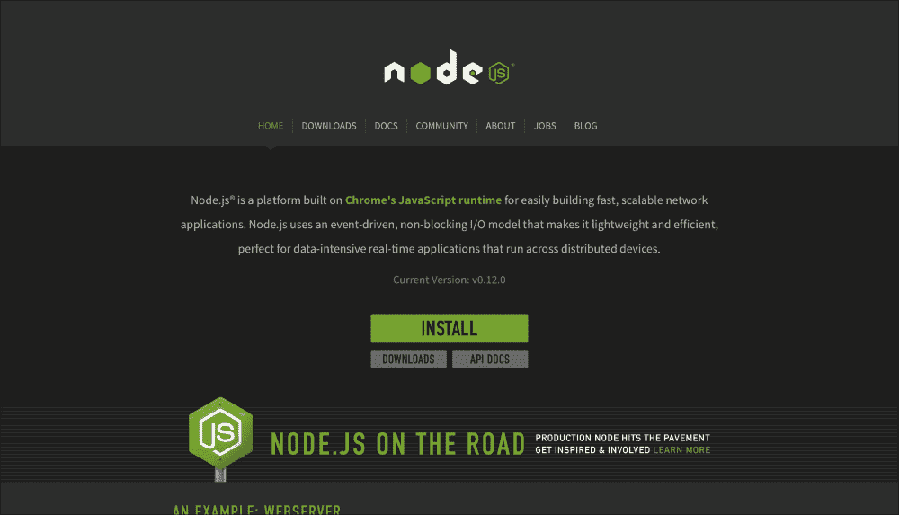
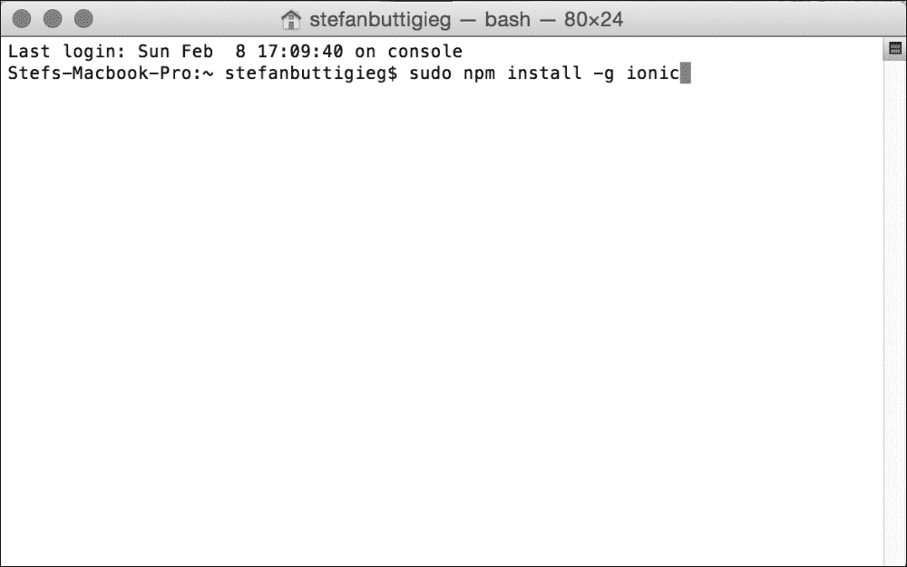
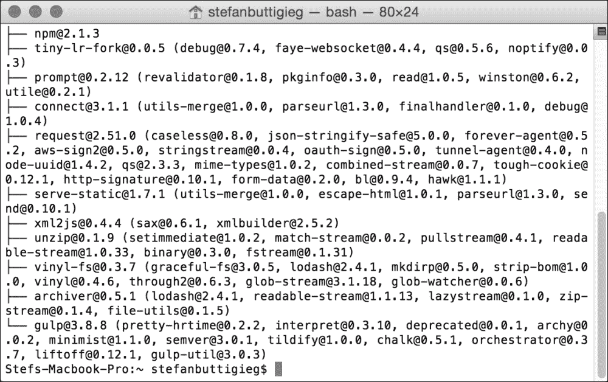
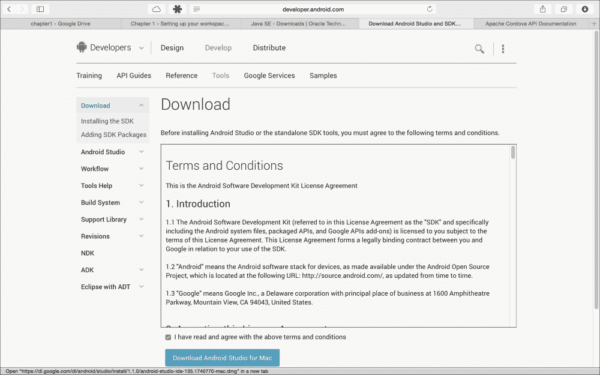
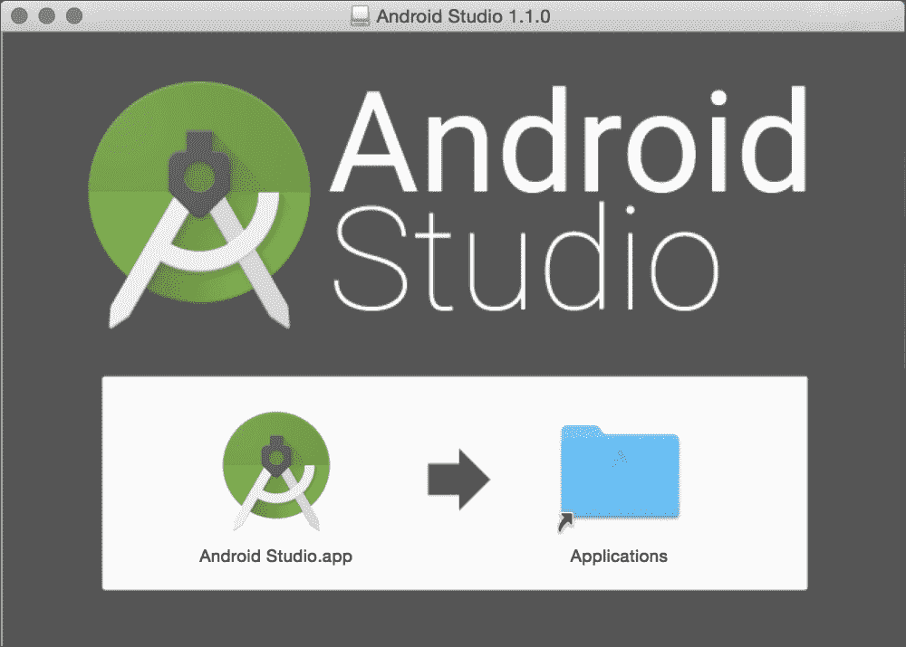
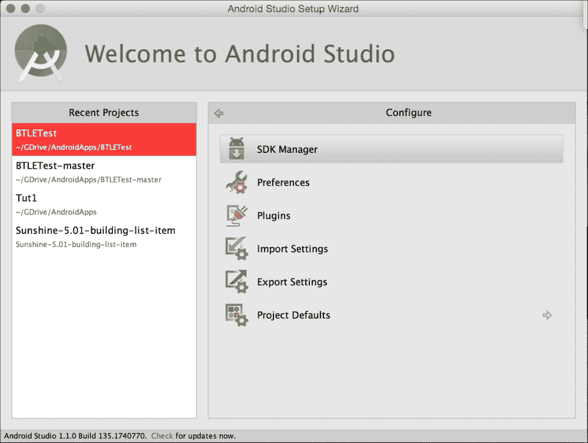
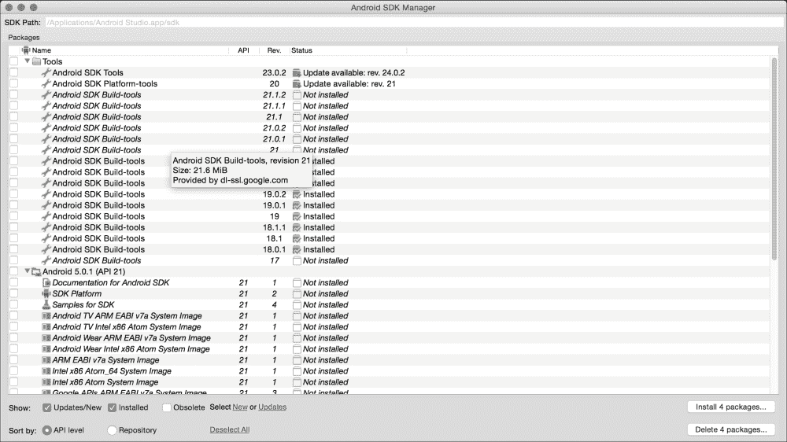

# 第一章。设置您的工作区

本书的总体目标是为您提供构建现代跨平台解决方案所需的工具和知识，以便有效地满足用户的需求。在本章中，我们将专注于工具本身，向您展示如何启动开发环境，以解决本书剩余部分中的挑战。我们还将简要介绍每个工具，以便让您了解它们为什么适合您的工具链。如果目前有任何不清楚的细节，不要担心。我们将在书的相关部分深入探讨每个工具的所有您需要了解的内容。

阅读完本章后，您将知道如何安装、配置和使用本书中将使用的基本软件组件。您还将对为现代应用程序开发选择这些工具有很好的理解。

# Node.js 后端

现代应用程序有一些要求，这些要求不能由应用程序本身提供，例如中央数据存储、通信路由和用户管理。为了提供这些服务，应用程序依赖于一个称为后端的外部软件组件。后端将在一个或多个远程服务器上执行，监听来自运行应用程序的设备的网络请求，并为它们提供请求所需的服务。

我们在本书中将使用的后端是 Node.js，它在其类别中是一个强大但奇特的存在。在撰写本书时，Node.js 是唯一几乎完全用 JavaScript 编写的主要后端，而实际上 JavaScript 是一种前端脚本语言。Node.js 的创建者希望有一个后端可以尽可能无缝地与 JavaScript 编写的应用程序集成，而 Node.js 就是最好的选择。此外，Node.js 以可靠和高性能而闻名。

在架构方面，Node.js 高度模块化，并且从头开始设计为可通过插件或软件包进行扩展。Node.js 自带其自己的软件包管理系统**Node Package Manager**（**NPM**），通过它您可以轻松地为您的项目安装、移除和管理软件包。您将在本章后面看到如何使用 NPM 来安装其他必要的组件。

# 在不同系统上安装 Node.js

Node.js 以一组 JavaScript 库的形式交付，执行在围绕 Google V8 JavaScript 引擎构建的 C/C++运行时上。这两者对于大多数主要的**操作系统**（**OS**）来说是捆绑在一起的，我们将在接下来的部分中看到安装它的具体细节。

### 注意

Google V8 JavaScript Engine 是 Chrome 浏览器中使用的相同 JavaScript 引擎，专为速度和效率而构建。

## Windows

对于 Windows，有一个专用的 MSI 向导来安装 Node.js，可以从项目的官方网站下载。要这样做，转到主页，导航到**下载**，然后选择**Windows 安装程序**。下载完成后，运行 MSI 向导，按照步骤选择安装选项，并完成安装。请记住，您需要重新启动系统以使更改生效。

## Linux

大多数主要的 Linux 发行版都通过其自己的软件包管理系统提供了方便的 Node.js 安装。然而，重要的是要记住，对于许多发行版来说，**Node Package Manager**（**NPM**）不会与主要的 Node.js 软件包捆绑在一起。相反，它是作为一个单独的软件包提供的。我们将在接下来的部分中展示如何安装两者。

## Ubuntu/Debian

打开终端并输入`sudo apt-get update`，以确保您拥有最新的软件包列表。之后，输入`apt-get install nodejsnpm`以一举安装 Node.js 和 NPM。

## Fedora/RHEL/CentOS

在 Fedora 18 或更高版本上，打开终端并输入`sudo yum install nodejsnpm`。系统将为您完成全部设置。

如果您正在运行 RHEL 或 CentOS，您需要启用可选的 EPEL 存储库。这可以与安装过程一起完成，因此在升级存储库时不需要再次执行，通过发出`sudo yum install nodejsnpm --enablerepo=epel`命令。

## 验证您的安装

现在我们已经完成了安装，让我们进行一次健全性检查，确保一切都按预期工作。为此，我们可以使用 Node.js shell，这是一个用于执行 JavaScript 代码的交互式运行时环境。要打开它，首先打开终端，然后向其发出以下命令：

```js
node

```

这将启动解释器，它将显示为一个 shell，输入行以`>`符号开头。一旦进入其中，输入以下内容：

```js
console.log("Hello world!);

```

然后按*Enter*。**Hello world!**短语应该出现在下一行。恭喜，您的系统现在已经设置好运行 Node.js！

## Mac OS X

对于 OS X，您可以通过访问[www.nodejs.org](http://www.nodejs.org)，转到**下载**，并选择**Mac OS X Installer**选项来找到一个准备好安装的 PKG 文件。否则，您可以单击**安装**，您的软件包文件将自动下载：



下载文件后，运行它并按照屏幕上的说明操作。建议您保留所有默认设置，除非您有充分的理由更改与您特定机器相关的内容。

## 验证您的安装

安装完成后，打开终端并通过以下命令启动 Node.js shell：

```js
node

```

这将启动交互式的 node shell，您可以在其中执行 JavaScript 代码。为了确保一切正常工作，请尝试向解释器发出以下命令：

```js
console.log("hello world!");

```

按下*Enter*键后，**hello world!**短语将出现在屏幕上。恭喜，Node.js 已经设置好，可以使用了！

# 为 Mac OS X 设置 Ionic 框架和 Cordova

在 Mac 上安装 Node.js 后，继续打开命令行应用程序并输入以下命令：

```js
$ sudonpm install -g ionic

```

输入此命令后，将提示您输入密码，如下截图所示：



如果您已经在 OS X 上设置了`npm`的权限，您可以使用以下命令安装 Ionic：

```js
$ npm install -g ionic

```

前面的命令行应该产生以下输出：



在 OS X 上安装 Cordova 与安装 Ionic 非常相似。您可以运行以下命令来安装 Cordova：

```js
$ sudonpm install -g cordova

```

# 在 Windows 上设置 Ionic 框架和 Cordova

一旦您安装了 Node.js，在 Windows 机器上安装 Ionic。其余步骤应该很简单。

打开命令提示符，并通过运行以下命令检查是否已安装`npm`：

```js
npm

```

一旦您确保已成功安装了`npm`，您可以继续运行以下命令：

```js
npm install -g ionic

```

此步骤应该产生一个输出，显示您已成功安装了 Ionic。

为了安装 Cordova，您也可以使用`npm`并运行以下命令：

```js
npm install -g cordova

```

一旦您收到成功的输出，您可以继续开始设置平台依赖项。

### 注意

Windows 的实验性设置：

在 Windows 上，您将有机会设置 Vagrant 软件包，这是在您的 Windows 机器上安装 Ionic 的一站式商店。这可以在[`github.com/driftyco/ionic`](https://github.com/driftyco/ionic)- box 上访问。

## 设置平台依赖项

要设置平台依赖项，您需要安装 Java，这在下一节中有解释。

### 安装 Java

如果您尚未安装 Java，或者您的版本低于 6.0，请前往[`j.mp/javadevkit-download`](http://j.mp/javadevkit-download)安装 Java JDK，并选择适合您的版本。

这些项目的主要建议是安装 JDK 6.0 或更高版本。

选择适合您操作系统的 JDK。在基于英特尔的 Mac 上，您可以使用以下有用的表格来检查您的 Mac 是 32 位还是 64 位操作系统。

您可以通过单击屏幕左上角的苹果图标，然后单击**关于我的 Mac**来检查**处理器名称**：

| 处理器名称 | 32 位或 64 位 |
| --- | --- |
| 英特尔酷睿 Solo | 32 位 |
| 英特尔酷睿双核 | 32 位 |
| 英特尔酷睿 2 双核 | 64 位 |
| 英特尔四核至强 | 64 位 |
| 双核英特尔至强 | 64 位 |
| 四核英特尔至强至强 | 64 位 |
| 酷睿 i3 | 64 位 |
| 酷睿 i5 | 64 位 |
| 酷睿 i7 | 64 位 |

在 Windows 的情况下，如果您的计算机是在过去几年内购买的，您应该选择 x64（64 位）版本。

# 为 Android、Mac 和 Windows 设置 Android Studio

要为 Android、Mac 和 Windows 设置 Android Studio，请按照以下步骤进行：

1.  访问 Android 开发者网站，网址为[`developer.android.com`](http://developer.android.com)。

1.  单击**Android Studio**，您将被引导到首页。您的操作系统版本将被自动检测：

1.  接受软件使用协议的条款和条件，然后点击**下载**：

1.  对于 Mac，双击下载的文件，按照提示操作，然后将 Android Studio 图标拖入**应用程序**文件夹中：

1.  对于 Windows，打开下载的文件，然后按照**Android Studio 设置** **向导**完成安装。

# 设置 Android 软件开发工具包

随着 Android Studio 的推出，设置 Android**软件开发工具包**（**SDK**）的过程得到了很大改善，因为许多软件包都预装在 Android Studio 安装包中。作为准备开始我们的 Android 项目的一部分，了解如何在 Android Studio 中安装（甚至卸载）SDK 将非常有帮助。

有多种方式可以访问 SDK 管理器。可以从 Android Studio 的主工具栏中进行：


否则，可以从**开始**菜单中访问**配置**—**SDK 管理器**：



这是 SDK 管理器的外观。如果您需要安装软件包，您需要选中特定软件包的标记，然后单击**安装软件包**，最后接受许可证：



# 为开发设置您的物理 Android 设备

以下是启用 Android 设备开发所需采取的三个主要步骤：

1.  在您特定的 Android 设备上启用**开发者选项**

1.  启用**USB 调试**

1.  通过安装 IDE 为您的计算机提供必要的信任凭据，通过安全 USB 调试。 (Android 4.4.2 设备)

## 启用开发者选项

根据您的设备，这可能会有所不同，但是从 Android 4.2 及更高版本开始，默认情况下**开发者选项**屏幕是隐藏的。

要启用它，请转到**设置** | **关于手机**，然后点击**版本号**七次。当您返回到上一个屏幕时，您会发现**开发者选项**已启用。

## 启用 USB 调试

**USB 调试**使 IDE 能够通过 USB 端口与设备通信。在启用**开发者选项**后，可以激活此功能，方法是勾选**USB 调试**，路径如下：

**设置**—**开发者选项**—**调试**—**USB 调试**

## 信任使用安全 USB 调试（Android 4.4.2 设备）安装 IDE 的计算机

在设备之间可以流动任何东西之前，您必须在手机或平板电脑上接受 RSA 密钥，通过**Android 调试桥**（**ADB**）进行连接。这是通过通过 USB 将设备连接到计算机来完成的，这将触发一个名为**启用 USB 调试？**的通知。

勾选**始终允许此** **计算机**并单击**确定**。

# 在 Windows 7 及更高版本上设置环境变量

使用 Ionic 和 Cordova 构建 Android 应用程序可能需要在 Windows 上修改**PATH**环境。可以通过以下步骤完成：

1.  右键单击**我的电脑**，然后单击**属性**。

1.  在左侧的栏中单击**高级系统设置**。

1.  在生成的对话框中，选择**环境变量**。

1.  选择**PATH**变量，然后单击**编辑**。

1.  根据您安装 SDK 的位置，将以下内容追加到**PATH**中：

```js
;C:\Development\adt-bundle\sdk\platform-tools;C:\Deve
lopment\adt-bundle\sdk\tools

```

# 在 Mac OS X 上为 iOS 设置环境变量

为 iOS 开发需要从运行 Mac OS X 的机器进行开发。目前，无法从 Windows 开发 iOS 应用程序。在以下步骤中，我们将概述如何开始开发 iOS 的 Ionic 应用程序。

## 安装 iOS SDK

以下是两种可用于下载 Xcode 的方法：

+   从 App Store 中，在应用程序中搜索**Xcode**

+   可在 Apple Developer Downloads 上找到，这需要您注册为 Apple 开发者。

命令行工具已集成在 Xcode 中。以前是单独安装的。下载并安装 Xcode 后，您就可以准备好从具有 Mac OS X 的机器处理 iOS 项目了。

# MongoDB

为了存储与您的应用程序和用户相关的数据，您的服务器将需要一个数据库——一个专门用于数据存储和检索的软件。

数据库有许多变种。在本书中，我们关注的是**NoSQL**数据库，因为它们不使用传统的基于表的 SQL 数据访问架构，而是使用更知名的关系数据库（如 Oracle、MySQL 和 PostgreSQL）所使用的。NoSQL 数据库在设计和功能上非常新颖，非常适合解决现代应用程序开发中可能遇到的挑战。

本书中将使用的 NoSQL 数据库是 MongoDB（通常缩写为 MDB 或简称 Mongo）。MongoDB 是一个面向文档的数据库，它将数据存储在几乎与标准 JSON 格式完全相同的数据结构中。

让我们看看如何安装和运行 MongoDB。如果您使用过更传统的数据库系统，您可能会对其易用性感到惊讶。

## 在不同操作系统上安装 MongoDB

MongoDB 以软件包的形式提供给大多数主要操作系统和版本。

### Windows

MongoDB 附带了完整的 MSI，可用于在 Windows 系统上安装。要下载它，请转到项目的官方网站[www.mongodb.org](http://www.mongodb.org)，导航到**下载**，然后选择**Windows**选项卡。您将被提供以下三种下载选择：

+   **Windows 64 位 R2+**：如果您正在运行 Windows Server 2008、64 位 Windows 7 或更新版本的 Windows

+   **Windows 32 位**：如果您使用的是新于 Windows Vista 的 32 位 Windows 安装

+   **Windows 64 位旧版**：如果您使用的是 Windows Vista 64 位、Windows Server 2003 或 Windows Server 2008。

### 注意

MongoDB 根本无法在 Windows XP 上运行。

下载 MSI 后，以管理员权限运行它以执行安装。安装向导将为您提供 MongoDB 将安装的默认位置—`C:/mongodb/`。如果需要，您可以更改此位置，但建议您保持不变，因为我们将假定这是 MongoDB 在本书的其余部分中所在的位置。

安装完成后，下一步是配置一个数据目录，MongoDB 可以在其中存储我们将输入的数据。此目录的默认位置是`/data/db`。在我们首次启动 MongoDB 实例之前，我们需要确保此目录存在并可写。因此，请以管理员权限启动命令提示符，并发出`md/data/db`命令。完成后，我们可以启动数据库服务器本身。要这样做，请保持在命令提示符中，并发出以下命令：

```js
C:/mongodb/bin/mongodb.exe

```

您应该收到确认消息，MongoDB 现在正在运行并正在等待连接。一切都准备就绪！

### Linux

在 Linux 上，您会发现大多数主要发行版上都预装了 MongoDB。但是，我们强烈建议您使用项目自己的存储库，以确保您始终可以访问最新的安全性和稳定性更新。

### Ubuntu

首先，您需要启用官方的 MongoDB 存储库。要这样做，请打开终端并按以下方式导入项目的公共**GNU 隐私保护**（**GPG**）密钥：

```js
sudo apt-key adv --keyserverhkp://keyserver.ubuntu.com:80 --recv7F0CEB10

```

完成此操作后，通过发出以下命令为存储库本身创建一个列表：

```js
echo 'deb http://downloads-distro.mongodb.org/repo/ubuntu-upstart dist10gen' | sudo tee /etc/apt/sources.list.d/mongodb.list

```

您的存储库列表现在已激活。让**高级软件包工具**（**APT**）意识到它以安装 MongoDB，如下所示：

```js
sudo apt-get update

```

最后，通过执行以下命令安装 MongoDB：

```js
sudo apt-get install mongodb-org

```

### Fedora/RHEL/CentOS

我们的首要任务是启用官方的 MongoDB 存储库。要这样做，首先确保您已安装了 nano 文本编辑器，方法是打开终端并执行以下命令：

```js
sudo yum install nano

```

完成此操作后，通过发出以下命令添加存储库：

```js
sudonano /etc/yum.repos.d/mongodb.repo

```

Nano 将打开一个新的空白文本文件。将以下内容复制并粘贴到文件中：

```js
[mongodb]
name=MongoDB Repository
baseurl=http://downloads-distro.mongodb.org/repo/redhat/os/x86_64/
gpgcheck=0
enabled=1

```

按下*Ctrl+O*，然后按*Enter*键保存并关闭文件。然后按*Ctrl+X*。

最后，通过执行以下命令进行安装：

```js
sudo yum install mongodb-org

```

## 启动 MongoDB

安装 MongoDB 后，您需要将 MongoDB 作为服务启动以使其运行。要这样做（在之前提到的所有发行版上），打开终端并运行以下命令：

```js
sudo service mongodb start

```

重要的是，如果您正在运行 SELinux，您必须确保它允许 MongoDB 访问其默认端口。要这样做，请在发出上述命令之前执行以下操作：

```js
sudosemanage port -a -t mongod_port_t -p tcp 27017

```

### Mac OS X

在 OS X 上安装 MongoDB 并保持最新的最简单方法是使用**Homebrew**软件包管理器。即使我们只是在这里使用它来安装 MongoDB，您在完成本书后很可能会发现它对于安装其他软件包也很有用。

安装 Homebrew 很简单；只需打开终端并执行以下命令：

```js
ruby -e "$(curl -fsSL https://raw.githubusercontent.com/Homebrew/install/master/install)"

```

安装完成后，请确保 Homebrew 软件包数据库是最新的，方法如下：

```js
brew update

```

最后，只需发出以下命令安装 MongoDB：

```js
brew install mongodb

```

安装完成后，我们需要定义一个数据目录，以便为 MongoDB 提供存储数据的位置。默认情况下，此目录将位于`/data/db`。因此，除非您指定其他内容，否则需要确保此目录存在，并且由运行 MongoDB 实例的用户具有可写和可读权限。例如，如果在您的系统上运行 MongoDB 的用户是*john*，您将需要执行以下命令：

```js
sudomkdir -p /data/db
sudochmod 0755 /data/dbsudochownmongod:mongod /data/db

```

现在，这一步已经完成，是时候启动 MongoDB 了。要这样做，请确保您已经以*john*登录，打开终端，然后简单地执行以下命令：

```js
mongodb

```

就是这样！您应该收到一个通知，告诉您 MongoDB 已经启动并正在等待连接。您的实例已经准备就绪！

#### 连接到 MongoDB

为了从 MongoDB 实例中读取和写入，我们首先需要连接到它。实际上，MongoDB 本身就像一个服务器。它通过网络端口公开其功能，客户端可以通过本地机器或甚至通过互联网连接到它。

### 注意

由于这个功能默认情况下是禁用的，因为这是一个糟糕的安全实践，它将需要对 MongoDB 运行的操作系统进行特殊配置。我们不会讨论这个功能，因为它超出了本书的范围，但我们会参考 MongoDB 文档，其中有几个有用的示例，说明如何在各种操作系统上实现它。

要连接到 MongoDB 实例，您至少需要以下信息：

+   **实例的 IP 地址**：如果您正在访问本地机器上的实例，这将默认为*本地主机*。

+   **MongoDB 正在监听的端口**：除非您配置了自定义值，否则这将始终默认为端口*27017*。

+   **您要连接的数据库**：不要将其与 MongoDB 实例本身混淆。每个 MongoDB 实例可以包含任意数量的数据库，每个数据库属于不同的用户。实例只是管理对它们的访问。

或者，您可能还需要以下内容：

+   一个用户名及其关联的密码，以授予您访问实例和其中您被授权与之交互的任何数据库的权限。

验证 MongoDB 是否按预期工作的一个非常简单的方法是使用 MongoDB shell，这是一个随 MongoDB 本身安装的工具，使用我们之前描述的方法。您如何访问 shell 取决于您的操作系统。我将在下一节中展示每种方法，然后给出如何使用 shell 本身的示例，因为这在所有平台上都是相同的。

### Windows

首先，确保 MongoDB 正在运行，按照之前概述的过程进行。之后，在命令提示符中输入以下命令：

```js
C:\mongodb\bin\mongo.exe

```

### Linux 和 OS X

首先，确保 MongoDB 正在运行。然后，打开一个终端并输入以下命令：

```js
mongo

```

现在我们的 shell 正在运行，让我们通过创建一个数据库并向其中添加一些数据来验证一切是否正常。

要创建一个数据库，请在 shell 中输入以下命令：

```js
use Fruits

```

这将创建一个名为`Fruits`的数据库，我们可以立即开始向其中添加数据。（什么，您期望有更多开销吗？在 MongoDB 中没有！）

我们不会向我们的数据库添加一个集合。集合只是一组数据条目，根据某种逻辑特征进行分组。例如，假设我们想要一个有嚼劲的水果集合。然后，我们输入以下命令：

```js
db.createCollection("Chewy")

```

Shell 应该会回应`{ "ok" : 1 }`的 JSON 响应，告诉我们一切都进行得很顺利。现在，让我们向我们的集合中添加一些有嚼劲的水果，如下所示：

```js
db.Chewy.insert({"name" : "pear"});
db.Chewy.insert({"name" : "apple"});

```

即使前面的代码命名使得直观地清楚了发生了什么，如果您还不完全理解所有细节，也不用担心。我们会在适当的时候讲到这些。

最后，让我们让 MongoDB 显示我们存储的有嚼劲的水果。输入以下命令：

```js
db.Chewy.find();

```

Shell 将会回应类似以下内容：

```js
{ "_id" : ObjectId("54eb3e6043adbad374577df9"), "name" : "apple" }
{ "_id" : ObjectId("54eb4036cdc928dc6a32f686"), "name" : "pear" }

```

在您的系统上，`_id`号码会不同，但您会发现名称是相同的。所有水果都在我们想要的位置。

恭喜，您现在拥有一个完全可用的 MongoDB 设置，准备好投入使用！

# 总结

到目前为止，你可能已经注意到我们为工具链选择的所有组件之间的联系；它们都基于 JavaScript。这使我们能够使用一种语言从头到尾编写所有逻辑，而不是为不同的组件使用不同的语言（客户端使用 Objective-C 或 Java，服务器使用 PHP，数据库使用 SQL，或者其他混合语言）。正如你将在本书的其余部分中看到的，这将使我们更容易编写简洁、专注和易于理解的代码。

一旦你完成了所有前面的步骤，我可以安全地假设你已经具备了必要的工具包，并且准备好应对即将到来的章节，在那里我们将有机会创建我们的第一个 Ionic 应用，并使其在 Android 和 iOS 设备上运行。

一旦你完成了设置工作区，我建议你花一些时间阅读 Apache Cordova 的文档，特别是与不同平台依赖相关的文档。

在下一章中，我们将进行进一步的准备工作，并配置 MongoDB 作为我们 Ionic 应用的后端的一部分。
