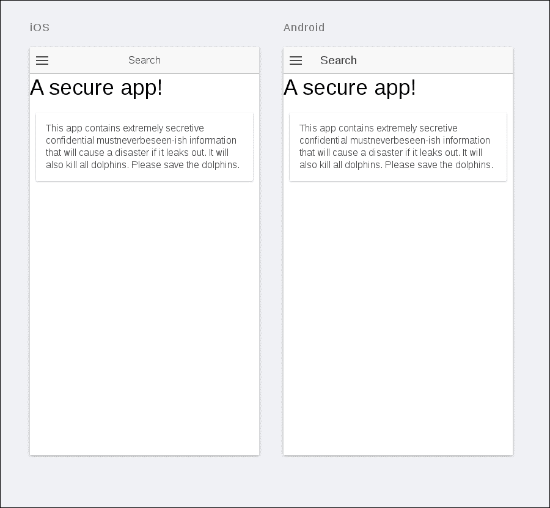
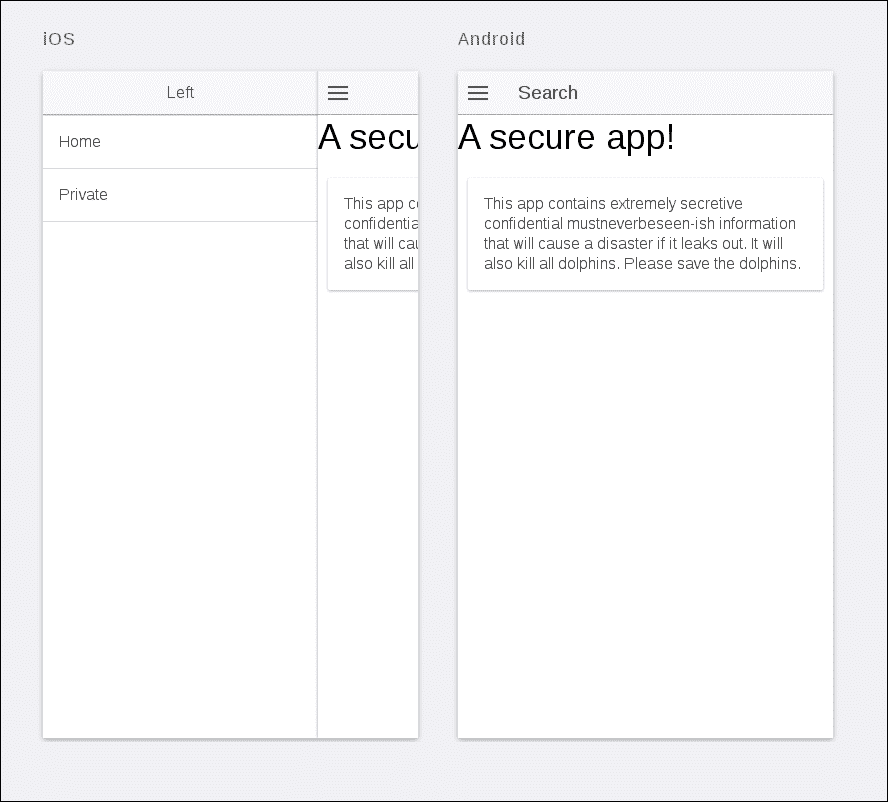

# 第十一章 安全工作

用户管理和各种形式的有条件访问在现代应用程序中几乎无处不在，现代用户期望能够使用他们已有的帐户登录或注册并使用新帐户。此外，他们期望他们在其帐户下提供的数据将保持安全，并符合适用的隐私立法。

在本章中，我们将探讨如何向我们的 Ionic 应用程序添加安全性，以满足大部分这些需求。我们将首先解释 Ionic 中视图之间的路由工作原理，以及如何保护对个别路由的访问。最后，我们将提供一些进一步阅读的指引，包括**OAuth**等高级身份验证概念。

# 客户端安全概述

我们将首先简要讨论一些涉及保护客户端应用程序的核心概念，比如我们在本书中开发的应用程序。

## 客户端安全是一种便利

关于客户端安全，你需要知道的第一件事是，实际上并不存在所谓的客户端安全。你向用户提供的应用程序，无论是原生的还是混合的，都面临着被篡改、逆向工程、破解以及其他一些基本上损害其完整性的可能性。因此，你永远无法真正信任客户端应用程序中的重要安全部分，这些部分最终需要保护用户的私人信息，并确保未经授权的用户无法访问他们不应该访问的数据。特别是，这些数据是私人的，其他用户无法访问。事实上，许多大公司在安全失败方面遭受的最严重打击之一，是由于用户数据被泄露给未经授权的第三方。

然而，你可以提供足够好的安全性，以满足应用程序的预期使用。例如，即使它不能保证完全安全，你仍然可以尝试通过使用更先进的安全措施，如某些设备上的指纹扫描仪，或者在本地数据上使用加密并强制用户选择非常强大的加密密钥，来阻止较不严重的侵犯隐私者试图从应用程序中获取个人数据。

客户端安全不是最终保护用户数据的措施，当然不应该阻止你使用它。事实上，客户端安全在我们构建应用程序的方式方面带来了许多好处。重要的是，它使我们能够创建丰富的用户体验，其中用户可以基于其身份验证状态来限制可以访问的应用程序部分。

## 客户端安全的基本组件

虽然各个系统和实现可能会有所不同，但几乎所有地方都在使用客户端安全的一些基本概念。以下是其中一些概念：

+   身份验证令牌：这些是在系统中唯一标识经过身份验证的用户的数据。它们由系统本身或关联的受信任系统授予，作为对用户向系统提供合法身份验证信息的响应。例如，这些信息可以是用户名-密码对、指纹/虹膜扫描，或其他受信任的身份验证手段。

+   **安全本地存储**：为了提高用户体验，我们绝对不希望强迫用户每次使用应用程序时都要进行身份验证。想象一下，如果每次重新启动设备时都必须重新登录到每个帐户，那将是一种什么情况！为了解决这个问题，我们使用某种安全存储，将在上一步中存储的访问令牌保留下来。然后应用程序只需从此存储中提取令牌，并使用它来执行与服务器的经过身份验证的通信。安全本地存储这个术语意味着一些必要的安全措施，关于如何存储和检索访问令牌。这是必要的，因为一个被泄露的访问令牌将允许未经授权的一方伪装成合法用户。在大多数移动设备上，都有本地存储的原生功能，安全性由驻留操作系统处理。在其他情况下，开发人员可以选择使用其他解决方案，比如需要一些外部机制来解锁系统的加密文件存储。

+   **安全通信**：访问令牌在存储中可能会被泄露。此外，在传输过程中它们也容易被盗窃。例如，各种类型的中间人攻击，其中攻击者伪装成网络连接的合法端点，可以用来拦截访问令牌以窃取用户的访问权限。在大多数情况下，安全通信不是开发人员需要手动实现的。通过 HTTPS 加密连接越来越成为互联网上的标准通信方式，并且它们为网络端点上的数据提供了非常强大的安全性。同时，几乎所有主要操作系统的网络堆栈都支持它，包括固定和移动设备。

# 构建一个安全的应用程序

现在我们对客户端安全性及其缺点有了更好的理解，让我们通过开发一个具有以下功能的应用程序来实践它：

+   有一个公共主屏幕，可以被使用应用程序的每个人看到

+   有一个私人部分，显示用户的一些个人信息，只有经过身份验证的用户才能访问

+   有用户认证的逻辑通过一个简单的登录表单

+   用户授权和认证的逻辑用于访问应用程序的私有部分

## 开始

让我们从配置基本项目结构开始。如果你已经读到这一点，现在应该是你的第二天性！转到所需的项目目录，然后只需从终端或命令行运行以下命令：

```js
ionic start secureApp

```

这将创建一个基本的空白 Ionic 应用程序。让我们为其添加一些基本结构。我们首先要做的是添加两个基本的导航状态——主页和公共页。转到您的应用程序的`www/js`文件夹，并确保`app.js`具有以下内容：

```js
angular.module('secureApp', [])
.run(function ($ionicPlatform) {
  $ionicPlatform.ready(function () {
    // Hide the accessory bar by default (remove this to show
    // the accessory bar above the keyboard for form inputs)
    if (window.cordova && window.cordova.plugins.Keyboard) {
      cordova.plugins.Keyboard.hideKeyboardAccessoryBar(true);
    }
    if (window.StatusBar) {
      // org.apache.cordova.statusbar required
      StatusBar.styleDefault();
    }
  });
})
.config(function ($stateProvider, $urlRouterProvider) {
  $stateProvider
    .state('app', {
       url: "/app",
       abstract: true,
       templateUrl: "templates/menu.html"
    })
    .state('app.home', {
      url: "/home",
      views: {
        'menuContent': {
          templateUrl: "templates/home.html"
        }
      }
    })
    .state('app.private', {
      url: "/private",
      views: {
        'menuContent': {
          templateUrl: "templates/private.html"
        }
      }
    });
    // if none of the above states are matched, use this as the fallback
    $urlRouterProvider.otherwise('/app/home');
  });
```

这将为应用程序设置必要的导航状态，在这一点上非常少！但是，我们仍然需要添加必要的模板。在`www`目录中，创建一个`templates`目录，并将以下三个文件添加到路径`www/templates/menu.html`：

```js
<ion-side-menus enable-menu-with-back-views="false">
  <ion-side-menu-content>
    <ion-nav-bar class="bar-stable">
      <ion-nav-back-button></ion-nav-back-button>
        <ion-nav-buttons side="left">
          <button class="button button-icon button-clear ion-navicon"
          menu-toggle="left">
          </button>
        </ion-nav-buttons>
      </ion-nav-bar>
      <ion-nav-view name="menuContent"></ion-nav-view>
      </ion-side-menu-content>
      <ion-side-menu side="left">
        <ion-header-bar class="bar-stable">
          <h1 class="title">Left</h1>
        </ion-header-bar>
        <ion-content>
          <ion-list>
            <ion-item menu-close
            href="#/app/home">
              Home
            </ion-item>
            <ion-item menu-close
            href="#/app/private">
              Private
            </ion-item>
          </ion-list>
        </ion-content>
      </ion-side-menu>
    </ion-side-menus>
```

以下代码片段代表了路径`www/templates/home.html`上的`home.html`模板：

```js
<ion-view view-title="Search">
  <ion-content class="has-header">
    <h1>A secure app!</h1>
    <div class="card">
      <div class="item item-text-wrap">
        This app contains extremely secretive confidential
        mustneverbeseen-ish information that will cause a
        disaster if it leaks out. It will also kill all
        dolphins. Please save the dolphins.
      </div>
    </div>
  </ion-content>
</ion-view>
```

以下代码片段代表了路径`www/templates/private.html`上的`private.html`模板：

```js
<ion-view view-title="Search">
  <ion-content class="has-header">
    <h1>Secret content!</h1>
    <div class="card">
      <div class="item item-text-wrap">
        You are authorized to see the grand secrets
        of the Universe!
      </div>
    </div>
  </ion-content>
</ion-view>
```

这就是我们基本设置所需的全部。您可以通过在目录的`root`文件夹中的终端或命令行中运行以下命令来验证它：

```js
Ionic serve -l

```

你会看到以下内容：



确实是一个严重的警告！让我们看看我们是否能绕过它。如果您点击应用程序屏幕左上角的应用程序图标（无论是 Android 还是 iOS），您可以打开我们在`www/templates/menu.html`文件中创建的导航抽屉：



如果您从列表中选择**私人**链接，您会期望该应用程序阻止我们访问可能会彻底结束 Flipper 的信息，但遗憾的是：


不好！为了解决这个问题，我们需要找到一种方法来阻止用户访问某些内容，除非他们经过身份验证，即使他们以某种方式进入内容，也没有有用的数据供他们查找。

## 基本身份验证服务

向我们的应用程序添加基本安全性的第一步是创建一个身份验证服务，该服务可用于执行身份验证请求。我们希望此服务提供以下功能：

+   它应该能够登录用户。此功能应该接受用户名和密码，并且如果它们匹配，则返回一个身份验证令牌，用户可以使用它来验证其身份。

+   它应该能够检查用户当前是否在应用程序中进行了身份验证。每当我们希望检查用户是否应该访问系统时，这将是必要的。

让我们继续构建这样一个服务。在`www/js`文件夹中添加`services.js`文件，并插入以下内容：

```js
angular.module('secureApp.services', [])
.factory('AuthFactory', function ($scope, $timeout) {
  var currentUser = null;
  var login = function (username, password) {
    return null;
  };
  var isAuthenticated = function () {
    return false;
  };
  var getCurrent = function () {
    return isAuthenticated() ? currentUser : null;
  };
  return {
    login: login,
    isAuthenticated: isAuthenticated,
    getCurrent: getCurrent
  }
});
```

这给了我们一个可以使用的框架。让我们逐步开始添加一些内容。

### 登录功能

登录功能的目的只是接受用户名和密码，并将它们与现有的用户名和密码对列表进行检查。为了使其工作，我们首先需要向我们的服务添加一些模拟数据（在现实生活中，您当然会从远程服务器拉取数据）。

继续确保`LoginFactory`包含以下内容：

```js
var validUsers = [
{
  firstName: 'Johanna',
  lastName: 'Doe',
  username: 'johnny',
  password: 'suchsecret'
},
{
  firstName: 'Jane',
  lastName: 'Doe',
  username: 'zo1337',
  password: 'muchhide'
},
{
  firstName: 'Mary',
  lastName: 'Doe',
  username: 'bl00dy',
  password: 'wow'
}
];
```

现在，我们只需要将以下内容添加到登录功能的主体中：

```js
var login = function (username, password) {
  var deferred = $q.defer();
  // We use timeout in order to simulate a roundtrip to a server,
  // which will be present in any realistic authentication scenario.
  $timeout(function () {
    // Clear any existing, cached user data before logging in
    currentUser = null;
    // See if we can find a matching username-password match
    validUsers.forEach(function (user) {
      if (user.username === username && user.password === password) {
        // If we have a match, cache it as the current user
        currentUser = user;
        deferred.resolve();
      }
    });
    // If no match could be found, reject the promise
    if (!currentUser) {
      deferred.reject();
    }
  }, 1000);
  // Return the promise to the caller
  return deferred.promise;
};
```

在这里，就身份验证而言，我们所做的实际上非常简单。我们只匹配`用户名`和`密码`与预定义数组。如果找到匹配项，我们会缓存匹配的用户并将其添加到`factories`上下文中。现在可以通过`getCurrent()`函数访问它。

## isAuthenticated 功能

此功能的目的是允许系统检查当前用户是否已登录。我们可以简单地根据成功登录事件中是否有缓存用户来实现它：

```js
var isAuthenticated = function () {
  return currentUser ? true : false;
};
```

### getCurrent 功能

这个功能很简单，它只是返回当前缓存的用户：

```js
var getCurrent = function () {
  return isAuthenticated() ? currentUser : null;
};
```

## 实施路由身份验证

现在我们有了一个可用的身份验证服务，让我们用它来保护世界的海豚，并封锁我们应用程序的私人部分。为此，首先确保`index.html`文件正确导入了新的服务，如下所示：

```js
<script src="img/services.js"></script>
```

接下来，修改`app.js`文件以导入该文件：

```js
angular.module('secureApp',
[
  'ionic',
  'secureApp.services',
])
```

现在，在`app.js`文件中，修改应用程序私人部分的路由`config`，使其看起来像以下代码：

```js
.state('app.private', {
  url: "/private",
  views: {
    'menuContent': {
    templateUrl: "templates/private.html",
    resolve: {
      isAuthenticated: function ($q, AuthFactory) {
        if (AuthFactory.isAuthenticated()) {
          return $q.when();
        } else {
          $timeout(function () {
          $state.go('app.home')
        },0);
        return $q.reject()
      }
    }
   }
});
```

这里发生了什么？要回答这个问题，考虑一下我们想要实现的目标。如果用户未经身份验证，我们希望将他们发送回主屏幕，直到他们登录。为了做到这一点，我们执行以下步骤：

1.  我们为转换到`app.private`状态添加了一个解析钩子。在路由器方面，这是一个必须在导航开始之前解决的函数。

1.  在这个钩子内，我们使用了之前定义的`AuthFactory.isAuthenticated`函数。但是，为了使`resolve`按预期工作，钩子的返回值需要是一个`promise`方法。因此，如果用户已登录，我们使用`$q`返回一个解析，如果他们没有登录，则返回一个拒绝事件。

1.  如果用户未登录，我们使用`$state`告诉路由器将控制重定向到主页。

最后，我们需要为应用程序添加一个实际的登录界面。为此，首先要在路径`www/js/controllers.js`中添加一个新文件来保存我们应用程序的`controllers`。确保该文件具有以下内容：

```js
angular.module('secureApp.controllers', ['secureApp.services'])
.controller('AppCtrl', function ($scope, $ionicModal, $timeout, AuthFactory) {
  // Form data for the login modal
  $scope.loginData = {};
  // Create the login modal that we will use later
  $ionicModal.fromTemplateUrl('templates/login.html', {
    scope: $scope
  }).then(function (modal) {
    $scope.modal = modal;
  });
  // Triggered in the login modal to close it
  $scope.closeLogin = function () {
    $scope.modal.hide();
  };
  // Open the login modal
  $scope.login = function () {
    $scope.modal.show();
  };
  // Perform the login action when the user submits the login form
  $scope.doLogin = function () {
    AuthFactory.login($scope.loginData.username, $scope.loginData.password)
    .then(function () {
      $scope.closeLogin();
    });
  };
});
```

渲染登录界面本身，添加一个模板到路径`www/templates/login.html`：

```js
<ion-modal-view>
  <ion-header-bar>
    <h1 class="title">Login</h1>
    <div class="buttons">
      <button class="button button-clear"
      ng-click="closeLogin()">
        Close
      </button>
    </div>
  </ion-header-bar>
  <ion-content>
    <form ng-submit="doLogin()">
      <div class="list">
        <label class="item item-input">
          <span class="input-label">
            Username
          </span>
          <input type="text"
          ng-model="loginData.username">
        </label>
        <label class="item item-input">
          <span class="input-label">
            Password
          </span>
          <input type="password"
          ng-model="loginData.password">
        </label>
        <label class="item">
          <button class="button button-block button-positive"
          type="submit">
            Log in
          </button>
        </label>
      </div>
    </form>
  </ion-content>
</ion-modal-view>
```

最后，通过确保应用程序加载我们新定义的控制器来将所有内容联系在一起。在`index.html`中加载它：

```js
<script src="img/controllers.js"></script>
```

接下来，确保它在`app.js`中列为依赖项：

```js
angular.module('secureApp',
[
  'ionic',
  'secureApp.services',
  'secureApp.controllers'
])
```

我们现在正在构建我们的应用程序。您可以通过自己运行它来尝试。尝试使用错误的凭据（根据我们定义的凭据）登录，以确信应用程序确实阻止用户去不该去的地方。

# 总结

在本章中，您对客户端身份验证的工作原理和基本限制有了基本的了解。您还看到了如何创建一个实现一些基本概念的基本应用程序，以便了解应用程序在实践中的工作方式。

在下一章中，您将学习如何通过应用程序设置网络套接字通信，以便订阅来自服务器的动态通知。
