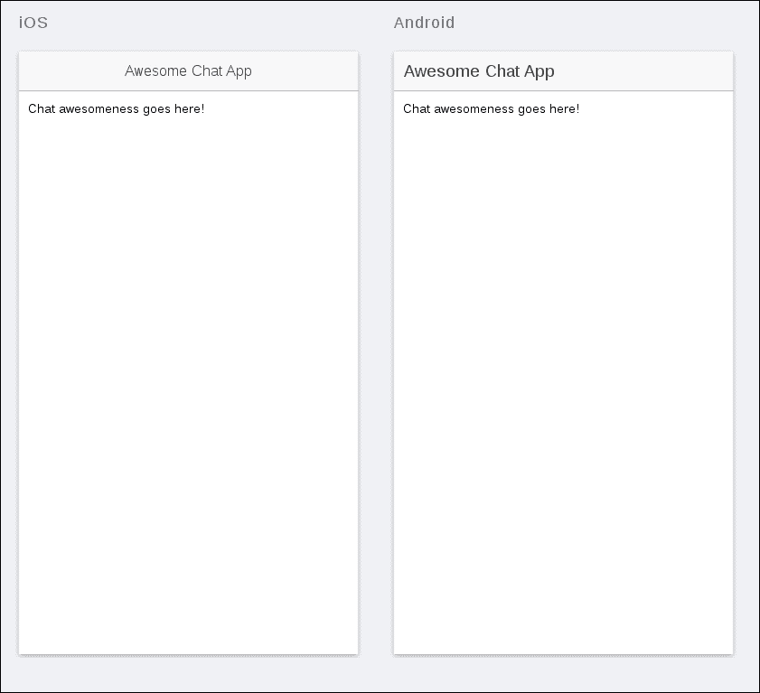
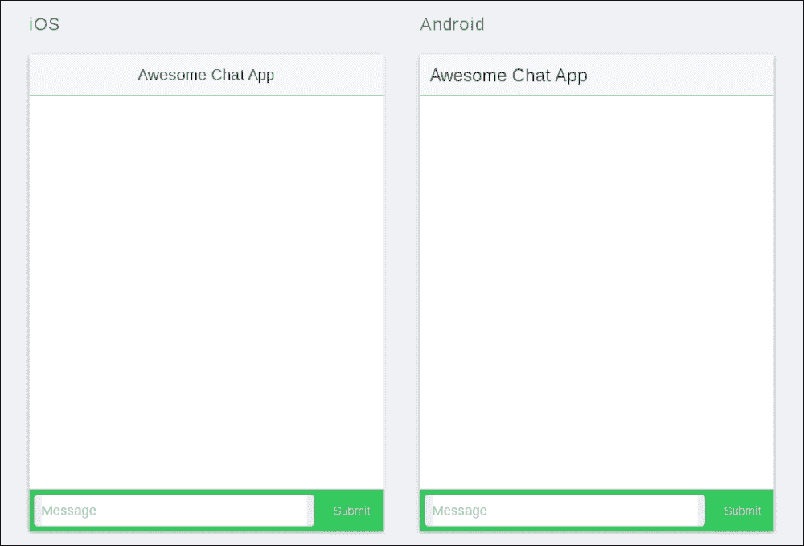
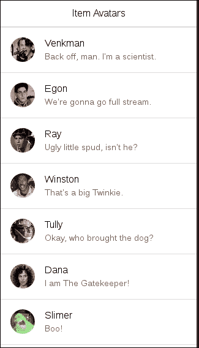
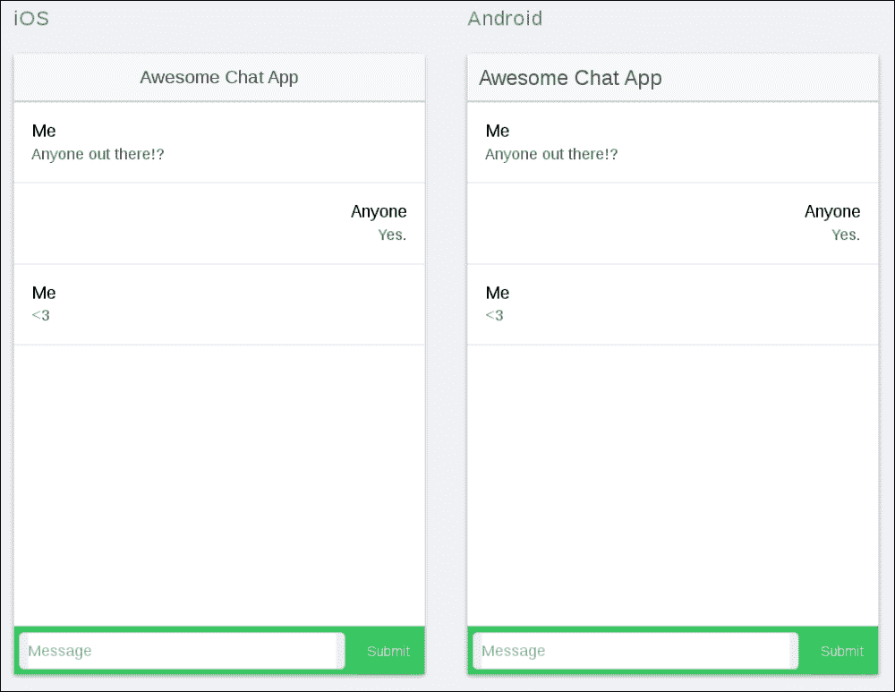

# 第十二章 实时数据处理

在今天的应用生态系统中，各种实时功能或多或少都成为了标配。聊天应用（以及现有应用的聊天功能）变得越来越普遍，推送通知将新闻和观点带给用户，而无需他们自己去寻找，等等。

在本章中，我们将看看如何将一些选择的实时功能整合到我们的 Ionic 应用中。我们将通过构建一个简单的聊天应用程序来实现这一点，该应用程序没有身份验证，至少两个人可以聚在一起谈论生活的奇迹。在这样做的过程中，我们将重新访问我们之前学到的关于 WebSockets 的知识，因为我们需要为此创建一个简单的服务器。

# 回顾 - WebSockets

在我们继续之前，让我们快速回顾一下我们之前讨论过的一个重要概念——WebSockets。

WebSockets 是一种标准化的互联网协议，允许在网络上直接进行服务器到客户端的通信。这在传统的客户端-服务器架构世界中相当不寻常，几乎所有的通信都是由客户端发起，服务器只是简单地响应这样的通信。

WebSockets 使得构建实时应用程序变得容易，因为服务器可以在其状态发生变化时动态地向连接的客户端推送新数据。这对于聊天应用程序来说是理想的，否则我们将不得不使用更加繁琐和资源消耗的方法，比如轮询，来近似达到相同的效果。

深入了解 WebSockets，请参考第五章，“实时数据和 WebSockets”，在那里我们深入讨论了它们。

# 了解情况

在本章中，我们将构建一个聊天应用程序，它让人不禁想起我们在第五章，“实时数据和 WebSockets”中看到的那个。当然，最大的区别是，这次我们的客户端将是一个 Ionic 应用，它将能够与同样连接到同一服务器的浏览器客户端完全交互。通过这样做，我们展示了构建几乎可以无缝地与使用相同服务器的其他平台上的应用程序交互的应用程序是多么容易。

## 我们需要什么

为了让我们的应用程序正常工作，我们需要：

+   一个既能接收消息又能通过 WebSockets 中继消息的服务器。

+   一个能够使用 WebSockets 连接到服务器并通过相同的协议发送、接收和处理消息的应用程序。所有发送的数据都应该以对用户有意义的方式呈现出来。

符合本书精神，我们当然会使用 Node.js 作为我们的服务器。为了为其添加 WebSocket 支持，我们将使用`socket.io`库，这是你在第六章，“介绍 Ionic”中已经看到的。

对于客户端，我们将使用标准的`socket.io`客户端库，这在第五章，“实时数据和 WebSockets”中已经看到了（这里有一个趋势？）。然而，我们将巧妙地利用它，以便在应用端顺利地运行。

让我们继续开始设置吧！

# 创建服务器

我们需要做的第一件事是创建一个 WebSocket 服务器，以在我们的客户端之间中继消息。找一个合适的项目文件夹，打开你的终端/命令行，并运行以下命令：

```js
npm init
```

这将创建基本的 Node.js 项目结构。你可以输入任何你认为合适的值：

```js
{
  "name": "ionic-chat-server",
  "version": "1.0.0",
  "description": "A websocket server for chatting.",
  "main": "server.js",
  "scripts": {
    "test": "echo \"Error: no test specified\" && exit 1"
  },
  "author": "csvan",
  "license": "MIT"
}
```

现在，让我们安装我们需要的依赖项。运行以下命令：

```js
npm install socket.io
```

这将安装`socket.io`，这是我们为了让服务器运行所需要的一切。

接下来，在当前文件夹中创建`server.js`文件，并向其中添加以下内容：

```js
var http = require('http');
var url = require('url');
var fs = require('fs');
var server = http.createServer(function (req, res) {
  var parsedUrl = url.parse(req.url, true);
  switch (parsedUrl.pathname) {
    case '/':
    // Read the file into memory and push it to the client
    fs.readFile('index.html', function (err, content) {
      if (err) {
        res.writeHead(500);
        res.end();
      }
      else {
        res.writeHead(200, {'Content-Type': 'text/html'});
        res.end(content, 'utf-8');
      }
    });
    break;
  }
});
// Connect the websocket handler to our server
var websocket = require('socket.io')(server);

// Create a handler for incoming websocket connections
websocket.on('UserConnectedEvent', function (socket) {
  console.log("New user connected");

  // Tell others a new user connected
  socket.broadcast.emit('UserConnectedEvent', null);

  // Bind event handler for incoming messages
  socket.on('MessageSentEvent', function (chatData) {
    console.log('Received new chat message');

    // By using the 'broadcast' connector, we will
    // send the message to everyone except the sender.
    socket.broadcast.emit('MessageReceivedEvent', chatData);
  });
});
server.listen(8080);
```

看起来很熟悉，不是吗？这几乎就是我们在第五章中开发的完全相同的服务器，*实时数据和 WebSockets*！它甚至有我们在那里构建的美丽现代的聊天 UI。我们需要做的就是提供它。为此，将`index.html`文件添加到当前文件夹，并添加以下内容：

```js
<!DOCTYPE html>
<html>
<head lang="en">
  <meta charset="UTF-8">
    <title>Socket.io chat application</title>
    <link rel="stylesheet" href="http://maxcdn.bootstrapcdn.com/bootstrap/3.3.4/css/bootstrap.min.css"/>
</head>
  <body>
    <ul id="messages"></ul>
    <div class="container">
      <div class="row">
         <div id="chat-box" class="well">
           <ul id="chat-view" class="list-unstyled"></ul>
         </div>
      </div>
      <form action="">
        <div class="row">
        <input type="text"
        id="chat-name"
        class="form-control"
        placeholder="Your name">
        </div>
        <div class="row">
          <input type="text"
          id="chat-message"
          class="form-control"
          placeholder="Enter message">
          <button id="chat-submit"
          type="submit"
          class="btn btn-default">Send
          </button>
        </div>
      </form>
    </div>
    <script src="img/socket.io.js"></script>
    <script src="img/jquery-1.11.0.min.js"></script>
    <script>
      var websocket = io();
      var appendChatMessage = function (sender, message) {
        $('#chat-view').append($('<li>').text(sender + ': ' + message));
      };
      var clearChatField = function () {
        $('#chat-message').text('');
      };
      // Notify the server when we send a new message

      $('#chat-submit').click(function () {
        var chatData = {
          name: $('#chat-name').val(),
          message: $('#chat-message').val()
        };
        appendChatMessage(chatData.name, chatData.message);
        clearChatField();
        websocket.emit('newChatMessage', chatData);
        return false;
      });

      // Update the state of the chat when we receive a new chat message
      websocket.on('new chat message', function (chatData) {
        appendChatMessage(chatData.name, chatData.message);
      });
    </script>
  </body>
</html>
```

就是这样。我们基于浏览器的聊天现在已经全部运行起来了！我不会在这里解释一切是如何工作的。如果有任何不清楚的地方，请查看第五章*实时数据和 WebSockets*。准备好了，让我们继续并开始我们的应用程序客户端。

# 构建聊天应用程序

在开发移动体验时，我们的主要关注之一是创建一个对用户来说直观易用的界面。幸运的是，Ionic 加载了一些非常方便的功能，使这成为可能。在我们到达那里之前，让我们先设置好基础知识。

## 设置基本应用程序结构

让我们从创建一个基本应用程序开始。创建一个适当的项目文件夹，与我们之前创建的聊天服务器的文件夹不同。转到该文件夹，打开终端/命令行，并运行以下命令：

```js
ionic start ionic-chat-app blank
```

正如我们之前所看到的，这将为我们创建一个空的 Ionic 项目，供我们填充爱和美好的东西。四处看看。在这里没有太多可见的内容，对吧？我们很快就会改变这一点。耐心等待。

现在，让我们立即启动 Ionic 预览服务器，以便可以实时查看应用程序。在不更改任何内容的情况下，从终端/命令行运行以下命令：

```js
ionic serve -l
```

这将显示 Android 和 iOS 显示的预览。正如预期的那样，目前还没有太多可见的内容：


让我们继续设置基础知识。我们需要处理的第一件事是路由。在`js/app.js`文件中，确保您有以下内容：

```js
angular.module('ionic-chat-app', ['ionic'])
.run(function ($ionicPlatform) {
  $ionicPlatform.ready(function () {
    if (window.cordova && window.cordova.plugins.Keyboard) {
      cordova.plugins.Keyboard.hideKeyboardAccessoryBar(true);
    }
    if (window.StatusBar) {
      StatusBar.styleDefault();
    }
  })
})
.config(function ($stateProvider, $urlRouterProvider) {
  // Configure the routing
  $stateProvider.
  state('app', {
    url: "/app",
    abstract: true,
    templateUrl: 'index.html'
  })
  .state('app.chat', {
    url: '/chat',
    templateUrl: 'templates/app-chat.html'
  });
  $urlRouterProvider.otherwise('/app/chat');
});
```

在这里，我们定义了一个基本的抽象状态，称为`app`，我们将其作为整个应用程序的根状态。这个状态的唯一子状态是`app.state`，它将包含实际的聊天视图和相关逻辑。

为一个我们只想要单个视图的应用添加状态可能看起来有些违反直觉。然而，这是一个很好的架构预防措施，以防我们想要进一步扩展应用程序。

现在，让我们添加一些基本的视图信息。在应用的`www`文件夹中创建一个**templates**文件夹，然后继续在其中创建一个名为`app-chat.html`的文件，其内容如下：

```js
<ion-view view-title="chat">
  <ion-content class="padding">
    Chat awesomeness goes here!
  </ion-content>
</ion-view>
```

现在，您的应用程序预览应该是这样的：



这样稍微好一点，但我们还没有完全到位。接下来，我们将向其中添加实际的聊天布局。

## 输入部分

继续修改`app-chat.html`文件，使其看起来像这样：

```js
<ion-view view-title="chat">
  <ion-content class="padding">
  </ion-content>
  <div class="bar bar-footer bar-balanced">
    <label class="item-input-wrapper">
      <input id="message-input" type="text" placeholder="Message">
    </label>
    <button class="button button-small">
      Submit
    </button>
  </div>
</ion-view>
```

在这里，我们将一个页脚附加到我们的应用程序中——这是一个将永久固定在视口底部的元素。在这个页脚中，我们定义了一个输入字段来添加消息和一个相关的按钮来实际发送它。为了使输入框适当地缩放，我们需要将以下内容添加到`css/style.css`文件中：

```js
#message-input {
  width: 100%;
}
```

完成所有这些后，我们将得到以下结果：



到目前为止，一切都很好。*必须*喜欢那种辣味的绿色。我们继续前进！

## 消息视图

现在，让我们创建应用程序的一部分，用于显示我们最重要的聊天中的所有消息。

修改`templates/app-chat.html`文件，使`<ion-content>`标签看起来像下面这样：

```js
<ion-content>
  <div class="list">
    <a class="item item-avatar">
      <h2>Me</h2>
      <p>Anyone out there!?</p>
    </a>
    <a class="item item-avatar other-chatbox">
      <h2>Anyone</h2>
      <p>Yes.</p>
    </a>
    <a class="item item-avatar">
      <h2>Me</h2>
      <p><3</p>
    </a>
  </div>
</ion-content>
```

上述代码创建了一个包含一组`item-avatar`元素的标准 Ionic 列表。这些是 Ionic 中的标准列表项，可以轻松显示头像图片、标题和一些文本，如 Ionic 元素参考中的示例所示：



然而，在我们的情况下，我们将跳过实际的图像，只使用标题和文本。这两者非常方便地显示单个聊天消息以及发送者的姓名。

接下来，将以下内容添加到`css/style.css`文件中：

```js
.item-avatar {
  padding-left: 16px;
}
.other-chatbox {
  text-align: right;
}
```

为了覆盖`item-avatar`元素的默认 Ionic 样式，需要上述代码。这允许标题和文本可以被定位在右侧或左侧。这将使最终外观更接近于更受欢迎的聊天应用程序，其中其他参与者的文本通常被定位在流的右侧，而我们自己的文本被定位在左侧。

您的预览现在应该是这样的：



这就是一个非常基本的聊天界面。现在，让我们继续为其添加一些逻辑。

## ChatService 函数

为了与 WebSocket 服务器通信，我们将创建一个服务，允许我们向服务器发送消息，并订阅由服务器发送的事件。

首先，创建一个名为`js/services.js`的文件，并在其中插入以下代码：

```js
angular.module('ionic-chat-app-services', [])
.service('ChatService', function ChatService($rootScope) {
  this.emit = function (message) {
    // Send a message
  };
  this.on = {
    userConnected: function (callback) {
      $rootScope.$on('UserConnectedEvent', function (event, user) {
        callback(user);
      })
    },
    messageReceived: function (callback) {
      $rootScope.$on('MessageReceivedEvent', function (event, message) {
        callback(message);
      })
    }
  }
});
```

我们的`service`在这里向用户公开了以下两个核心功能：

+   `Emit`：这允许用户向服务器广播消息

+   `On`：这允许用户订阅以下两个事件：

+   `UserConnectedEvent`: 每当新用户连接到应用程序时触发

+   `MessageReceivedEvent`: 每当从服务器接收到新消息时触发

在上述代码中，消息的传递是通过`$rootScope`函数实现的，它已经为我们提供了一个强大的机制。我们只是为了满足我们自己的目的而将其包装起来。

要将`service`集成到我们的应用程序中，请将以下内容添加到`index.html`文件中：

```js
<script src="img/app.services.js"></script>
```

接下来，在`js/app.js`文件中将聊天服务列为依赖项，如下所示：

```js
angular.module('ionic-chat-app',
[
  'ionic',
  'ionic-chat-app-services'
])
```

## 将 WebSockets 添加到混合中

现在，服务已连接到应用程序，让我们开始使用 WebSockets 来使其真正有趣！首先，在`index.html`文件中添加以下内容，以导入`socket.io`客户端库：

```js
<script src="img/socket.io-x.x.x.js"></script>
```

在上述代码中，用你在服务器上运行的`socket.io`版本（如果不确定，请检查我们之前创建的聊天服务器项目中的`package.json`文件）替换`x.x.x`。

这将给我们一个名为`io`的全局对象，可以用来与 WebSocket 服务器交互。全局对象是邪恶的。非常邪恶。因此，作为一个良好原则的问题，我们将尽最大努力将其包含在我们的聊天服务中，如下所示：

```js
angular.module('ionic-chat-app-services', [])
.service('ChatService', function ChatService($rootScope) {

  // Init the Websocket connection
  var socket = io.connect('http://localhost:8080');

  // Bridge events from the Websocket connection to the rootScope
  socket.on('UserConnectedEvent', function(user) {
    $rootScope.emit('UserConnectedEvent', user);
  });
  socket.on('MessageReceivedEvent', function(message) {
    $rootScope.emit('MessageReceivedEvent', message);
  });

  /*
  * Send a message to the server.
  * @param message
  */
  this.emit = function (message) {
    socket.emit('MessageSentEvent', message);
  };
  this.on = {
    userConnected: function (callback) {
      $rootScope.$on('UserConnectedEvent', function (event, user) {
        callback(user);
      })
    },
    messageReceived: function (callback) {
      $rootScope.$on('MessageReceivedEvent', function (event, message) {
        callback(message);
      })
    }
  }
});
```

我们在这里所做的事情非常简单，可以总结如下：

+   我们使用`on`函数从 WebSocket 服务器监听事件，并简单地将这些事件传递给`$rootScope`函数。通过这样做，我们应用的其他部分可以注册监听器和回调函数，以便对其进行操作。

+   我们使用 socket 的`emit`函数向服务器发送消息。

这就结束了我们应用程序背后的硬逻辑。接下来，我们将通过使我们的聊天视图动态化来将所有内容联系起来。

## 更新聊天视图

每当您或其他连接的用户提交聊天内容时，您希望聊天显示屏显示新消息。如果这听起来像是`ng-repeat`的工作，那是因为...嗯...实际上并不是。

虽然`ng-repeat`本身是一个非常强大的指令，但随着数据集随着时间的推移增长，特别是在移动设备上，处理能力有限，它可能会产生严重的性能损失。为了解决这个问题，Ionic 提供了另一个指令来渲染动态数据集——`collection-repeat`。在我们的情况下，`collection-repeat`将在处理集合时做很多繁重的工作，而我们几乎不需要干预。

但是，在我们这样做之前，我们需要为我们的聊天视图添加一个控制器。继续创建`js/app.controllers.js`文件。分别在`index.html`和`app.js`中导入它并将其添加为依赖项：

```js
<script src="img/app.controllers.js"></script>

angular.module('ionic-chat-app',
[
  'ionic',
  'ionic-chat-app-services',
  'ionic-chat-app-controllers'
])
```

接下来，让我们向文件添加一些基本内容：

```js
angular.module('ionic-chat-app-controllers', [])
.controller('ChatController', function ($scope) {
});
```

最后，让我们将控制器绑定到我们应用程序的聊天状态。在`app.js`中，确保您的状态定义如下所示：

```js
$stateProvider.
state('app', {
  url: "/app",
  abstract: true,
  templateUrl: 'index.html'
})
.state('app.chat', {
  url: '/chat',
  templateUrl: 'templates/app-chat.html',
  controller: 'ChatController'
});
```

现在我们准备开始为我们的应用程序添加一些严肃的功能！继续在您的控制器中添加以下内容：

```js
angular.module('ionic-chat-app-controllers', [])
.controller('ChatController', function ($scope, ChatService) {
  // The chat messages
  $scope.messages = [];
  // Notify whenever a new user connects
  ChatService.on.userConnected(function (user) {
    $scope.messages.push({
      name: 'Chat Bot',
      text: 'A new user has connected!'
    });
  });
  // Whenever a new message appears, append it
  ChatService.on.messageReceived(function (message) {
    message.external = true;
    $scope.messages.push(message);
  });
  $scope.inputMessage = '';
  $scope.onSend = function () {
    $scope.messages.push({
      name: 'Me',
      text: $scope.inputMessage
    });
    // Send the message to the server
    ChatService.emit({
      name: 'Anonymous',
      text: $scope.inputMessage
    });
    // Clear the chatbox
    $scope.inputMessage = '';
  }
});
```

最后，修改`templates/app-chat.html`文件以连接到控制器数据，如下所示：

```js
<ion-view view-title="chat">
  <ion-content>
    <div class="list">
      <a collection-repeat="message in messages"
      class="item item-avatar"
      ng-class="{'other-chatbox' : message.external}">
        <h2>{{message.name}}</h2>
        <p>{{message.text}}</p>
      </a>
    </div>
  </ion-content>
  <div class="bar bar-footer bar-balanced">
    <label class="item-input-wrapper">
      <input id="message-input"
      type="text"
      placeholder="Message"
      ng-model="inputMessage">
    </label>
    <button class="button button-small"
    ng-click="onSend()">
      Submit
    </button>
  </div>
</ion-view>
```

请注意，我们在这里使用了传说中的`collection-repeat`函数，几乎不需要任何配置！应用程序现在将对我们自己发送的消息事件以及从服务器接收的其他消息做出响应。在预览中启动它并尝试一下吧！

# 更进一步

在这里，为了保持简单，我们在模拟器上模拟了我们的聊天应用程序。但是，如果我们真的在一组物理设备上运行它，我们当然可以更有趣。如果您是那种在杂货店回来时可以随便买一堆 iPhone 和 Android 设备的人（或者只是有很多朋友有相同的设备），为什么不将其作为一个有趣的项目，将您的聊天服务器托管在实际的**VPS**（虚拟专用服务器）上并将项目连接到它？您和您的朋友可以在自己的应用程序中讨论世界统治的计划！

您想要使用的 VPS 取决于您，但我们可以考虑几个选项供您考虑。查看[`www.digitalocean.com/`](https://www.digitalocean.com/)和[`www.linode.com/`](https://www.linode.com/)来启动您的后端。还有一些更具体的解决方案，可以让您以较少的配置启动后端，比如**Heroku**。许多知名服务都非常容易配置服务器功能的更关键元素，比如 DNS。

一旦您配置好 VPS 并运行聊天服务器，就将应用中的目标域从 localhost 更改为服务器的域名/IP。邀请您的朋友并开始聊天吧！但是，为了确保用户的完整性得到保护，请确保您只在实际的实时应用程序中启用基于 HTTPS 的通信。

# 总结

在本章中，我们探讨了如何在 Ionic 应用程序中使用`socket.io`将实时功能整合进来。在这个过程中，我们构建了一个简单的聊天应用程序，以后可以扩展学习高级的实时功能。

在下一章中，我们将看看如何通过应用程序设置 WebSocket 通信，以便订阅来自服务器的动态通知。我们将详细介绍这如何帮助我们开发诸如聊天应用程序之类的真正动态的应用程序。
