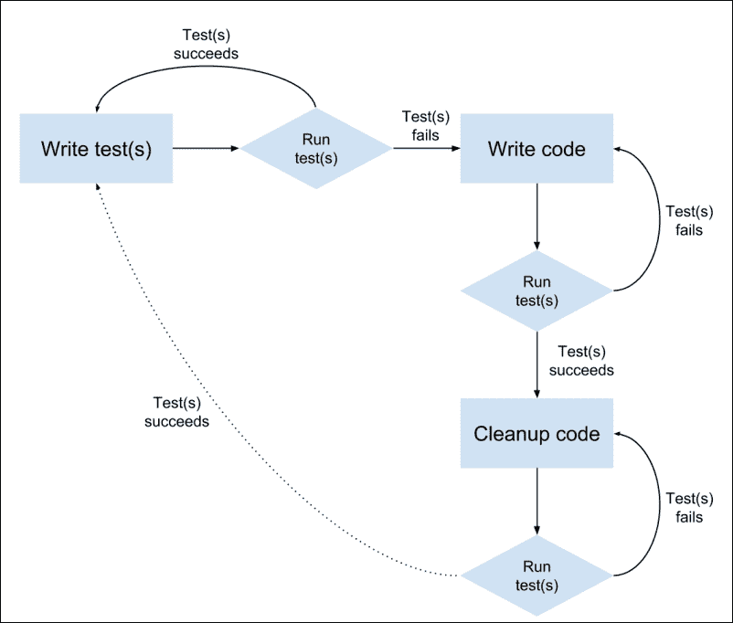
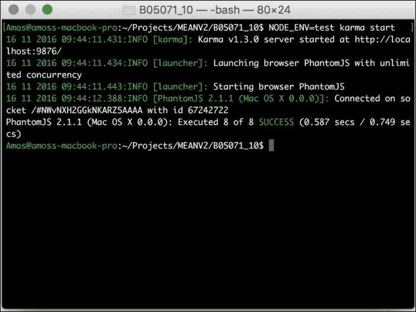
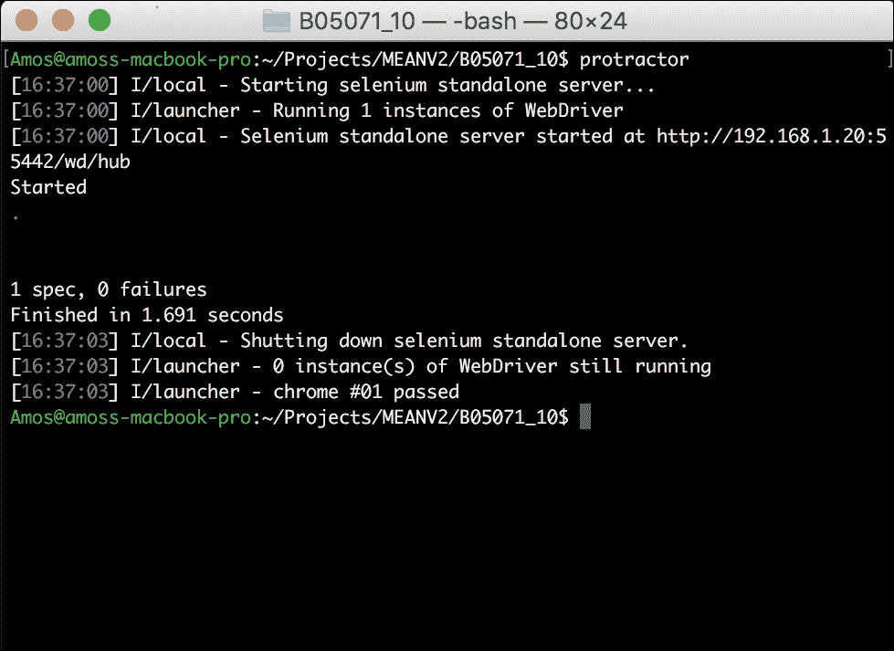

# 第十章。测试 MEAN 应用程序

在之前的章节中，你学会了如何构建实时的 MEAN 应用程序。你学习了 Express 和 Angular 的基础知识，并学会了将所有部分连接在一起。然而，当你的应用程序变得更大更复杂时，你很快就会发现手动验证你的代码非常困难。然后，你需要开始自动测试你的应用程序。幸运的是，借助新工具和适当的测试框架，测试 Web 应用程序，这曾经是一项复杂的任务，现在变得更加容易。在本章中，你将学习如何使用现代测试框架和流行工具来覆盖你的 MEAN 应用程序代码。我们将涵盖以下主题：

+   介绍 JavaScript TDD 和 BDD

+   设置你的测试环境

+   安装和配置 Mocha 测试框架

+   编写 Express 模型和控制器测试

+   安装和配置 Karma 测试运行器

+   使用 Jasmine 来对你的 Angular 实体进行单元测试

+   编写和运行端到端的 Angular 测试

# 介绍 JavaScript 测试

正如你已经知道的，在过去的几年里，JavaScript 发展迅速。它曾经是一个简单的脚本语言，用于小型 Web 应用程序，但现在它是复杂架构的骨干，无论是在服务器还是浏览器中。然而，这种发展让开发人员陷入了一个境地，他们需要手动管理一个大型的代码库，而这些代码在自动化测试方面仍然没有覆盖到。虽然我们的 Java、.NET 或 Ruby 开发人员一直安全地编写和运行他们的测试，但 JavaScript 开发人员仍然处于未知的领域，需要弄清楚如何正确地测试他们的应用程序。最近，这个空白已经被由才华横溢的 JavaScript 社区成员编写的新工具和测试框架填补。在本章中，我们将介绍一些流行的工具，但请记住，这个领域是相当新的，不断变化，所以你也需要密切关注新出现的解决方案。

在本章中，我们将讨论两种主要类型的测试：单元测试和**端到端**（**E2E**）测试。单元测试是为了验证孤立的代码单元的功能。这意味着开发人员应该努力编写每个单元测试来覆盖应用程序中最小的可测试部分。例如，开发人员可能会编写单元测试来验证 ORM 方法是否正常工作，并且输出正确的验证错误。然而，开发人员通常会选择编写验证更大代码单元的单元测试，主要是因为这些单元一起执行孤立的操作。如果开发人员想要测试包括许多软件组件的过程，他将编写一个 E2E 测试。E2E 测试是为了验证跨应用程序功能。这些测试通常会迫使开发人员使用多个工具，并在同一个测试中覆盖应用程序的不同部分，包括 UI、服务器和数据库组件。一个例子是验证注册过程的 E2E 测试。确定正确的测试是编写应用程序的适当测试套件的关键步骤之一。然而，为开发团队设置适当的约定可以使这个过程变得更加容易。

在我们开始讨论特定于 JavaScript 的工具之前，让我们首先快速了解一下 TDD 范式的概述以及它如何影响我们日常的开发周期。

## TDD、BDD 和单元测试

**测试驱动开发**（**TDD**）是由软件工程师和敏捷方法倡导者 Kent Beck 开发的一种软件开发范式。在 TDD 中，开发人员首先编写一个（最初失败的）测试，定义了对代码的孤立单元的期望。然后，开发人员需要实现最少量的代码来通过测试。

当测试成功通过时，开发人员清理代码并验证所有测试是否通过。下图说明了 TDD 循环：



重要的是要记住，尽管 TDD 已经成为现代软件开发中流行的方法，但在其纯粹形式下实施是非常困难的。为了简化这个过程并改善团队沟通，TDD 的基础上开发了一种新的方法，称为**行为驱动开发**（**BDD**）。BDD 范式是 TDD 的一个子集，由 Dan North 创建，帮助开发人员确定其单元测试的范围，并用行为术语表达其测试过程。基本上，TDD 为编写测试提供了框架，而 BDD 提供了塑造测试编写方式的词汇。通常，BDD 测试框架为开发人员提供了一组自解释的方法来描述测试过程。

尽管 BDD 为我们提供了编写测试的机制，但在 JavaScript 环境中运行这些测试仍然是一个复杂的任务。您的应用程序可能会在不同的浏览器甚至同一浏览器的不同版本上运行。因此，在单个浏览器上运行您编写的测试将无法提供适当的覆盖范围。为解决这个问题，JavaScript 社区开发了一系列多样化的工具，用于编写、评估和正确运行测试。

## 测试框架

虽然您可以开始使用自己的库编写测试，但很快就会发现这种方法不够可扩展，并且需要您构建一个复杂的基础设施。幸运的是，已经付出了相当大的努力来解决这个问题，这导致了几个流行的测试框架，允许您以结构化和通用的方式编写测试。这些测试框架通常提供一组方法来封装测试。测试框架通常还提供一些 API，使您能够运行测试并将结果与开发周期中的其他工具集成。

## 断言库

尽管测试框架为开发人员提供了一种创建和组织测试的方式，但它们通常缺乏实际测试表示测试结果的布尔表达式的能力。例如，Mocha 测试框架（我们将在下一节介绍）不提供开发人员断言工具。为此，社区开发了几个断言库，允许您检查特定的谓词。开发人员使用断言表达式来指示在测试上下文中应为真的谓词。运行测试时，将评估断言，如果结果为假，则测试失败。

## 测试运行器

测试运行器是一种实用工具，可以让开发人员轻松地运行和评估测试。测试运行器通常使用一个定义好的测试框架以及一组预配置的属性来在不同的上下文中评估测试结果。例如，测试运行器可以配置为在不同的环境变量下运行测试，或者在不同的测试平台（通常是浏览器）上运行相同的测试。我们将在*测试您的 Angular 应用程序*部分看到两种不同的测试运行器。

现在您已经了解了与测试相关的一组术语，最终可以学习如何测试您的 MEAN 应用程序的不同部分。尽管您的代码完全是用 JavaScript 编写的，但它在不同的平台上以不同的场景运行。为了简化测试过程，我将其分为两个不同的部分：测试 Express 组件和测试 Angular 组件。让我们从测试您的 Express 应用程序组件开始。

# 测试您的 Express 应用程序

在您的 MEAN 应用程序的 Express 部分中，您的业务逻辑主要封装在控制器中；但是，您还有 Mongoose 模型，它们模糊了许多任务，包括数据操作和验证。因此，为了正确覆盖 Express 应用程序代码，您需要编写覆盖模型和控制器的测试。为此，您将使用 Mocha 作为测试框架，`Should.js`作为模型的断言库，`SuperTest HTTP`作为控制器的断言库。您还需要创建一个新的测试环境配置文件，该文件将为您提供用于测试目的的特殊配置选项，例如专用的 MongoDB 连接字符串。在本节结束时，您将学会使用 Mocha 命令行工具来运行和评估测试结果。我们将从介绍 Mocha 测试框架开始。

## 介绍 Mocha

Mocha 是由 Express 的创始人 TJ Holowaychuk 开发的多功能测试框架。它支持 BDD 和 TDD 单元测试，使用 Node.js 运行测试，并允许开发人员运行同步和异步测试。由于 Mocha 的结构很简洁，它不包括内置的断言库；相反，它支持流行的断言框架的集成。它配备了一系列不同的报告器来呈现测试结果，并包括许多功能，如挂起测试、排除测试和跳过测试。与 Mocha 的主要交互是通过提供的命令行工具完成的，该工具允许您配置测试的执行和报告方式。

Mocha 测试的 BDD 接口包括几种描述性方法，使开发人员能够轻松描述测试场景。这些方法如下：

+   `describe(description, callback)`: 这是一个基本方法，用于为每个测试套件添加描述。回调函数用于定义测试规范或子套件。

+   `it(description, callback)`: 这是一个基本方法，用于为每个测试规范添加描述。回调函数用于定义实际的测试逻辑。

+   `before(callback)`: 这是一个钩子函数，在测试套件中的所有测试之前执行一次。

+   `beforeEach(callback)`: 这是一个钩子函数，在测试套件中的每个测试规范执行前执行一次。

+   `after(callback)`: 这是一个钩子函数，在测试套件中的所有测试执行后执行一次。

+   `afterEach(callback)`: 这是一个钩子函数，在测试套件中的每个测试规范执行后执行一次。

使用这些基本方法将允许您利用 BDD 范式定义单元测试。然而，没有包含确定开发人员对覆盖的代码的期望的断言表达式，没有测试可以得出结论。为了支持断言，您需要使用一个断言库。

### 注意

您可以通过访问官方文档了解更多关于 Mocha 的特性[`github.com/mochajs/mocha`](https://github.com/mochajs/mocha)。

## 介绍 Should.js

`Should.js`库也是由 TJ Holowaychuk 开发的，旨在帮助开发人员编写可读性强且表达力强的断言表达式。使用`Should.js`，您将能够更好地组织测试代码并生成有用的错误消息。`Should.js`库通过一个不可枚举的 getter 扩展了`Object.prototype`，允许您表达对象应该如何行为。`Should.js`的一个强大功能是每个断言都返回一个包装对象，因此可以链接断言。这意味着您可以编写可读的表达式，几乎描述了与被测试对象相关的断言。例如，链接的断言表达式如下所示：

```js
user.should.be.an.Object.and.have.property('name', 'tj');
```

### 注意

请注意每个辅助属性如何返回一个 Should.js 对象，可以使用另一个辅助属性（`be`，`an`，`have`等）链接，或者使用断言属性和方法（`Object`，`property()`）进行测试。您可以通过阅读官方文档了解更多关于 Should.js 的功能：[`github.com/shouldjs/should.js`](https://github.com/shouldjs/should.js)。

虽然 Should.js 在测试对象方面做得很好，但它无法帮助您测试 HTTP 端点。为此，您需要使用不同类型的断言库。这就是 Mocha 的最小模块化的地方派上用场。

## 介绍 SuperTest

SuperTest 是由 TJ Holowaychuk 开发的另一个断言库，与其他断言库不同之处在于它提供了一个抽象层，用于进行 HTTP 断言。这意味着它将帮助您创建断言表达式来测试 HTTP 端点，而不是测试对象。在您的情况下，它将帮助您测试控制器端点，从而覆盖暴露给浏览器的代码。为此，它将利用 Express 应用程序对象并测试从 Express 端点返回的响应。一个 SuperTest 断言表达式示例如下：

```js
request(app).get('/user')
  .set('Accept', 'application/json')
  .expect('Content-Type', /json/)
  .expect(200, done);
```

### 注意

请注意每个方法如何可以链接到另一个断言表达式。这将允许您使用`expect()`方法对同一响应进行多个断言。您可以通过访问官方文档了解更多关于 SuperTest 的功能：[`github.com/visionmedia/supertest`](https://github.com/visionmedia/supertest)。

在接下来的部分中，您将学习如何利用 Mocha、Should.js 和 SuperTest 来测试您的模型和控制器。让我们开始安装这些依赖项并正确配置测试环境。本章中的示例将直接从前几章中的示例继续，因此请复制第九章中的最终示例，*使用 Socket.io 添加实时功能*，然后从那里开始。

# 安装 Mocha

Mocha 基本上是一个 Node.js 模块，提供了运行测试的命令行功能。使用 Mocha 的最简单方法是首先将其作为全局 node 模块使用`npm`进行安装。为此，只需在命令行工具中输入以下命令：

```js
$ npm install –g mocha

```

通常情况下，这将在全局`node_modules`文件夹中安装 Mocha 的最新版本。安装过程成功完成后，您将能够从命令行中使用 Mocha 实用程序。接下来，您需要在项目中安装 Should.js 和 SuperTest 断言库。

### 注意

您可能会在安装全局模块时遇到一些问题。这通常是一个权限问题，所以在运行全局安装命令时，请使用`sudo`或`super user`。

## 安装 Should.js 和 SuperTest 模块

在开始编写测试之前，您需要使用`npm`安装`Should.js`和`SuperTest`。为此，请按照以下步骤更改项目的`package.json`文件：

```js
{
  "name": "MEAN",
  "version": "0.0.10",
  "scripts": {
    "tsc": "tsc",
    "tsc:w": "tsc -w",
    "app": "node server",
    "start": "concurrently \"npm run tsc:w\" \"npm run app\" ",
    "postinstall": "typings install"
  },
  "dependencies": {
    "@angular/common": "2.1.1",
    "@angular/compiler": "2.1.1",
    "@angular/core": "2.1.1",
    "@angular/forms": "2.1.1",
    "@angular/http": "2.1.1",
    "@angular/platform-browser": "2.1.1",
    "@angular/platform-browser-dynamic": "2.1.1",
    "@angular/router": "3.1.1",
    "body-parser": "1.15.2",
    "core-js": "2.4.1",
    "compression": "1.6.0",
    "connect-flash": "0.1.1",
    "connect-mongo": "1.3.2",
    "cookie-parser": "1.4.3",
    "ejs": "2.5.2",
    "express": "4.14.0",
    "express-session": "1.14.1",
    "method-override": "2.3.6",
    "mongoose": "4.6.5",
    "morgan": "1.7.0",
    "passport": "0.3.2",
    "passport-facebook": "2.1.1",
    "passport-google-oauth": "1.0.0",
    "passport-local": "1.0.0",
    "passport-twitter": "1.0.4",
    "reflect-metadata": "0.1.8",
    "rxjs": "5.0.0-beta.12",
    "socket.io": "1.4.5",
    "systemjs": "0.19.39",
    "zone.js": "0.6.26"
  },
  "devDependencies": {
    "concurrently": "3.1.0",
 "should": "11.1.1",
 "supertest": "2.0.1",
    "traceur": "0.0.111",
    "typescript": "2.0.3",
    "typings": "1.4.0"
  }
}
```

要安装新的依赖项，请转到应用程序的根文件夹，并在命令行工具中输入以下命令：

```js
$ npm install

```

这将在您项目的`node modules`文件夹中安装指定版本的`Should.js`和`SuperTest`。安装过程成功完成后，您将能够在测试中使用这些模块。接下来，您需要通过创建新的环境配置文件并设置测试环境来为测试准备项目。

## 配置您的测试环境

由于您将运行包括数据库操作的测试，因此最好使用不同的配置文件来运行测试。幸运的是，您的项目已经配置为根据`NODE_ENV`变量使用不同的配置文件。虽然应用程序在运行测试环境时会自动使用`config/env/development.js`文件，但我们将确保将`NODE_ENV`变量设置为测试。您需要做的就是在`config/env`文件夹中创建一个名为`test.js`的新配置文件。在这个新文件中，粘贴以下代码片段：

```js
module.exports = {
 db: 'mongodb://localhost/mean-book-test',
  sessionSecret: 'Your Application Session Secret',
  viewEngine: 'ejs',
  facebook: {
    clientID: 'APP_ID',
    clientSecret: 'APP_SECRET',
    callbackURL: 'http://localhost:3000/oauth/facebook/callback'
  },
  twitter: 
  {
    clientID: 'APP_ID',
    clientSecret: 'APP_SECRET',
    callbackURL: 'http://localhost:3000/oauth/twitter/callback'
  },
  google: {
    clientID: 'APP_ID',
    clientSecret: 'APP_SECRET',
    callbackURL: 'http://localhost:3000/oauth/google/callback'
  }
};
```

正如您所注意到的，我们已经更改了`db`属性，以使用不同的 MongoDB 数据库。其他属性保持不变，但您可以稍后更改它们以测试应用程序的不同配置。

现在，您需要为测试文件创建一个新文件夹。要这样做，请转到您的应用程序文件夹并创建一个名为`tests`的新文件夹。设置环境完成后，您可以继续下一节并编写您的第一个测试。

## 编写您的第一个 Mocha 测试

在开始编写测试之前，您首先需要识别和分解 Express 应用程序的组件为可测试单元。由于大多数应用程序逻辑已经分为模型和控制器，显而易见的方法是分别测试每个模型和控制器。下一步将是将此组件分解为逻辑代码单元，并分别测试每个单元。例如，对控制器中的每个方法进行测试。当每个方法本身不执行任何重要操作时，您还可以决定一起测试控制器的一些方法。另一个例子是对 Mongoose 模型进行测试并测试每个模型方法。

在 BDD 中，每个测试都以自然语言描述测试目的开始。这是使用`describe()`方法完成的，它允许您定义测试场景的描述和功能。描述块可以嵌套，这使您能够进一步阐述每个测试。一旦您准备好测试的描述结构，您将能够使用`it()`方法定义测试规范。每个`it()`块将被测试框架视为单个单元测试。每个测试还将包括一个或多个断言表达式。断言表达式基本上将作为布尔测试指示器，用于测试您的测试假设。当断言表达式失败时，它通常会为测试框架提供可追踪的错误对象。

虽然这基本上解释了您将遇到的大多数测试，但您还可以使用支持方法，在测试上下文中执行某些功能。这些支持方法可以配置为在一组测试之前或之后运行，甚至可以在每个测试执行之前或之后运行。

在接下来的示例中，您将学习如何轻松使用每个方法来测试您在第八章中创建的文章模块，*创建一个 MEAN CRUD 模块*。为简单起见，我们将仅为每个组件实现一个基本的测试套件。这个测试套件可以和应该大大扩展，以最终提供体面的代码覆盖率。

### 注意

尽管 TDD 明确规定在开始编写功能代码之前应编写测试，但本书的结构迫使我们编写检查现有代码的测试。如果您希望在开发过程中实施真正的 TDD，您应该意识到开发周期应该从首先编写适当的测试开始。

### 测试 Express 模型

在模型的测试示例中，我们将编写两个测试，以验证模型的`save`方法。要开始测试您的`Article` Mongoose 模型，您需要在`app/tests`文件夹中创建一个名为`article.server.model.tests.js`的新文件。在新文件中，粘贴以下代码行：

```js
const app = require('../../server.js');
const should = require('should');
const mongoose = require('mongoose');
const User = mongoose.model('User');
const Article = mongoose.model('Article');

let user, article;

describe('Article Model Unit Tests:', () => {
  beforeEach((done) => {
    user = new User({
      firstName: 'Full',
      lastName: 'Name',
      displayName: 'Full Name',
      email: 'test@test.com',
      username: 'username',
      password: 'password'
    });

    user.save(() => {
      article = new Article({
        title: 'Article Title',
        content: 'Article Content',
        user: user
      });

      done();
    });
  });

  describe('Testing the save method', () => {
 it('Should be able to save without problems', () => {
 article.save((err) => {
 should.not.exist(err);
 });
 });

 it('Should not be able to save an article without a title', () => {
 article.title = '';

 article.save((err) => {
 should.exist(err);
 });
 });
 });

  afterEach((done) => {
    Article.remove(() => {
      User.remove(() => {
        done();
      });
    });
  });
});
```

让我们开始分解测试代码。首先，您需要引入模块依赖项并定义全局变量。然后，您使用`describe()`方法开始测试，该方法通知测试工具将要检查`Article`模型。在`describe`块内，我们首先使用`beforeEach()`方法创建新的`user`和`article`对象。`beforeEach()`方法用于定义在执行每个测试之前运行的代码块。您还可以用`before()`方法替换它，它只会在执行所有测试之前执行一次。注意`beforeEach()`方法如何通过调用`done()`回调通知测试框架可以继续执行测试。这将允许数据库操作在实际执行测试之前完成。

接下来，您创建了一个新的`describe`块，表明您将要测试模型保存方法。在这个块中，您使用`it()`方法创建了两个测试。第一个测试使用`article`对象保存了一篇新文章。然后，您使用`Should.js`断言库来验证没有发生错误。第二个测试通过将无效值赋给`title`属性来检查`Article`模型的验证。这次，使用`Should.js`断言库来验证在尝试保存无效的`article`对象时确实发生了错误。

您通过使用`afterEach()`方法清理`Article`和`User`集合来完成测试。与`beforeEach()`方法类似，这段代码将在每个测试执行后运行，并且也可以用`after()`方法替换。`done()`方法在这里也以相同的方式使用。

恭喜，您创建了您的第一个单元测试！正如我们之前所述，您可以继续扩展此测试套件，以覆盖更多模型代码，当处理更复杂的对象时，您可能会这样做。接下来，我们将看到在覆盖控制器代码时如何编写更高级的单元测试。

### 测试 Express 控制器

在控制器测试示例中，我们将编写两个测试来检查控制器检索文章的方法。在开始编写这些测试时，我们有两个选择：直接测试控制器的方法，或者在测试中使用定义的控制器 Express 路由。虽然最好是分别测试每个单元，但由于我们的路由定义非常简单，所以我们选择第二个选项，这样我们可以从编写更全面的测试中受益。

要开始测试文章控制器，您需要在`app/tests`文件夹中创建一个名为`articles.server.controller.tests.js`的新文件。在新文件中，粘贴以下代码片段：

```js
const app = require('../../server');
const request = require('supertest');
const should = require('should');
const mongoose = require('mongoose');
const User = mongoose.model('User');
const Article = mongoose.model('Article');

let user, article;

describe('Articles Controller Unit Tests:', () => {
  beforeEach((done) => {
    user = new User({
      firstName: 'Full',
      lastName: 'Name',
      displayName: 'Full Name',
      email: 'test@test.com',
      username: 'username',
      password: 'password'
    });

    user.save(() => {
      article = new Article({
        title: 'Article Title',
        content: 'Article Content',
        user: user
      });

      article.save((err) => {
        done();
      });
    });
  });

  describe('Testing the GET methods', () => {
 it('Should be able to get the list of articles', (done) => {
 request(app).get('/api/articles/')
 .set('Accept', 'application/json')
 .expect('Content-Type', /json/)
 .expect(200)
 .end((err, res) => {
 res.body.should.be.an.Array().and.have.lengthOf(1);
 res.body[0].should.have.property('title', article.title);
 res.body[0].should.have.property('content',article.content);

 done();
 });
 });

 it('Should be able to get the specific article', (done) => {
 request(app).get('/api/articles/' + article.id)
 .set('Accept', 'application/json')
 .expect('Content-Type', /json/)
 .expect(200)
 .end((err, res) => {
 res.body.should.be.an.Object().and.have.property('title',article.title);
 res.body.should.have.property('content', article.content);

 done();
 });
 });
  });

  afterEach((done) => {
    Article.remove().exec();
    User.remove().exec();

    done();
  });
});
```

就像您的模型测试一样，首先需要引入模块依赖项并定义全局变量。然后，您使用`describe()`方法开始测试，该方法通知测试工具将要检查`Articles`控制器。在`describe`块内，我们首先使用`beforeEach()`方法创建新的`user`和`article`对象。这次，在初始化测试之前保存了文章，然后通过调用`done()`回调继续测试执行。

接下来，您创建了一个新的`describe`块，表明您将要测试控制器的`GET`方法。在这个块中，您使用`it()`方法创建了两个测试。第一个测试使用`SuperTest`断言库在返回文章列表的端点发出 HTTP `GET`请求。然后检查 HTTP 响应变量，包括`content-type`头和 HTTP 响应代码。当它验证响应正确返回时，它使用三个`Should.js`断言表达式来测试响应主体。响应主体应该是包含一篇文章的文章数组，这篇文章应该类似于您在`beforeEach()`方法中创建的文章。

第二个测试使用`SuperTest`断言库在返回单个文章的端点发出 HTTP `GET`请求。然后，它检查 HTTP 响应变量，包括`content-type`头和 HTTP 响应代码。一旦验证响应正确返回，它使用三个`Should.js`断言表达式来测试响应主体。响应主体应该是一个单独的`article`对象，并且应该类似于您在`beforeEach()`方法中创建的文章。

就像以前一样，您可以通过使用`afterEach()`方法清理`Article`和`User`集合来完成测试。完成测试环境的设置和创建测试后，您所剩的就是使用 Mocha 的命令行工具运行它们。

## 运行您的 Mocha 测试

要运行您的 Mocha 测试，您需要使用先前安装的 Mocha 命令行实用程序。为此，请使用命令行工具并导航到项目的基本文件夹。然后，发出以下命令：

```js
$ NODE_ENV=test mocha --reporter spec app/tests

```

Windows 用户应首先执行以下命令：

```js
> set NODE_ENV=test

```

然后使用以下命令运行 Mocha：

```js
> mocha --reporter spec app/tests

```

上述命令将执行一些操作。首先，它将将`NODE_ENV`变量设置为`test`，强制您的 MEAN 应用程序使用测试环境的配置文件。然后，它将使用`--reporter`标志执行 Mocha 命令行实用程序，告诉 Mocha 使用`spec`报告和您的测试文件夹的路径。测试结果应该在您的命令行工具中报告，并且类似于以下截图：


Mocha 的测试结果

这结束了对 Express 应用程序的测试覆盖。您可以使用这些方法来扩展您的测试套件，并显着改进应用程序开发。建议您从开发过程的开始设置测试约定；否则，编写测试可能会成为一种令人不知所措的体验。接下来，您将学习如何测试您的 Angular 组件并编写 E2E 测试。

# 测试您的 Angular 应用程序

多年来，测试前端代码是一项复杂的任务。在不同浏览器和平台上运行测试是复杂的，由于大多数应用程序代码是无结构的，测试工具主要集中在 UI E2E 测试上。然而，向 MVC 框架的转变使社区能够创建更好的测试工具，改进了开发人员编写单元测试和 E2E 测试的方式。事实上，Angular 团队非常注重测试，团队开发的每个功能都是以可测试性为目标设计的。

此外，平台碎片化还创建了一个称为测试运行器的新工具层，允许开发人员轻松地在不同的上下文和平台上运行他们的测试。在本节中，我们将重点关注与 Angular 应用程序相关的工具和框架，解释如何最好地使用它们来编写和运行单元测试和 E2E 测试。我们将从将在两种情况下为我们提供服务的测试框架开始：Jasmine 测试框架。

### 注意

尽管我们可以使用 Mocha 或任何其他测试框架，但在测试 Angular 应用程序时，使用 Jasmine 目前是最简单和最常见的方法。

## 介绍 Jasmine 框架

Jasmine 是由 Pivotal 组织开发的一种有见地的 BDD 框架。方便的是，Jasmine 使用与 Mocha 的 BDD 接口相同的术语，包括`describe()`、`it()`、`beforeEach()`和`afterEach()`方法。然而，与 Mocha 不同，Jasmine 预先捆绑了断言功能，使用与**Matchers**相关的`expect()`方法链接的断言方法。Matchers 基本上是实现实际对象和预期值之间的布尔比较的函数。例如，使用`toBe()`匹配器的简单测试如下：

```js
describe('Matchers Example', function() {
  it('Should present the toBe matcher example', function() {
    var a = 1;
    var b = a;

    expect(a).toBe(b);
    expect(a).not.toBe(null);
  });
});
```

`toBe()`匹配器使用`===`运算符来比较对象。Jasmine 还包括许多其他匹配器，甚至使开发人员能够添加自定义匹配器。Jasmine 还包括其他强大的功能，以允许更高级的测试套件。在下一节中，我们将重点介绍如何使用 Jasmine 轻松测试您的 Angular 组件。

### 注意

您可以通过访问官方文档了解更多有关 Jasmine 功能的信息[`jasmine.github.io/2.5/introduction.html`](http://jasmine.github.io/2.5/introduction.html)。

## Angular 单元测试

过去，想要编写单元测试以覆盖其前端代码的 Web 开发人员必须努力确定其测试范围并正确组织其测试套件。然而，Angular 中的关注点内在分离迫使开发人员编写独立的代码单元，使测试过程变得更加简单。开发人员现在可以快速识别他们需要测试的单元，因此组件、服务、指令和任何其他 Angular 实体都可以作为独立单元进行测试。此外，Angular 中广泛使用的依赖注入使开发人员能够切换上下文并轻松地使用广泛的测试套件覆盖其代码。但是，在开始为您的 Angular 应用程序编写测试之前，您首先需要准备好测试环境，从 Karma 测试运行器开始。

### 介绍 Karma 测试运行器

Karma 测试运行器是由 Angular 团队开发的实用工具，可帮助开发人员在不同的浏览器中执行测试。它通过启动一个运行源代码和测试代码的 Web 服务器在选定的浏览器上运行，将测试结果报告给命令行实用程序。Karma 为真实设备和浏览器提供真实的测试结果，为 IDE 和命令行提供流程控制，并提供与框架无关的可测试性。它还为开发人员提供了一组插件，使他们能够使用最流行的测试框架运行测试。团队还提供了称为浏览器启动器的特殊插件，使 Karma 能够在选定的浏览器上运行测试。

在我们的情况下，我们将使用 Jasmine 测试框架以及 PhantomJS 浏览器启动器。但是，测试真实应用程序将需要您扩展 Karma 的配置以包括更多的启动器，并在您打算支持的浏览器上执行测试。

### 注意

PhantomJS 是一个无头的 WebKit 浏览器，通常用于不需要视觉输出的可编程场景；这就是为什么它非常适用于测试目的。您可以通过访问官方文档了解更多关于 PhantomJS 的信息[`phantomjs.org/documentation/`](http://phantomjs.org/documentation/)。

### 安装 Karma 命令行工具

开始使用 Karma 的最简单方法是使用`npm`提供的命令行工具进行全局安装。要这样做，只需在命令行工具中输入以下命令：

```js
$ npm install -g karma-cli

```

这将在全局`node_modules`文件夹中安装 Karma 命令行实用程序的最新版本。安装过程成功完成后，您将能够从命令行使用 Karma 实用程序。接下来，您需要安装 Karma 的项目依赖项。

### 注意

您可能会在安装全局模块时遇到一些问题。这通常是权限问题，因此在运行全局安装命令时，请使用`sudo`或超级用户。

### 安装 Karma 的依赖项

在您开始编写测试之前，您需要使用`npm`安装 Karma 的依赖项。要这样做，请按照以下步骤更改您的`package.json`文件：

```js
{
  "name": "MEAN",
  "version": "0.0.10",
  "scripts": {
    "tsc": "tsc",
    "tsc:w": "tsc -w",
    "app": "node server",
    "start": "concurrently \"npm run tsc:w\" \"npm run app\" ",
    "postinstall": "typings install"
  },
  "dependencies": {
    "@angular/common": "2.1.1",
    "@angular/compiler": "2.1.1",
    "@angular/core": "2.1.1",
    "@angular/forms": "2.1.1",
    "@angular/http": "2.1.1",
    "@angular/platform-browser": "2.1.1",
    "@angular/platform-browser-dynamic": "2.1.1",
    "@angular/router": "3.1.1",
    "body-parser": "1.15.2",
    "core-js": "2.4.1",
    "compression": "1.6.0",
    "connect-flash": "0.1.1",
    "connect-mongo": "1.3.2",
    "cookie-parser": "1.4.3",
    "ejs": "2.5.2",
    "express": "4.14.0",
    "express-session": "1.14.1",
    "method-override": "2.3.6",
    "mongoose": "4.6.5",
    "morgan": "1.7.0",
    "passport": "0.3.2",
    "passport-facebook": "2.1.1",
    "passport-google-oauth": "1.0.0",
    "passport-local": "1.0.0",
    "passport-twitter": "1.0.4",
    "reflect-metadata": "0.1.8",
    "rxjs": "5.0.0-beta.12",
    "socket.io": "1.4.5",
    "systemjs": "0.19.39",
    "zone.js": "0.6.26"
  },
  "devDependencies": {
    "concurrently": "3.1.0",
 "jasmine": "2.5.2",
 "jasmine-core": "2.5.2",
 "karma": "1.3.0",
 "karma-jasmine": "1.0.2",
 "karma-phantomjs-launcher": "1.0.2",
    "should": "11.1.1",
    "supertest": "2.0.1",
    "traceur": "0.0.111",
    "typescript": "2.0.3",
    "typings": "1.4.0"
  }
}
```

如您所见，您已将 Karma 和 Jasmine 核心包、Karma 的 Jasmine 插件以及 Karma 的 PhantomJS 启动器添加到了`devDependencies`属性中。要安装新的依赖项，请转到应用程序的`root`文件夹，并在命令行工具中输入以下命令：

```js
$ npm install

```

这将在你的项目的`node_modules`文件夹中安装指定版本的 Karma 核心包、Karma 的 Jasmine 插件和 Karma 的 PhantomJS 启动器。当安装过程成功完成时，你将能够使用这些模块来运行你的测试。接下来，你需要通过添加一个 Karma 配置文件来配置 Karma 的执行。

### 配置 Karma 测试运行器

为了控制 Karma 的测试执行，你需要使用一个特殊的配置文件来配置 Karma，该文件放置在应用程序的`root`文件夹中。当执行时，Karma 将自动查找默认配置文件，命名为`karma.conf.js`，位于应用程序的`root`文件夹中。你也可以使用命令行标志指示你的配置文件的名称，但出于简单起见，我们将使用默认文件名。要开始配置 Karma，在你的应用程序文件夹中创建一个新文件，并将其命名为`karma.conf.js`。在你的新文件中，粘贴以下代码片段：

```js
module.exports = function(config) {
  config.set({
    basePath: '',
    frameworks: ['jasmine'],
    files: [
      'node_modules/systemjs/dist/system.js',
      'node_modules/systemjs/dist/system-polyfills.js',
      'node_modules/core-js/client/shim.min.js',
      'node_modules/reflect-metadata/Reflect.js',
      'node_modules/zone.js/dist/zone.js',
      'node_modules/zone.js/dist/long-stack-trace-zone.js',
      'node_modules/zone.js/dist/proxy.js',
      'node_modules/zone.js/dist/sync-test.js',
      'node_modules/zone.js/dist/jasmine-patch.js',
      'node_modules/zone.js/dist/async-test.js',
      'node_modules/zone.js/dist/fake-async-test.js',

      { pattern: 'public/systemjs.config.js', served: true,included: false, watched: false },
      { pattern: 'public/app/**/*.*', served: true, included:false, watched: false },
      { pattern: 'node_modules/rxjs/**/*.js', served: true,included: false, watched: false },
      { pattern: 'node_modules/@angular/**/*.js', served:true,included: false, watched: false },

      'karma.shim.js',
    ],
    proxies: {
      '/lib/': '/base/node_modules/',
      '/app/': '/base/public/app/',
    },
    reporters: ['progress'],
    browsers: ['PhantomJS'],
    captureTimeout: 60000,
    singleRun: true
  });
};
```

如你所见，Karma 的配置文件用于设置 Karma 执行测试的方式。在这种情况下，我们使用了以下设置：

+   `basePath`：这告诉 Karma 使用空的基本路径。

+   `frameworks`：这告诉 Karma 使用 Jasmine 框架。

+   `files`：这设置了 Karma 将包含在其测试中的文件列表。请注意，你可以使用 glob 模式来指示文件模式。在这种情况下，我们包括了所有的库文件和模块文件，但不包括我们的测试文件。此外，我们配置了我们的应用程序和库文件，以便它们由 Karma 服务器提供，即使它们并没有直接包含在页面中。

+   `reporters`：这设置了 Karma 报告其测试结果的方式。

+   `browsers`：这是 Karma 将在其上测试的浏览器列表。请注意，由于我们没有安装其他启动器插件，所以我们只能使用 PhantomJS 浏览器。

+   `captureTimeout`：这设置了 Karma 测试执行的超时时间。

+   `singleRun`：这强制 Karma 在完成测试执行后退出。

这些属性是项目导向的，这意味着它们将根据你的需求而改变。例如，在实际应用中，你可能会包含更多的浏览器启动器。

### 注意

你可以通过访问官方文档了解更多关于 Karma 配置的信息[`karma-runner.github.io/1.0/config/configuration-file.html`](https://karma-runner.github.io/1.0/config/configuration-file.html)。

我们还有两件事要做，以完成我们的 Karma 配置。我们将首先修改`System.js`配置。为此，转到你的`public`/s`ystemjs.config.js`文件，并按以下方式更改它：

```js
(function(global) {
  var packages = {
    app: {
        main: './bootstrap.js',
        defaultExtension: 'js'
      }
  };

  var map = {
    '@angular': 'lib/@angular',
      'rxjs': 'lib/rxjs'
  };

  var ngPackageNames = [
    'common',
    'compiler',
    'core',
    'forms',
    'http',
    'router',
    'platform-browser',
    'platform-browser-dynamic',
  ];

  ngPackageNames.forEach(function(pkgName) {
    packages['@angular/' + pkgName] = { main: '/bundles/' +pkgName + '.umd.js', defaultExtension: 'js' };
 map['@angular/' + pkgName + '/testing'] = 'lib/@angular/' + pkgName + '/bundles/' + pkgName + '-testing.umd.js';
  });

  System.config({
    defaultJSExtensions: true,
    transpiler: null,
    packages: packages,
    map: map
  });
})(this);
```

正如你所看到的，我们只告诉`System.js`将我们的 Angular 测试模块映射到正确的`UMD`模块文件。接下来，我们需要创建我们的 karma“shim”文件，实际上加载我们的测试。为此，在应用程序的`root`文件夹中创建一个名为`karma.shim.js`的新文件。在你的新文件中，粘贴以下代码：

```js
__karma__.loaded = function () { };

System.import('/base/public/systemjs.config.js').then(loadTests);

function loadTests() {
  Promise.all([
    System.import('app/bootstrap.spec'),
    System.import('app/articles/articles.service.spec'),
    System.import('app/articles/list/list.component.spec'),
    System.import('app/app.routes.spec'),
    System.import('app/directive.spec'),
    System.import('app/pipe.spec')
  ]).then(__karma__.start, __karma__.error);
}
```

如你所见，我们的文件基本上通过覆盖加载钩子来阻止 Karma 在启动时自动运行测试。然后，它加载`System.js`配置文件并导入我们的测试文件。一旦加载了所有文件，它告诉 Karma 通过调用其 start hook 来运行测试。就是这样！我们唯一剩下的事情就是开始编写我们的测试。

### 编写 Angular 单元测试

一旦配置了测试环境，编写单元测试就变得很容易。虽然一般结构是相同的，但每个实体测试都有些不同，并涉及微妙的变化。在本节中，你将学习如何测试主要的 Angular 实体。让我们从测试一个组件开始。

#### 测试组件

测试一个组件的复杂程度可能会有所不同。简单的组件测试起来相当容易，而更复杂的组件可能会有些棘手。一个很好的中间例子是测试我们的文章列表组件，因为它使用了一个服务，并为我们的文章呈现了一个简单的 DOM。要测试您的组件，请转到`public/app/articles/list`文件夹，并创建一个名为`list.component.spec.ts`的文件。在新文件中，粘贴以下代码：

```js
import { Observable } from "rxjs/Rx";
import { Directive, Input }   from '@angular/core';
import { ComponentFixture, TestBed, async, fakeAsync } from '@angular/core/testing';
import { ArticlesService } from '../articles.service';
import { ListComponent } from './list.component';

class MockArticlesService {
  articles = [{
    _id: '12345678',
    title: 'An Article about MEAN',
    content: 'MEAN rocks!',
    created: new Date(),
    creator: {
      fullName: 'John Doe'
    }
  }];

  public list() {
    return Observable.of(this.articles);
  }
};

@Directive({
  selector: '[routerLink]',
  host: {
    '(click)': 'onClick()'
  }
})
export class RouterLinkStubDirective {
  @Input('routerLink') linkParams: any;
  navigatedTo: any = null;

  onClick() {
    this.navigatedTo = this.linkParams;
  }
}

describe('List component tests', () => {
  let componentFixture: ComponentFixture<ListComponent>;

  beforeEach(async(() => {
    TestBed.configureTestingModule({
      declarations: [ ListComponent, RouterLinkStubDirective ],
      providers:    [ {provide: ArticlesService, useClass: MockArticlesService } ]
    }).compileComponents();
  }));

    beforeEach(fakeAsync(() => {
        componentFixture = TestBed.createComponent(ListComponent);
    }));

 it('Should render list', () => {
 componentFixture.detectChanges();

 const mockArticleService = new MockArticlesService();
 const listComponentElement = componentFixture.nativeElement;

 const articleElements = listComponentElement.querySelectorAll('li');
 const articleElement = articleElements[0];
 const articleTitleElement = articleElement.querySelector('a');
 const articleContentElement = articleElement.querySelector('p');

 const mockArticleList = mockArticleService.articles;
 const mockArticle = mockArticleList[0];
 const mockArticleTitle = mockArticle.title;
 const mockArticleContent = mockArticle.content;

 expect(articleElements.length).toBe(mockArticleList.length);

 expect(articleTitleElement.innerHTML).toBe(mockArticleTitle);

 expect(articleContentElement.innerHTML).toBe(mockArticleContent);
 });
});
```

让我们来看看这个例子。我们首先导入所有测试所需的模块。接下来，我们创建`MockArticlesService`，它将替换我们的`ArticlesService`，以便为`ListComponent`提供一组文章。这是一个重要的步骤，因为在编写单元测试时，尽可能地隔离每个单元非常重要。在这种情况下，我们希望避免与真实的`ArticlesService`建立任何连接，因此我们将为我们的组件提供一个静态数据源。然后，我们创建一个模拟的`routerLink`，以便我们的组件测试可以呈现我们的链接。

接下来，我们使用`describe`关键字创建我们的测试套件，并使用 Angular 的`TestBed`对象来配置我们的测试模块。我们使用`configureTestingModule`方法提供我们模块中需要的声明和提供者，然后再次使用`TestBed`对象来创建我们的`ListComponent`的组件装置。然后我们使用`it`关键字创建我们的测试，并使用组件装置来获取我们的`ListComponent`的原生元素，这样我们就能够使用 Jasmine 的匹配器与`MockArticlesService`的数据进行比较。就是这样！接下来，我们将看到如何测试服务，但在我们这样做之前，我们需要学习如何模拟后端数据服务。

#### 模拟后端数据

在测试 Angular 应用程序时，建议单元测试快速执行，并与后端服务器分开。这是因为我们希望单元测试尽可能地独立并以同步方式工作。这意味着我们需要控制依赖注入过程，并提供模拟组件来模拟真实组件的操作。例如，大多数与后端服务器通信的组件通常使用`http`服务或某种抽象层。此外，`Http`服务使用`XHRBackend`服务向服务器发送请求。这意味着通过注入不同的后端服务，我们可以发送不会命中真实服务器的假 HTTP 请求。正如我们之前所述，Angular 团队非常致力于测试，因此他们已经为我们创建了这些工具，以`MockBackend`类的形式提供。`MockBackend`类允许开发人员定义对 HTTP 请求的模拟响应。这个类可以被注入到任何使用`Http`服务的服务中，并配置为提供预定义数据的 HTTP 请求。让我们看看如何使用它来测试我们的`ArticlesService`。

#### 测试服务

测试服务与测试组件有些不同。正如我们之前讨论的，我们需要使用`MockBackend`类来模拟我们的服务 HTTP 请求。让我们看看如何在`ArticlesService`中应用这个方法。要创建一个服务的示例测试套件，请转到`public/app/articles`文件夹，并创建一个名为`articles.service.spec.ts`的文件。在新文件中，粘贴以下代码：

```js
import { async, inject, TestBed } from '@angular/core/testing';
import { MockBackend, MockConnection } from '@angular/http/testing';
import { HttpModule, Http, XHRBackend, Response, ResponseOptions } from '@angular/http';
import { ArticlesService } from './articles.service';

let backend: MockBackend;
let service: ArticlesService;

const mockArticle = {
  title: 'An Article about MEAN',
  content: 'MEAN rocks!',
  creator: {
    fullName: 'John Doe'
  }
};

describe('Articles service tests', () => {
  beforeEach(async(() => {
    TestBed.configureTestingModule({
      imports: [ HttpModule ],
      providers: [
        ArticlesService,
 { provide: XHRBackend, useClass: MockBackend }
      ]
    })
    .compileComponents();
  }));

 beforeEach(inject([Http, XHRBackend], (_http: Http, _mockBackend: MockBackend) => {
 backend = _mockBackend;
 service = new ArticlesService(_http);
 }));

 it('Should create a single article', done => {
 const options = new ResponseOptions({ status: 200, body: mockArticle });
 const response = new Response(options);

 backend.connections.subscribe((connection: MockConnection) => connection.mockRespond(response));

 service.create(mockArticle).do(article => {
 expect(article).toBeDefined();

 expect(article.title).toEqual(mockArticle.title);
 expect(article.content).toEqual(mockArticle.content);

 done();
 }).toPromise();
 }); 
});
```

让我们来看看这个例子。我们首先导入所有必要的模块进行测试。接下来，我们使用`describe`关键字创建我们的测试套件，并利用 Angular 的`TestBed`对象来配置我们的测试模块。我们使用`configureTestingModule`方法提供`ArticlesService`提供程序和`MockBackend`作为我们的`XHRBackend`提供程序。然后我们将其与 HTTP 服务一起注入并创建我们的`ArticlesService`的实例。在我们的实际测试中，我们创建一个模拟响应，并告诉我们的`MockBackend`实例通过订阅其连接来响应我们的模拟响应。我们通过调用`ArticlesService`的`create`方法并期望它响应我们的模拟文章实例属性来完成我们的测试。就是这样！我们刚刚测试了`ArticlesService`的一个方法；要完成测试套件，您还需要测试其他方法。接下来，我们将学习如何测试我们的 Angular 路由定义。

#### 测试路由

要测试我们的路由，我们需要确保我们的路由器能够导航到我们应用程序的 URL。在我们的情况下，我们可以测试在我们的`AppComponent`中创建的路由。要这样做，转到您的`public/app`文件夹并创建一个名为`app.routes.spec.ts`的文件。在新文件中，粘贴以下代码：

```js
import { async, fakeAsync, TestBed } from '@angular/core/testing';
import { RouterTestingModule } from '@angular/router/testing';
import { SpyLocation } from '@angular/common/testing';
import { Location } from '@angular/common';
import { AppModule } from './app.module';
import { AppComponent } from './app.component';

let router: Router;
let location: SpyLocation;

describe('AppComponent Routing', () => {
  beforeEach(async(() => {
    TestBed.configureTestingModule({
      imports: [ AppModule, RouterTestingModule ]
    }).compileComponents();
  }));

  beforeEach(fakeAsync(() => {
    const injector = TestBed.createComponent(AppComponent).debugElement.injector;
    location = injector.get(Location); 
  }));

 it('Should navigate to home', fakeAsync(() => {
 location.go('/');
 expect(location.path()).toEqual('/');
 }));

 it('Should navigate to signin', fakeAsync(() => {
 location.go('/authentication/signin');
 expect(location.path()).toEqual('/authentication/signin');
 }));

 it('Should navigate to signup', fakeAsync(() => {
 location.go('/authentication/signup');
 expect(location.path()).toEqual('/authentication/signup');
 }));
});
```

正如您所注意到的，测试路由非常简单。我们只是使用 Angular 的`TestBed`对象来创建我们的测试模块并导入`RouterTestingModule`。接下来，我们使用我们的组件注入器来获取`location`实例。在我们的测试中，我们只是使用`location.go`方法并检查位置路径是否相应地更改。接下来，我们将学习如何为指令编写单元测试。

#### 测试指令

在 Angular 2 中测试指令基本上是测试结构和属性指令影响 DOM 的方式。例如，要测试`ngIf`指令，您可以转到您的`public/app`文件夹并创建一个名为`directive.spec.ts`的文件。在新文件中，粘贴以下代码：

```js
import { Component }   from '@angular/core';
import { ComponentFixture, TestBed } from '@angular/core/testing';
import { By } from '@angular/platform-browser';

@Component({ 
  template: 
  `<ul>
    <li *ngIf="shouldShow" name="One">1</li>
    <li *ngIf="!shouldShow" name="Two">2</li>
  </ul>`
})
class TestComponent {  
  shouldShow = true
}

describe('ngIf tests', () => {
  let componentFixture: ComponentFixture<TestComponent>;

  beforeEach(() => {
    componentFixture = TestBed.configureTestingModule({
      declarations: [TestComponent]
    }).createComponent(TestComponent);
  });  

 it('It should render the list properly', () => {
 componentFixture.detectChanges(); 

 let listItems = componentFixture.debugElement.queryAll(By.css('li'));
 expect(listItems.length).toBe(1);
 expect(listItems[0].attributes['name']).toBe('One');
 });

 it('It should rerender the list properly', () => {
 componentFixture.componentInstance.shouldShow = false;
 componentFixture.detectChanges();

 let listItems = componentFixture.debugElement.queryAll(By.css('li'));
 expect(listItems.length).toBe(1);
 expect(listItems[0].attributes['name']).toBe('Two');
 });
});
```

注意我们为指令创建了一个`TestComponent`，然后使用`TestBed`实用程序生成我们的组件实例，并测试`ngIf`指令改变 DOM 渲染的方式。

#### 测试管道

与指令一样，我们还没有涉及管道的主题。然而，管道是 Angular 的一个非常简单但功能强大的组件，它可以帮助我们轻松地将数据转换为可读格式。Angular 的管道功能各不相同，从简单的大小写转换到日期和国际化，但最重要的是，您可以编写自己的管道。测试管道非常容易，因为您只需实例化`Pipe`类并为其提供输入和预期输出。例如，要测试 Angular 的`LowerCasePipe`类，您需要转到`public/app`文件夹并创建一个名为`pipe.spec.ts`的文件。在新文件中，粘贴以下代码：

```js
import { LowerCasePipe } from '@angular/common';

describe('LowerCasePipe tests', () => {
  let pipe = new LowerCasePipe();

 it('should capitalise', () => {
 expect(pipe.transform('MEAN')).toEqual('mean');
 });
});
```

正如您所注意到的，我们只是导入了`LowerCasePipe`类，并使用其 transform 方法来检查其功能。

现在您已经有了一些单元测试，让我们看看如何使用 Karma 的命令行实用程序来执行它。

### 运行您的 Angular 单元测试

要运行您的 Angular 测试，您需要使用之前安装的 Karma 的命令行实用程序。在您完成测试设置之前，我们需要完成我们的测试设置。要这样做，转到您的`public/app`文件夹并创建一个名为`bootstrap.spec.ts`的文件。在新文件中，粘贴以下代码：

```js
import { TestBed } from '@angular/core/testing';
import { BrowserDynamicTestingModule, platformBrowserDynamicTesting } from '@angular/platform-browser-dynamic/testing';

TestBed.initTestEnvironment(
  BrowserDynamicTestingModule,
  platformBrowserDynamicTesting()
);
```

这将为我们设置适当的平台模块的测试环境。现在您只需要转到项目的基本文件夹，然后发出以下命令：

```js
$ npm run tsc

```

这将编译您的 TypeScript 文件，因此您现在可以使用以下命令运行 Karma：

```js
$ NODE_ENV=test karma start

```

Windows 用户应首先执行以下命令：

```js
> set NODE_ENV=test

```

然后，使用以下命令运行您的测试：

```js
> karma start

```

上述命令将执行一些操作。首先，它将将`NODE_ENV`变量设置为`test`，强制您的 MEAN 应用程序使用测试环境配置文件。然后，它将执行 Karma 命令行实用程序。测试结果应该报告在您的命令行工具中，类似于以下屏幕截图：



Karma 的测试结果

这结束了您的 Angular 应用程序的单元测试覆盖范围。建议您使用这些方法来扩展您的测试套件并包含更多测试。在下一小节中，您将了解有关 Angular 端到端测试以及如何编写和运行跨应用程序端到端测试。

## Angular 端到端测试

虽然单元测试作为保持应用程序覆盖的第一层，但有时需要编写涉及多个组件一起与某个接口交互的测试。Angular 团队经常将这些测试称为端到端测试。

为了更好地理解这一点，让我们假设 Bob 是一位优秀的前端开发人员，他保持他的 Angular 代码经过了充分的测试。Alice 也是一位优秀的开发人员，但她负责后端代码，确保她的 Express 控制器和模型都得到了覆盖。理论上，这两个人的团队做得很好，但当他们完成他们的 MEAN 应用程序的登录功能的编写时，他们突然发现它失败了。当他们深入挖掘时，他们发现 Bob 的代码发送了一个特定的`JSON`对象，而 Alice 的后端控制器期望一个略有不同的`JSON`对象。事实是，他们两个都做了自己的工作，但代码仍然失败了。你可能会说这是团队领导的错，但我们都曾经历过这种情况，虽然这只是一个小例子，但现代应用程序往往变得非常复杂。这意味着你不能只信任手动测试甚至单元测试。您需要找到一种方法来测试整个应用程序的功能，这就是端到端测试如此重要的原因。

### 介绍 Protractor 测试运行器

要执行端到端测试，您将需要一些模拟用户行为的工具。过去，Angular 团队推荐了一个称为**Angular 场景测试运行器**的工具。然而，他们决定放弃这个工具，并创建一个名为**Protractor**的新测试运行器。Protractor 是一个专门的端到端测试运行器，模拟人类交互并使用 Jasmine 测试框架运行测试。它基本上是一个使用名为**WebDriver**的不错的库的 Node.js 工具。WebDriver 是一个开源实用程序，允许对 Web 浏览器的行为进行可编程控制。正如我所说，Protractor 默认使用 Jasmine，因此测试看起来会非常类似于您之前编写的单元测试，但 Protractor 还为您提供了几个全局对象，如下所示：

+   `browser`：这是一个`WebDriver`实例包装器，允许您与浏览器通信。

+   `element`：这是一个辅助函数，用于操作 HTML 元素。

+   `by`：这是一组元素定位器函数。您可以使用它通过 CSS 选择器、其 ID 甚至通过其绑定到的模型属性来查找元素。

+   `protractor`：这是一个`WebDriver`命名空间包装器，包含一组静态类和变量。

使用这些实用程序，您将能够在测试规范中执行浏览器操作。例如，`browser.get()`方法将为您加载一个页面以进行测试。重要的是要记住，Protractor 是 Angular 应用程序的专用工具，因此如果它尝试加载的页面不包括 Angular 库，`browser.get()`方法将抛出错误。您将很快编写您的第一个端到端测试，但首先让我们安装 Protractor。

### 注意

Protractor 是一种比较年轻的工具，因此事情很可能会迅速发生变化。建议您通过访问官方存储库页面[`github.com/angular/protractor`](https://github.com/angular/protractor)来了解更多关于 Protractor 的信息。

### 安装 Protractor 测试运行器

Protractor 是一个命令行工具，因此您需要使用`npm`全局安装它。只需在命令行工具中发出以下命令即可：

```js
$ npm install -g protractor

```

这将在全局`node_modules`文件夹中安装最新版本的 Protractor 命令行实用程序。安装过程成功完成后，您将能够从命令行中使用 Protractor。

### 注意

在安装全局模块时可能会遇到一些问题。这通常是一个权限问题，所以在运行全局安装命令时使用`sudo`或`super user`。

由于 Protractor 将需要一个可用的 WebDriver 服务器，您将需要使用 Selenium 服务器或安装一个独立的 WebDriver 服务器。您可以通过在命令行工具中发出以下命令来下载并安装一个独立的服务器：

```js
$ webdriver-manager update

```

这将安装 Selenium 独立服务器，您稍后将用它来处理 Protractor 的测试。下一步是配置 Protractor 的执行选项。

### 注意

您可以通过访问官方项目页面[`www.seleniumhq.org/`](http://www.seleniumhq.org/)了解更多关于 WebDriver 的信息。

### 配置 Protractor 测试运行器

为了控制 Protractor 的测试执行，您需要在应用程序的`root`文件夹中创建一个 Protractor 配置文件。执行时，Protractor 将自动在应用程序的`root`文件夹中查找名为`protractor.conf.js`的配置文件。您也可以使用命令行标志指定配置文件名，但出于简单起见，我们将使用默认文件名。因此，请在应用程序的`root`文件夹中创建一个名为`protractor.conf.js`的新文件。在您的新文件中，粘贴以下代码行：

```js
exports.config = {
  specs: ['public/tests/**/e2e/*.js'],
  useAllAngular2AppRoots: true
}
```

我们的 Protractor 配置文件非常基本。`specs`属性基本上告诉 Protractor 在哪里找到测试文件，`useAllAngular2AppRoots`属性告诉 Protractor 遍历页面中所有可用的 Angular 应用程序。这个配置是面向项目的，这意味着它会根据您的需求而改变。

### 注意

您可以通过查看示例配置文件[`github.com/angular/protractor/blob/master/lib/config.ts`](https://github.com/angular/protractor/blob/master/lib/config.ts)了解更多关于 Protractor 配置的信息。

### 编写您的第一个端到端测试

由于端到端测试编写和阅读起来相当复杂，我们将从一个简单的例子开始。在我们的例子中，我们将测试**创建文章**页面，并尝试创建一篇新文章。由于我们没有先登录，应该会出现错误并呈现给用户。要实现这个测试，转到您的`public/tests`文件夹，并创建一个名为`e2e`的新文件夹，在这个文件夹内，创建一个名为`articles`的新文件夹。在`articles`文件夹内，创建一个名为`articles.client.e2e.tests.js`的新文件。最后，在您的新文件中，粘贴以下代码片段：

```js
describe('Articles E2E Tests:', function() {
  describe('New Article Page', function() {
    it('Should not be able to create a new article', function() {
      browser.get('http://localhost:3000/#!/articles/create');
      element(by.css('input[type=submit]')).click();
      element(by.id('error')).getText().then(function(errorText) {
        expect(errorText).toBe('User is not logged in');
      });
    });
  });
});
```

一般的测试结构应该已经很熟悉了；然而，测试本身是非常不同的。我们首先使用`browser.get()`方法请求**创建文章**页面。然后，我们使用`element()`和`by.css()`方法提交表单。最后，我们使用`by.id()`找到错误消息元素并验证错误文本。虽然这是一个简单的例子，但它很好地说明了端到端测试的工作方式。接下来我们将使用 Protractor 来运行这个测试。

### 运行您的 Angular 端到端测试

运行 Protractor 与使用 Karma 和 Mocha 有些不同。Protractor 需要您的应用程序运行，以便它可以像真实用户一样访问它。因此，让我们从运行应用程序开始；转到应用程序的`root`文件夹，并使用命令行工具启动 MEAN 应用程序，如下所示：

```js
$ NODE_ENV=test npm start

```

Windows 用户应首先执行以下命令：

```js
> set NODE_ENV=test

```

然后，使用以下命令运行您的应用程序：

```js
> npm start

```

这将使用测试环境的配置文件启动您的 MEAN 应用程序。现在，打开一个新的命令行窗口，并导航到您的应用程序的`root`文件夹。然后，通过发出以下命令启动 Protractor 测试运行器：

```js
$ protractor

```

Protractor 应该在命令行窗口中运行您的测试并报告结果，如下面的屏幕截图所示：



Protractor 的测试结果

恭喜！您现在知道如何用 E2E 测试覆盖您的应用程序代码。建议您使用这些方法来扩展您的测试套件并包括广泛的 E2E 测试。

# 摘要

在本章中，您学习了如何测试您的 MEAN 应用程序。您了解了一般的测试和常见的 TDD/BDD 测试范式。然后，您使用了 Mocha 测试框架，并创建了控制器和模型单元测试，其中您使用了不同的断言库。然后，我们讨论了测试 Angular 的方法，您了解了单元测试和 E2E 测试之间的区别。然后，我们使用 Jasmine 测试框架和 Karma 测试运行器对您的 Angular 应用程序进行了单元测试。然后，您学习了如何使用 Protractor 创建和运行 E2E 测试。一旦您构建并测试了您的实时 MEAN 应用程序，在下一章中，您将学习如何使用一些流行的自动化工具来提高您的开发周期时间。
