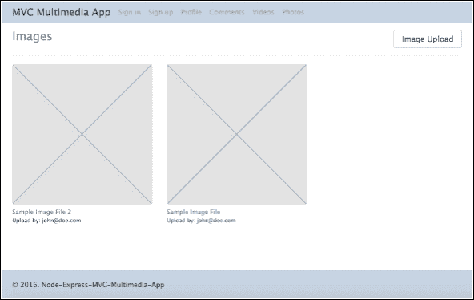
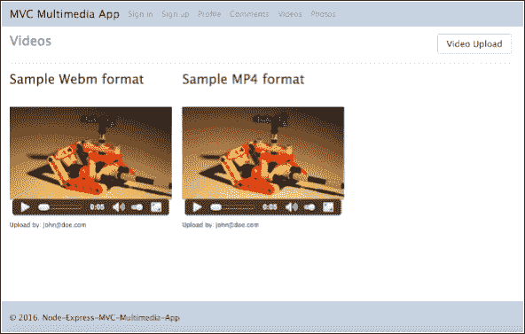
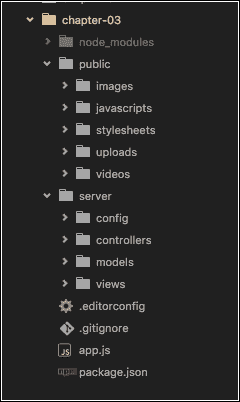
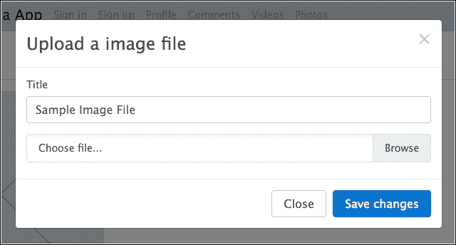
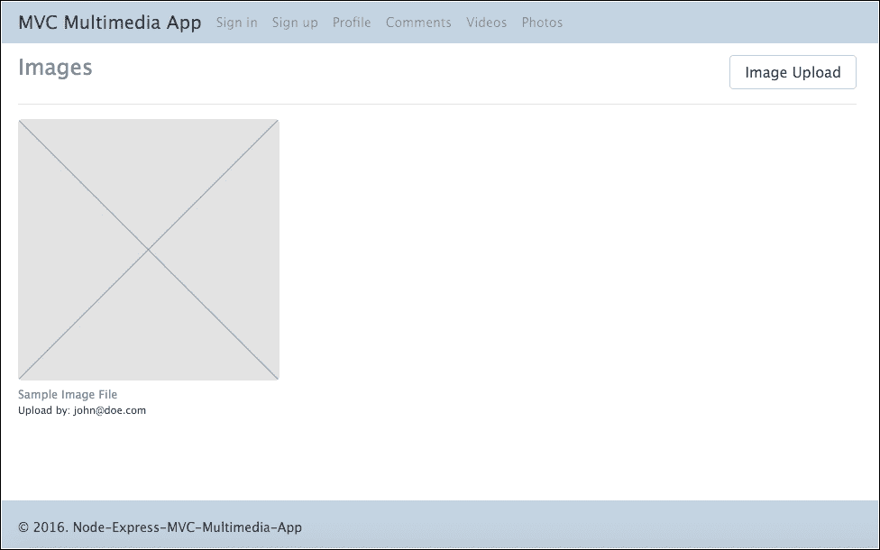
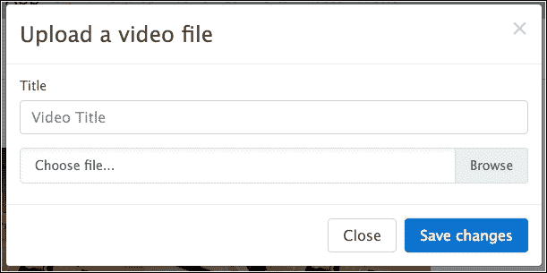

# 第三章。构建多媒体应用程序

在 Node.js 应用程序中最常讨论的话题之一无疑是文件的加载和存储，无论是文本、图像、音频还是视频。也有许多方法可以做到这一点；我们不会深入技术细节，但会简要概述两种最重要的方法。

一种是直接以二进制格式保存文件在数据库中，另一种方式是直接将文件保存在服务器上（服务器的硬盘），或者简单地将文件存储在云中。

在本章中，我们将看到一种非常实用的方式，可以直接将文件上传到硬盘，并将文件名记录在我们的数据库中作为参考。这样，如果需要，我们可以使用可扩展的云存储服务。

在本章中，我们将涵盖以下主题：

+   如何将不同的文件上传到硬盘

+   如何使用 Stream API 读写文件

+   处理多部分表单上传

+   如何配置 Multer 模块将文件存储在本地机器上

+   如何获取文件类型并应用简单的文件验证

+   如何使用动态用户 gravatar 生成器

# 我们正在构建什么？

我们将构建一个使用 MongoDB 和 Mongoose 进行用户身份验证的上传图像和视频的应用程序；然后我们可以看到这些图像将成为我们工作的最终结果。

在这个例子中，我们将使用另一种方式开始我们的项目；这次我们将从`package.json`文件开始。

以下截图展示了我们最终应用程序的样子：

| **图像屏幕** | **视频屏幕** |
| --- | --- |
|  |  |

# 从 package.json 开始

正如我们在前几章中所解释的，`packages.json`文件是应用程序的核心。创建必要文件的步骤如下：

1.  创建一个名为`chapter-03`的文件夹。

1.  创建一个名为`package.json`的新文件，并将其保存在`chapter-03`文件夹中，包含以下代码：

```js
      { 
        "name": "chapter-03", 
        "description": "Build a multimedia Application with Node.js", 
        "license": "MIT", 
        "author": { 
          "name": "Fernando Monteiro", 
          "url": "https://github.com/newaeonweb/node-6-blueprints" 
       }, 
        "repository": { 
          "type": "git", 
          "url": "https://github.com/newaeonweb/node-6-blueprints.git" 
        }, 
        "keywords": [ 
          "MVC", 
          "Express Application", 
          "Expressjs", 
          "Expressjs images upload", 
          "Expressjs video upload" 
        ], 
        "version": "0.0.1", 
        "private": true, 
        "scripts": { 
          "start": "node app.js" 
        }, 
         "dependencies": { 
          "bcrypt-nodejs": "0.0.3", 
          "body-parser": "~1.13.2", 
          "connect-flash": "⁰.1.1", 
          "connect-mongo": "¹.1.0", 
          "cookie-parser": "~1.3.5", 
          "debug": "~2.2.0", 
          "ejs": "~2.3.3", 
           "express": "~4.13.1", 
          "express-session": "¹.13.0", 
          "gravatar": "¹.4.0", 
          "mongoose": "⁴.4.5", 
          "morgan": "~1.6.1", 
          "multer": "¹.1.0", 
          "node-sass-middleware": "0.8.0", 
          "passport": "⁰.3.2", 
          "passport-local": "¹.0.0", 
          "serve-favicon": "~2.3.0" 
        }, 
        "devDependencies": { 
          "nodemon": "¹.9.1" 
        } 
      } 

```

# 添加基线配置文件

现在让我们向项目添加一些有用的文件：

1.  创建一个名为`.editorconfig`的文件，并将其保存在`chapter-03`文件夹中，包含以下代码：

```js
      # http://editorconfig.org 
      root = true 

      [*] 
      indent_style = tab 
      indent_size = 4 
      charset = utf-8 
      trim_trailing_whitespace = true 
      insert_final_newline = true 

      [*.md] 
      trim_trailing_whitespace = false 

```

1.  创建一个名为`.gitignore`的文件，保存在`chapter-03`中，并包含以下代码：

```js
      # Logs 
      logs 
      *.log 

      # Runtime data 
      pids 
      *.pid 
      *.seed 

      # Directory for instrumented libs generated by jscoverage/JSCover 
      lib-cov 

      # Coverage directory used by tools like istanbul 
          coverage 

      # Grunt intermediate 
      storage (http://gruntjs.com/creating-plugins#storing-task-files) 
      .grunt 

      # node-waf configuration 
      .lock-wscript 

      # Compiled binary addons (http://nodejs.org/api/addons.html) 
      build/Release 

      # Dependency directory 
      # https://www.npmjs.org/doc/misc/npm-faq.html#should-i-check-
      my-node_modules-folder-into-git- 
      node_modules 

      # Debug log from npm 
      npm-debug.log 

```

### 提示

请记住，我们正在使用 git 作为源代码控制。虽然这个文件不是运行应用程序所必需的，但我们强烈建议您使用源代码版本控制系统。

1.  创建一个名为`app.js`的文件。

# 添加服务器文件夹

要完成应用程序的基本创建，我们现在将创建存储控件、模板和应用程序其他文件的目录：

1.  创建一个名为`public`的文件夹，并在其中创建以下文件夹：

+   `/images`

+   `/javascripts`

+   `/stylesheets`

+   `/uploads`

+   `/视频`

1.  创建一个名为`server`的文件夹，并在其中创建这些文件夹：

+   `/config`

+   `/controllers`

+   `/models`

+   `/views`

1.  此时，我们的项目已经具有了所有基本目录和文件；让我们从`package.json`中安装 Node 模块。

1.  在项目根目录打开您的终端/ shell，并输入以下命令：

```js
npm install

```

在执行步骤 1、2 和 3 之后，项目文件夹将具有以下结构：



文件夹结构

让我们开始创建`app.js`文件内容。

# 配置 app.js 文件

我们将逐步创建`app.js`文件；它将与`第一章`中创建的应用程序有许多相似的部分。但是，在本章中，我们将使用不同的模块和不同的方式来创建应用程序控件。

在`Node.js`中使用 Express 框架，有不同的方法来实现相同的目标：

1.  打开项目根目录下的`app.js`文件，并添加以下模块：

```js
      // Import basic modules 
      var express = require('express'); 
      var path = require('path'); 
      var favicon = require('serve-favicon'); 
      var logger = require('morgan'); 
      var cookieParser = require('cookie-parser'); 
      var bodyParser = require('body-parser'); 

      // import multer 
      var multer  = require('multer'); 
      var upload = multer({ dest:'./public/uploads/', limits: {fileSize:
       1000000, files:1} }); 

```

### 提示

请注意，我们正在使用 Multer 模块来处理`multipart/form-data`。您可以在[`github.com/expressjs/multer`](https://github.com/expressjs/multer)找到有关`multer`的更多信息。

1.  在`multer`导入之后添加以下行：

```js
       // Import home controller 
       var index = require('./server/controllers/index'); 
       // Import login controller 
       var auth = require('./server/controllers/auth'); 
       // Import comments controller 
       var comments = require('./server/controllers/comments'); 
       // Import videos controller 
       var videos = require('./server/controllers/videos'); 
       // Import images controller 
       var images = require('./server/controllers/images'); 

```

### 提示

不要担心这些控制文件。在本书的后面，我们会逐个看到它们。此时，我们将专注于创建`app.js`。

1.  在`controller`导入器之后添加以下行：

```js
       // ODM with Mongoose 
       var mongoose = require('mongoose'); 
       // Modules to store session 
       var session = require('express-session'); 
       var MongoStore = require('connect-mongo')(session); 
       // Import Passport and Warning flash modules 
       var passport = require('passport'); 
       var flash = require('connect-flash'); 
       // start express application in variable app. 
       var app = express(); 

```

上述代码设置了带有消息系统的用户会话，还使用 Passport 进行身份验证。

1.  现在让我们设置模板引擎和与应用程序数据库的连接。在`express app`变量之后添加以下代码：

```js
      // view engine setup 
      app.set('views', path.join(__dirname, 'server/views/pages')); 
      app.set('view engine', 'ejs'); 
      // Database configuration 
      var config = require('./server/config/config.js'); 
      // connect to our database 
      mongoose.connect(config.url); 
       // Check if MongoDB is running 
     mongoose.connection.on('error', function() { 
         console.error('MongoDB Connection Error. Make sure MongoDB is
         running.'); 
     }); 
     // Passport configuration 
     require('./server/config/passport')(passport); 

```

以下行设置了一些默认中间件并初始化了`Passport-local`和用户会话。

1.  在上一个代码块之后添加以下行：

```js
      app.use(logger('dev')); 
      app.use(bodyParser.json()); 
      app.use(bodyParser.urlencoded({ extended: false })); 
      app.use(cookieParser()); 
      app.use(require('node-sass-middleware')({ 
      src: path.join(__dirname, 'public'), 
      dest: path.join(__dirname, 'public'), 
      indentedSyntax: true, 
      sourceMap: true 
      })); 
      // Setup public directory 
      app.use(express.static(path.join(__dirname, 'public'))); 

      // required for passport 
      // secret for session 
      app.use(session({ 
      secret: 'sometextgohere', 
      saveUninitialized: true, 
      resave: true, 
           //store session on MongoDB using express-session + connect mongo 
      store: new MongoStore({ 
      url: config.url, 
      collection : 'sessions' 
          }) 
      })); 

      // Init passport authentication 
     app.use(passport.initialize()); 
      // persistent login sessions 
      app.use(passport.session()); 
      // flash messages 
      app.use(flash()); 

```

现在让我们添加所有应用程序路由。我们本可以使用外部文件来存储所有路由，但是我们将其保留在此文件中，因为我们的应用程序中不会有太多路由。

1.  在`app.use(flash())`之后添加以下代码：

```js
      // Application Routes 
      // Index Route 
      app.get('/', index.show); 
      app.get('/login', auth.signin); 
      app.post('/login', passport.authenticate('local-login', { 
         //Success go to Profile Page / Fail go to login page 
      successRedirect : '/profile', 
      failureRedirect : '/login', 
      failureFlash : true 
      })); 
      app.get('/signup', auth.signup); 
      app.post('/signup', passport.authenticate('local-signup', { 
          //Success go to Profile Page / Fail go to Signup page 
      successRedirect : '/profile', 
      failureRedirect : '/signup', 
      failureFlash : true 
      })); 

      app.get('/profile', auth.isLoggedIn, auth.profile); 

      // Logout Page 
      app.get('/logout', function(req, res) { 
      req.logout(); 
      res.redirect('/'); 
       }); 

      // Setup routes for comments 
      app.get('/comments', comments.hasAuthorization, comments.list); 
      app.post('/comments', comments.hasAuthorization, comments.create); 

      // Setup routes for videos 
      app.get('/videos', videos.hasAuthorization, videos.show); 
      app.post('/videos', videos.hasAuthorization, upload.single('video'),
      videos.uploadVideo); 

      // Setup routes for images 
      app.post('/images', images.hasAuthorization, upload.single('image'),
      images.uploadImage); 
      app.get('/images-gallery', images.hasAuthorization, images.show); 

```

### 提示

在这里，您可以看到我们正在使用第一章中的示例应用程序相同的路由和函数，*使用 MVC 设计模式构建类似 Twitter 的应用程序*；我们保留了路由、身份验证和评论，并进行了一些小的更改。

要采取的最后一步是添加`error`函数并配置我们的应用程序将使用的`服务器端口`。

1.  在上一个代码块之后添加以下代码：

```js
      // catch 404 and forward to error handler 
      app.use(function(req, res, next) { 
      var err = new Error('Not Found'); 
      err.status = 404; 
      next(err); 
       }); 

      // development error handler 
      // will print stacktrace 
      if (app.get('env') === 'development') { 
      app.use(function(err, req, res, next) { 
      res.status(err.status || 500); 
      res.render('error', { 
      message: err.message, 
      error: err 
              }); 
         }); 
      } 

      // production error handler 
      // no stacktraces leaked to user 
      app.use(function(err, req, res, next) { 
      res.status(err.status || 500); 
      res.render('error', { 
       message: err.message, 
      error: {} 
          }); 
      }); 

      module.exports = app; 

      app.set('port', process.env.PORT || 3000); 

      var server = app.listen(app.get('port'), function() { 
      console.log('Express server listening on port ' +
      server.address().port); 
      }); 

```

# 创建 config.js 文件

在`server/config/`文件夹内创建一个名为`config.js`的文件，并添加以下代码：

```js
// Database URL 
module.exports = { 
    'url' : 'mongodb://localhost/mvc-app-multimedia' 
}; 

```

在`server/config/`文件夹内创建一个名为`passport.js`的文件。

在这一步中，我们将使用第一章中使用的`Passport`模块的相同配置文件，*在 Node.js 中使用 MVC 设计模式构建类似 Twitter 的应用程序*。您可以从[www.packtpub.com](http://www.packtpub.com)或从 GitHub 的官方存储库下载示例代码。

# 创建控制器文件

现在让我们在`server/controllers`中创建控制器文件：

1.  创建一个名为`auth.js`的文件，并添加以下代码：

```js
      // get gravatar icon from email 
      var gravatar = require('gravatar'); 
      var passport = require('passport'); 

      // Signin GET 
      exports.signin = function(req, res) { 
          // List all Users and sort by Date 
      res.render('login', { title: 'Login Page', message:
      req.flash('loginMessage') }); 
      }; 
      // Signup GET 
      exports.signup = function(req, res) { 
          // List all Users and sort by Date 
      res.render('signup', { title: 'Signup Page', message:
      req.flash('signupMessage') }); 

      }; 
      // Profile GET 
      exports.profile = function(req, res) { 
          // List all Users and sort by Date 
      res.render('profile', { title: 'Profile Page', user : req.user,
      avatar:gravatar.url(req.user.email ,  {s: '100', r: 'x', d: 'retro'},
      true) }); 
      }; 
      // Logout function 
      exports.logout = function () { 
      req.logout(); 
      res.redirect('/'); 
      }; 

      // check if user is logged in 
      exports.isLoggedIn = function(req, res, next) { 
      if (req.isAuthenticated()) 
      return next(); 
      res.redirect('/login'); 
      }; 

```

1.  创建一个名为`comments.js`的文件，并添加以下代码：

```js
      // get gravatar icon from email 
      var gravatar = require('gravatar'); 
      // get Comments model 
      var Comments = require('../models/comments'); 

      // List Comments 
      exports.list = function(req, res) { 
         // List all comments and sort by Date 
      Comments.find().sort('-created').populate('user',
      'local.email').exec(function(error, comments) { 
       if (error) { 
       returnres.send(400, { 
       message: error 
                  }); 
              } 
              // Render result 
       res.render('comments', { 
       title: 'Comments Page', 
       comments: comments, 
       gravatar: gravatar.url(comments.email ,  {s: '80', r: 'x', d:
        'retro'}, true) 
               }); 
        }); 
      }; 
      // Create Comments 
      exports.create = function(req, res) { 
         // create a new instance of the Comments model with request body 
      var comments = new Comments(req.body); 
          // Set current user (id) 
      comments.user = req.user; 
          // save the data received 
      comments.save(function(error) { 
      if (error) { 
      returnres.send(400, { 
       message: error 
                  }); 
              } 
              // Redirect to comments 
      res.redirect('/comments'); 
           }); 
      }; 
      // Comments authorization middleware 
       exports.hasAuthorization = function(req, res, next) { 
         if (req.isAuthenticated()) 
         return next(); 
        res.redirect('/login'); 
      }; 

```

1.  创建一个名为`index.js`的文件，并添加以下代码：

```js
      // Show home screen 
      exports.show = function(req, res) { 
         // Render home screen 
       res.render('index', { 
               title: 'Multimedia Application', 
               callToAction: 'An easy way to upload and manipulate files
                 with Node.js' 
         }); 
      }; 

```

现在让我们创建控制器来处理图像和视频上传到我们的应用程序。我们将使用 Node.js API 流来读取和写入我们的文件。

### 提示

您可以在[`nodejs.org/api/stream.html`](https://nodejs.org/api/stream.html)找到此 API 的完整文档。

1.  创建一个名为`images.js`的文件。

1.  添加以下代码：

```js
      // Import modules 
      var fs = require('fs'); 
      var mime = require('mime'); 
      // get gravatar icon from email 
      var gravatar = require('gravatar'); 

      var Images = require('../models/images'); 
      // set image file types 
      var IMAGE_TYPES = ['image/jpeg','image/jpg', 'image/png']; 

```

1.  在`importer`模块之后添加以下代码：

```js
      // Show images gallery 
      exports.show = function (req, res) { 

      Images.find().sort('-created').populate('user',
      'local.email').exec(function(error, images) { 
      if (error) { 
        returnres.status(400).send({ 
          message: error 
         }); 
      } 
      // Render galley 
      res.render('images-gallery', {  
      title: 'Images Gallery', 
      images: images, 
      gravatar: gravatar.url(images.email ,  {s: '80', r: 'x', d: 'retro'},
      true) 
              }); 
          }); 
      }; 

```

现在让我们添加负责将文件保存到临时目录并将其传输到`public`文件夹中的目录的函数。

1.  在上一个代码块之后添加以下行：

```js
      // Image upload 
      exports.uploadImage = function(req, res) { 
      var src; 
      var dest; 
      var targetPath; 
      var targetName; 
      var tempPath = req.file.path; 
      console.log(req.file); 
          //get the mime type of the file 
      var type = mime.lookup(req.file.mimetype); 
         // get file extension 
      var extension = req.file.path.split(/[. ]+/).pop(); 
         // check support file types 
      if (IMAGE_TYPES.indexOf(type) == -1) { 
        returnres.status(415).send('Supported image formats: jpeg, jpg,
        jpe, png.'); 
       } 
          // Set new path to images 
      targetPath = './public/images/' + req.file.originalname; 
         // using read stream API to read file 
      src = fs.createReadStream(tempPath); 
         // using a write stream API to write file 
      dest = fs.createWriteStream(targetPath); 
      src.pipe(dest); 

          // Show error 
      src.on('error', function(err) { 
      if (err) { 
        returnres.status(500).send({ 
        message: error 
                  }); 
              } 
       }); 
          // Save file process 
      src.on('end', function() { 
             // create a new instance of the Images model with request body 
      var image = new Images(req.body); 
             // Set the image file name 
      image.imageName = req.file.originalname; 
             // Set current user (id) 
      image.user = req.user; 
             // save the data received 
      image.save(function(error) { 
      if (error) { 
        return res.status(400).send({ 
        message: error 
                      }); 
                  } 
              }); 
              // remove from temp folder 
      fs.unlink(tempPath, function(err) { 
      if (err) { 
          return res.status(500).send('Woh, something bad happened here'); 
                } 
                // Redirect to galley's page 
          res.redirect('images-gallery'); 

              }); 
          }); 
      }; 

```

添加检查用户是否经过身份验证并被授权插入图像的函数。

1.  在文件末尾添加以下代码：

```js
      // Images authorization middleware 
      exports.hasAuthorization = function(req, res, next) { 
      if (req.isAuthenticated()) 
      return next(); 
      res.redirect('/login'); 
      }; 

```

1.  现在让我们重复这个过程来控制`videos.js`，然后创建一个名为`videos.js`的文件，并添加以下代码：

```js
      // Import modules 
      var fs = require('fs'); 
      var mime = require('mime'); 
      // get gravatar icon from email 
      var gravatar = require('gravatar'); 

      // get video model 
      var Videos = require('../models/videos'); 
      // set image file types 
      var VIDEO_TYPES = ['video/mp4', 'video/webm', 'video/ogg',
       'video/ogv']; 

      // List Videos 
      exports.show = function(req, res) { 

      Videos.find().sort('-created').populate('user',
      'local.email').exec(function(error, videos) { 
      if (error) { 
        return res.status(400).send({ 
        message: error 
                  }); 
              } 
              // Render result 
      console.log(videos); 
      res.render('videos', { 
      title: 'Videos Page', 
      videos: videos, 
      gravatar: gravatar.url(videos.email ,  {s: '80', r: 'x', d: 'retro'},
      true) 
              }); 
          }); 
      }; 
      // Create Videos 
      exports.uploadVideo = function(req, res) { 
      var src; 
      var dest; 
      var targetPath; 
      var targetName; 
      console.log(req); 
      var tempPath = req.file.path; 
          //get the mime type of the file 
      var type = mime.lookup(req.file.mimetype); 
         // get file extenstion 
      var extension = req.file.path.split(/[. ]+/).pop(); 
        // check support file types 
      if (VIDEO_TYPES.indexOf(type) == -1) { 
      return res.status(415).send('Supported video formats: mp4, webm, ogg,
      ogv'); 
          } 
          // Set new path to images 
      targetPath = './public/videos/' + req.file.originalname; 
         // using read stream API to read file 
      src = fs.createReadStream(tempPath); 
        // using a write stream API to write file 
      dest = fs.createWriteStream(targetPath); 
      src.pipe(dest); 

          // Show error 
      src.on('error', function(error) { 
      if (error) { 
        return res.status(500).send({ 
        message: error 
                  }); 
              } 
        }); 

          // Save file process 
      src.on('end', function() { 
              // create a new instance of the Video model with request body 
      var video = new Videos(req.body); 
              // Set the video file name 
      video.videoName = req.file.originalname; 
             // Set current user (id) 
      video.user = req.user; 
             // save the data received 
      video.save(function(error) { 
      if (error) { 
        return res.status(400).send({ 
        message: error 
                      }); 
                 } 
              }); 
              // remove from temp folder 
      fs.unlink(tempPath, function(err) { 
      if (err) { 
        return res.status(500).send({ 
        message: error 
                      }); 
                  } 
                 // Redirect to galley's page 
      res.redirect('videos'); 

              }); 
          }); 
      }; 
      // Videos authorization middleware 
      exports.hasAuthorization = function(req, res, next) { 
      if (req.isAuthenticated()) 
         return next(); 
         res.redirect('/login'); 
      };

```

如您所见，我们使用与图像控制器相同的概念来创建视频控制器。

由于流，Node.js API 可以使用`createReadStream()`和`createWriteStream()`函数处理任何类型的文件。

# 创建模型文件

现在让我们创建应用程序的模板文件。由于我们在第一章中使用了 mongoose 中间件，*在 Node.js 中使用 MVC 设计模式构建类似 Twitter 的应用程序*，我们将保持相同类型的配置：

1.  在`server/models`文件夹内创建一个名为`comments.js`的文件，并添加以下代码：

```js
      // load the things we need 
      var mongoose = require('mongoose'); 
      var Schema = mongoose.Schema; 

      var commentSchema = mongoose.Schema({ 
      created: { 
       type: Date, 
      default: Date.now 
          }, 
      title: { 
      type: String, 
      default: '', 
      trim: true, 
      required: 'Title cannot be blank' 
          }, 
      content: { 
      type: String, 
      default: '', 
      trim: true 
          }, 
      user: { 
      type: Schema.ObjectId, 
      ref: 'User' 
          } 
      }); 

      module.exports = mongoose.model('Comments', commentSchema); 

```

1.  在`server/models`文件夹内创建一个名为`user.js`的文件，并添加以下代码：

```js
      // Import Mongoose and password Encrypt 
      var mongoose = require('mongoose'); 
      var bcrypt   = require('bcrypt-nodejs'); 

      // define the schema for User model 
      var userSchema = mongoose.Schema({ 
          // Using local for Local Strategy Passport 
      local: { 
      name: String, 
      email: String, 
      password: String, 
          } 

      }); 

      // Encrypt Password 
      userSchema.methods.generateHash = function(password) { return
      bcrypt.hashSync(password, bcrypt.genSaltSync(8), null); 
      }; 

      // Verify if password is valid 
      userSchema.methods.validPassword = function(password) { return
      bcrypt.compareSync(password, this.local.password); 
      }; 

      // create the model for users and expose it to our app 
      module.exports = mongoose.model('User', userSchema); 

```

1.  然后，在`server/models`文件夹内创建一个名为`images.js`的文件，并添加以下代码：

```js
      // load the things we need 
      var mongoose = require('mongoose'); 
      var Schema = mongoose.Schema; 

      var imagesSchema = mongoose.Schema({ 
      created: { 
      type: Date, 
      default: Date.now 
          }, 
      title: { 
      type: String, 
      default: '', 
      trim: true, 
      required: 'Title cannot be blank' 
          }, 
      imageName: { 
      type: String 
          }, 
      user: { 
      type: Schema.ObjectId, 
      ref: 'User' 
          } 
      }); 

      module.exports = mongoose.model('Images', imagesSchema); 

```

1.  接下来，在`server/models`文件夹内创建一个名为`videos.js`的文件，并添加以下代码：

```js
      // load the things we need 
      var mongoose = require('mongoose'); 
      var Schema = mongoose.Schema; 

      var videosSchema = mongoose.Schema({ 
        created: { 
          type: Date, 
          default: Date.now 
        }, 
        title: { 
          type: String, 
          default: '', 
          trim: true, 
          required: 'Title cannot be blank' 
        }, 
        videoName: { 
         type: String 
        }, 
        user: { 
          type: Schema.ObjectId, 
          ref: 'User' 
        } 
      }); 

      module.exports = mongoose.model('Videos', videosSchema); 

```

# 创建视图文件

在本节中，我们将使用与`第一章`中相同的`view`文件来处理以下文件：

+   `views/partials/javascripts.ejs`

+   `views/partials/stylesheets.ejs`

+   `views/pages/login.ejs`

+   `views/pages/signup.ejs`

+   `views/pages/profile.ejs`

+   `views/pages/index.ejs`

+   `views/pages/comments.js`

+   `views/pages/error.ejs`

如前所述，您可以从 Packt 网站或本书的官方 GitHub 存储库下载这些文件。

除了这些文件之外，我们将为照片和视频页面创建`views`文件，并将这些路由添加到应用程序菜单中：

1.  在`views/partials`文件夹内创建一个名为`footer.ejs`的文件，并添加以下代码：

```js
      <footer class="footer"> 
      <div class="container"> 
       <span>&copy 2016\. Node-Express-MVC-Multimedia-App</span> 
      </div> 
      </footer> 

```

1.  然后在`views/partials`文件夹内创建一个名为`header.ejs`的文件，并添加以下代码：

```js
      <!-- Fixed navbar --> 
      <div class="pos-f-t"> 
        <div class="collapse" id="navbar-header"> 
          <div class="container bg-inverse p-a-1"> 
            <h3>Collapsed content</h3> 
            <p>Toggleable via the navbar brand.</p> 
          </div> 
        </div> 
        <nav class="navbarnavbar-light navbar-static-top"> 
        <div class="container"> 
          <button class="navbar-toggler hidden-sm-up" type="button"
          data-toggle="collapse" data-target="#exCollapsingNavbar2"> 
          Menu 
          </button> 
          <div class="collapse navbar-toggleable-xs"
            id="exCollapsingNavbar2"> 
            <a class="navbar-brand" href="/">MVC Multimedia App</a> 
            <ul class="navnavbar-navnavbar-right"> 
              <li class="nav-item"> 
                <a class="nav-link" href="/login">Sign in</a> 
              </li> 
              <li class="nav-item"> 
                <a class="nav-link" href="/signup">Sign up</a> 
              </li> 
              <li class="nav-item"> 
                <a class="nav-link" href="/profile">Profile</a> 
              </li> 
              <li class="nav-item"> 
                <a class="nav-link" href="/comments">Comments</a> 
              </li> 
              <li class="nav-item"> 
                <a class="nav-link" href="/videos">Videos</a> 
              </li> 
              <li class="nav-item"> 
                <a class="nav-link" href="/images-gallery">Photos</a> 
              </li> 
            </ul> 
          </div> 
        </div> 
        </nav> 
      </div> 
      <!-- Fixed navbar --> 

```

1.  在`views/pages`文件夹内创建一个名为`images-gallery.ejs`的文件，并添加以下代码：

```js
      <!DOCTYPE html> 
      <html> 
      <head> 
        <title><%= title %></title> 
        <% include ../partials/stylesheet %> 
      </head> 
      <body> 
        <% include ../partials/header %> 
        <div class="container"> 
          <div class="row"> 
            <div class="col-lg-6"> 
              <h4 class="text-muted">Images</h4> 
            </div> 
          <div class="col-lg-6"> 
            <button type="button" class="btnbtn-secondary pull-right"
             data-toggle="modal" data-target="#createImage"> 
                    Image Upload 
             </button> 
           </div> 
         </div> 
         <!-- Modal --> 
         <div class="modal fade" id="createImage" tabindex="-1"
          role="dialog" aria-labelledby="myModalLabel"
          aria-hidden="true"> 
           <div class="modal-dialog" role="document"> 
             <div class="modal-content"> 
               <form action="/images" method="post"
                 enctype="multipart/formdata"> 
               <div class="modal-header"> 
                 <button type="button" class="close" data-dismiss="modal"
                  aria-label="Close"> 
                   <span aria-hidden="true">&times;</span> 
                 </button> 
                 <h4 class="modal-title" id="myModalLabel">
                   Upload a imagefile
                 </h4>
               </div> 

               <div class="modal-body"> 
                 <fieldset class="form-group"> 
                 <label  for="itle">Title</label> 
                   <input type="text" id="itle" name="title" class="form-
                    control" placeholder="Image Title" required=""> 
                 </fieldset> 
                 <label class="file" style="width: 100%"> 
                   <input type="file" id="image" name="image"> 
                   <span class="file-custom"></span> 
                 </label> 
               </div> 
               <div class="modal-footer"> 
                 <button type="button" class="btnbtnsecondary" data
                  dismiss="modal">Close
                  </button> 
                 <button type="submit" class="btnbtn-primary">
                    Savechanges
                 </button> 
               </div> 
               </form> 
             </div> 
           </div> 
         </div> 
         <hr> 
         <div class="row"> 
           <% images.forEach(function(images){ %> 
           <div class="col-lg-4"> 
             <figure class="figure"> 
              " class="figure-img
               img-fluid img-rounded" alt="<%= images.imageName %>"> 
              <figcaption class="figure-caption"><%= images.title%>
              </figcaption> 
              <small>Upload by: <%= images.user.local.email %></small> 
             </figure> 
           </div> 
           <% }); %> 
         </div> 
       </div> 
       <% include ../partials/footer %> 
       <% include ../partials/javascript %> 
      </body> 
      </html> 

```

上述代码设置了一个表单 HTML 标签，使用`enctype="multipart/form-data`类型，并创建一个循环来显示添加到图库中的所有图像。

1.  在`views/pages`文件夹内创建一个名为`videos.ejs`的文件，并添加以下代码：

```js
      <!DOCTYPE html> 
      <html> 
      <head> 
        <title><%= title %></title> 
        <% include ../partials/stylesheet %> 
      </head> 
      <body> 
      <% include ../partials/header %> 
      <div class="container"> 
      <div class="row"> 
      <div class="col-lg-6"> 
      <h4 class="text-muted">Videos</h4> 
      </div> 
      <div class="col-lg-6"> 
      <button type="button" class="btn btn-secondary pull-right"
       data-toggle="modal" data-target="#createVideo"> 
                    Video Upload 
       </button> 
      </div> 
      </div> 
      <!-- Modal --> 
      <div class="modal fade" id="createVideo" tabindex="-1" role="dialog"
       aria-labelledby="myModalLabel" aria-hidden="true"> 
      <div class="modal-dialog" role="document"> 
      <div class="modal-content">  
      <form action="/videos" method="post" enctype="multipart/form-data"> 
      <div class="modal-header"> 
      <button type="button" class="close" data-dismiss="modal"
       aria-label="Close"> 
      <span aria-hidden="true">&times;</span> 
      </button> 
      <h4 class="modal-title" id="myModalLabel">Upload a video file</h4> 
       </div> 

      <div class="modal-body"> 
      <fieldset class="form-group"> 
      <label  for="inputitle">Title</label> 
      <input type="text" id="inputitle" name="title" class="form-control"
       placeholder="Video Title" required=""> 
      </fieldset> 
       <label class="file" style="width: 100%"
         onclick="$('input[id=lefile]').click();"> 
       <input type="file" id="video" name="video"> 
       <span class="file-custom"></span> 
       </label> 
       </div> 
      <div class="modal-footer"> 
      <button type="button" class="btnbtn-secondary"
       data-dismiss="modal">Close</button> 
      <button type="submit" class="btnbtn-primary">Save changes</button> 
      </div> 
      </form> 
      </div> 
      </div> 
      </div> 
      <hr> 
      <div class="row"> 
      <% videos.forEach(function(videos){ %> 
      <div class="col-lg-4"> 
      <h4 class="list-group-item-heading"><%= videos.title %></h4> 
      <video width="320" height="240" controls preload="auto"
      codecs="avc1.42E01E, mp4a.40.2"> 
      <source src="img/<%= videos.videoName %>" type="video/mp4" /> 
      </video> 
      <small>Upload by: <%= videos.user.local.email %></small> 
       </div> 
      <% }); %> 
      </div> 
      </div> 
      <% include ../partials/footer %> 
      <% include ../partials/javascript %> 
      </body> 
      </html> 

```

# 创建 public 文件夹内容

在这个阶段，我们已经完成了在`server`目录中创建文件夹和文件的所有必要步骤，如控制器、模型和视图。

现在我们需要复制在`第一章`中创建的`public`文件夹中的内容：

1.  复制以下文件夹及其内容，并将它们粘贴到`chapter-03`根项目文件夹中：

+   `public/images`

+   `public/javascripts`

+   `bootstrap.min.js`

+   `jquery.min.js`

+   `public/stylesheets`

+   `bootstrap.min.css`

+   `style.css`

+   `style.css.map`

+   `style.sass`

1.  在`public`文件夹内创建一个名为`uploads`的文件夹。

1.  然后，在`public`文件夹内创建一个名为`videos`的文件夹。

# 使用上传表单在应用程序中插入图像

现在是测试应用程序的时候了，需要注意的是，为此您应该启动您的 MongoDB。否则，应用程序在连接时会返回失败错误：

1.  在项目根目录打开您的终端/Shell，并输入以下命令：

```js
npm start

```

1.  转到`http://localhost:3000/signup`并输入以下数据：

+   姓名：**约翰**

+   电子邮件：**john@doe.com**

+   密码：**123**

1.  转到`http://localhost:3000/images-gallery`，点击**图像上传**按钮，填写表单标题并选择图像（请注意，我们设置了图像大小限制为*1*MB，仅用于示例目的）。您将看到一个模型表单，如下截图所示：

图像上传表单

1.  选择图像后，点击**保存更改**按钮，完成！您将在`http://localhost:3000/images-gallery`页面看到以下截图：

图库图像屏幕

# 使用上传表单在应用程序中插入视频文件

与插入图像到我们的应用程序一样，让我们按照相同的步骤来插入视频：

1.  转到`http://localhost:3000/videos`，点击**视频上传**按钮，填写表单标题并选择视频文件（请注意，我们再次将图像大小限制设置为 1MB，视频格式设置为*MP4, WEBM*，仅用于示例目的）。您将看到一个模型表单，如下截图所示：

视频上传表单

# 关于图像和视频上传的重要说明

Node.js 为我们提供了一个完整的处理文件的 API（流 API），如图像、视频、pdf 和其他格式。还有几种将文件上传到服务器或存储在云中的方法，正如前面已经提到的。此外，Node.js 生态系统为我们提供了许多模块，用于处理不同类型的文件，并使用带有`enctype="multipart/form-data"`的表单。

在本章中，我们使用了`Multer`模块。Multer 是一个完整的中间件，用于处理各种上传和文件存储的方法。

在这个例子中，我们只在 MongoDB 中存储了文件名，并直接将文件发送到服务器文件夹。还有另一种上传方式，我们将文件以二进制格式发送到数据库，尽管重要的是要记住 MongoDB 存储*BSON*文件的容量为*16*MB。

如果您选择将文件存储在 MongoDB 数据库中，您可以使用 MongoDB 的 GridFS 功能和 Node.js 模块，如`GridFS-stream`，作为上传中间件，就像我们使用 Multer 一样。

在本章的示例中，我们将上传大小限制为 1 MB，在下面突出显示的行中可以看到：

```js
      var upload = multer({ 
         dest:'./public/uploads/', 
         limits: {fileSize: 1000000, files:1} 
      }); 

```

### 提示

您可以在 Multer 的官方文档中找到有关限制的更多信息，网址为[`github.com/expressjs/multer#limits`](https://github.com/expressjs/multer#limits)。

# 总结

在本章中，我们构建了一个完整的 Node MVC 应用程序，用于上传图像和视频文件；我们还设置了一个用户会话，使用电子邮件和密码进行身份验证，并将加密密码存储在 MongoDB 上。

此外，本章使您能够构建模块化、健壮和可扩展的 MVC 应用程序。

此外，我们还使用了在 Web 应用程序中非常常见的功能，如访问数据库、登录和注册以及文件上传。

在下一章中，我们将看到如何使用云服务操纵和上传图像，并将元数据存储在 MongoDB 中。
